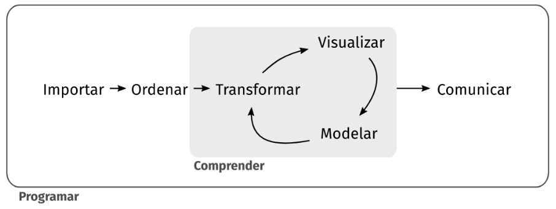

# Ciencia de Datos

> "Disciplina **emergente** que se basa en el conocimiento en **metodología estadística y ciencias de la computación** para crear predicciones, clasificaciones e ideas impactantes para una amplia gama de campos tradicionales"

No existe un acuerdo sobre una definición formal de ciencia de datos, pero la mayoría de estas definiciones concuerda en que tiene al menos tres pilares: el conocimiento estadístico, el conocimiento de ciencias de la computación y el conocimiento de área sobre el cual se va a aplicar.
En este caso el turismo.

El proceso de ciencia de datos en el cual nos vamos a basar se puede ver en el siguiente diagrama:



Primero, debes **importar** tus datos hacia la herramienta donde vas a procesarlos.
Típicamente, esto implica tomar datos que están guardados en un archivo o base de datos y cargarlos en tu software para poder trabajar con ellos.

Una vez que has importado los datos, el siguiente paso es **ordenarlos** para que tengan un formato adecuado para su análisis.
Este formato pensado para el análisis tiene la característica que, en los conjuntos de datos ordenados, *cada columna es una variable y cada fila una observación*.
Tener `r gdef("datos ordenados")` nos provee una estructura consistente, preparada para analizarlos y podemos enfocar nuestros esfuerzos en las preguntas que queremos contestar con nuestros datos y no tener que acomodarlos cada vez que la pregunta cambie.

Cuando tus datos están ordenados, podemos necesitar *transformarlos*.
La transformación implica quedarte con las observaciones que sean de interés (como todos los hoteles de una ciudad o todos los datos del último año), crear nuevas variables que a partir de variables ya existentes (como calcular el porcentaje de ocupación a partir de la cantidad de plazas totales y las ocupadas) y calcular una serie de estadísticos de resumen (como recuentos y medias).

Una vez que tienes los datos ordenados con las variables que necesitas, hay dos principales fuentes generadoras de conocimiento: la **visualización** y el **modelado**.
Ambas tienen fortalezas y debilidades complementarias, por lo que cualquier análisis va a utilizarlas varias veces aprovechando los resultados de una para alimentar a la otra.

La visualización es una herramienta fundamental.
Una buena visualización te mostrará el patrón de los datos, cosas que tal vez no esperabas o te hará surgir nuevas preguntas.
También puede ayudarte a replantear tus preguntas o darte cuenta si necesitas recolectar datos diferentes.

Los modelos son herramientas complementarias a la visualización.
Una vez que tus preguntas son lo suficientemente precisas, puedes utilizar un modelo para responderlas.
Los modelos son herramientas estadísticas o computacionales y tienen supuestos para poder aplicarlos, así que la tarea de seleccionar el modelo adecuado para nuestro problema es una parte importante de este proceso, como también lo es su implantación e interpretación posterior.

El último paso en el proceso de la ciencia de datos es la **comunicación**, una parte crítica de cualquier proyecto de análisis de datos, porque es cuando vas a mostrar tus resultados a otras personas y necesitas que puedan comprenderlos y encontrarlos útiles para utilizarlos.

Alrededor de todas estas herramientas se encuentra la **programación** como herramienta transversal en el proyecto de ciencia de datos.
No necesitás ser una persona experta en programación para hacer ciencia de datos, pero aprender más sobre programar te ayudará a automatizar tareas recurrentes, compartir tu trabajo de forma reusable y aprovechar el trabajo de otros para resolver problemas similares con mayor facilidad y rapidez.

En este cuadernillo te mostraremos como realizar cada una de estas etapas utilizando el software R y te dejaremos links donde puedes aprender y profundizar más cada aspecto de este proceso.

## ¿Por qué R?

Excel es un software admirable.
Es genial para hacer data entry, para ver los datos crudos y para hacer gráficos rápidos.
Si venís usándolo hace tiempo, seguro que aprendiste un montón de trucos para sacarle el jugo al máximo, habrás aprendido a usar fórmulas, tablas dinámicas, e incluso macros.
Pero seguro que también sufriste sus limitaciones.

En una hoja de Excel no hay un límite claro entre datos y análisis.
Sobrescribir datos es un peligro muy real y análisis complicados son imposibles de entender, especialmente si abrís una hoja de cálculo armada por otra persona (que quizás es tu vos del pasado).
Además, repetir el análisis en datos distintos o cambiando algún parámetro se puede volver muy engorroso.

Si lo que necesitás son reportes frecuentes y automáticos, y análisis de datos con muchas partes móviles, estaría bueno poder escribir una receta paso a paso y que la computadora corra todo automáticamente cada vez que se lo pedís.
Para poder hacer eso, ese paso a paso tiene que estar escrito en un lenguaje que la computadora pueda entender, ese lenguaje es R.

La forma en la que interactuás con la computadora con R es diametralmente distinta que con Excel.
Esto lo hace extremadamente poderoso, pero el precio a pagar es básicamente el de tener que aprender un nuevo idioma.

## Cómo decirle a R qué hacer

### Orientándose en RStudio

En principio se podría escribir código de R con el Bloc de Notas y luego ejecutarlo, pero nosotros vamos a usar RStudio, que brinda una interfaz gráfica con un montón de herramientas extra para hacernos la vida más fácil.

Cuando abras RStudio te vas a encontrar con una ventana con cuatro paneles como esta:


Los dos paneles de la izquierda son las dos formas principales de interactuar con R.
El panel de abajo a la izquierda es **la consola**.
Es el lugar que te permite *conversar* con R.
Podés escribir comandos que se van a ejecutar inmediátamente cuando aprietes Enter y cuyo resultado se va a mostrar en la consola.

Por ejemplo, hacé click en la consola, escribí `2 + 2` y apretá Enter.
Vas a ver algo como esto:

```{r}
2 + 2
```

Le dijiste a R que sume 2 y 2 y R te devolvió el resultado: 4 (no te preocupes del `[1]` por ahora).
Eso está bueno si querés hacer una cuenta rápida o chequear algo pequeño, pero no sirve para hacer un análisis complejo y reproducible.

En el panel de arriba a la izquierda tenemos esencialmente un editor de texto.
Ahí es donde vas a escribir si querés guardar instrucciones para ejecutarlas en otro momento y donde vas a estar el 87% de tu tiempo usando R.

A la derecha hay paneles más bien informativos y que tienen varias solapas que vamos a ir descubriendo a su tiempo.
Para destacar, arriba a la derecha está el "environment", que es forma de ver qué es lo que está "pensando" R en este momento.
Ahí vas a poder ver un listado de los datos que están abiertos y otros objetos que están cargados en la memoria de R.
Ahora está vacío porque todavía no cargaste ni creaste ningún dato.
Abajo a la derecha tienen un explorador de archivos rudimentario y también el panel de ayuda, que es donde vas a pasar el otro 13% del tiempo usando R.

Entonces, para resumir:


### Hablando con R

Ya viste cómo usar R como una calculadora.

```{r}
2 + 2
```

Si usaste fórmulas en Excel, esto es muy parecido a poner `=2+2` en una celda.
R entiende un montón de operaciones aritméticas escritas como seguramente ya te imaginás:

-   `+`: sumar
-   `-`: restar
-   `*`: multiplicar
-   `/`: dividir
-   `^`: exponenciar

Pero además conoce muchas otras operaciones.
Para decirle a R que calcule el seno de 1 hay que escribir esto:

```{r}
sin(1)
```

Esto es similar a poner `=SIN(1)` en Excel.
La sintaxis básica para aplicar cualquier función es `nombre_funcion(argumentos)`.

::: {.alert .alert-success}
**Nota**: En Excel el nombre de las funciones dependen del idioma en el que está instalado.
Si lo usás en español, la función seno es `SEN()`.
En R, las funciones siempre se escriben igual (que coincide con el inglés).
:::

::: {.alert .alert-info}
**Desafío**

Decile a R que compute las siguientes operaciones:

-   2 multiplicado por 2
-   3 al cuadrado
-   dos tercios
-   5 por 8 más 1
:::

Al hacer todas estas operaciones, lo único que hiciste fue decirle a R que haga esos cálculos.
R te devuelve el resultado, pero no lo guarda en ningún lado.
Para decirle que guarde el resultado de una operación hay que decirle con qué "nombre" querés guardarlo.
El siguiente código hace eso:

```{r}
x <- 2 + 2
```

La "flechita" `<-` es el operador de asignación, que le dice a R que tome el resultado de la derecha y lo guarde en una variable con el nombre que está a la izquierda.
Vas a ver que no te devele el resultado.
Para verlo, ejecutamos

```{r}
x
```

Esto le dice a R que te "imprima" el contenido de la variable x.

::: {.alert .alert-info}
**Desafío**

¿Qué te imaginás que va a pasar cuando ahora corra el siguiente código?

```{r, eval = FALSE}
x + 2
```
:::

Ponerle nombre a las variables es a veces la parte más difícil de escribir código.
A R le viene bien cualquier nombre de variable siempre y cuando no empiece con un número o un "\_".
Pero a los seres humanos que lean el código y tengan que interpretarlos les va a resultas más fácil entender qué hace la variable `promedio_noches_estadia` que la variable `xxy1`.

El consejo es tratar en lo posible usar nombre descriptivos y consistentes.
Por ejemplo, siempre usar minúsculas y separar palabras con "\_".

::: {.alert .alert-success}
**Tip**: Para hacerse la vida más fácil existen "guías de estilo" para programar que explicitan reglas específicas para escribir código.
Por ejemplo [esta](https://rpubs.com/FvD/guia-estilo-r){.alert-link} o [esta otra](https://github.com/eliocamp/tesis/blob/master/docs/gu%C3%ADa_de_estilo.md){.alert-link}.
Se trata de reglas únicamente para los ojos humanos, y que no afectan en absoluto la eficiencia o correctitud de la programación.
En general, no existen guías buenas o malas, la idea es elegir una y ser consistente.
De esta manera, vas a poder entender tu código con más facilidad.
:::

### Extendiendo R

R es un lenguaje creado por personas que practican la estadística y pensado para la estadística, por lo que ya viene con un montón de métodos estadísticos incorporados, como `mean()` o `median()`.
Pero hay tantos métodos estadísticos como gente haciendo estadística así que es imposible que estén todos.
La solución es que podés "agregarle" a R funciones que no vienen instaladas por defecto pero que escribieron otras personas en forma de "paquetes".
¡Este es el poder de **la comunidad de R**!

Para instalar paquetes de R, la forma mas fácil es con la función `install.packages()`.
Entonces, por ejemplo,

```{r, eval=FALSE}
install.packages("readr")
```

te instala un paquete que contiene funciones para leer datos.
Luego, usando el comando

```{r}
library(readr)
```

le decís a R que cargue las funciones que vienen en el paquete readr para usarlas.

::: {.alert .alert-info}
**Desafío**: Instalá el paquete {readr} con el comando `install.packages("readr")`en la consola.
:::

::: {.alert .alert-success}
**Nota**: Si cerrás y volveś a abrir R, vas a tener que usar `library(readr)` nuevamente para acceder a la funcionalidad del paquete readr.
Sólo hace falta correr `install.packages("readr")` una vez por máquina.
:::

### Buscando ayuda

Entre la enorme cantidad de funciones que tiene R por defecto y las que se pueden agregar instalando paquetes externos, es imposible recordar todas las funciones y cómo usarlas.
Por eso, una gran proporción del tiempo que uses R vas a pasarlo leyendo documentación de funciones, ya sea para aprender a usarlas o porque no te acordás algún detalle.

Para acceder a la ayuda de una función usamos el signo de pregunta:

```{r}
?sin
```

::: {.alert .alert-success}
**Nota**: Otra forma de acceder a la ayuda de una función es poniendo el cursor sobre ella y apretando F1
:::

Esto va a abrir el documento de ayuda para la función `sin()` que, como verás, tiene la documentación de las funciones trigonométricas que trae R por defecto.
Todas las ayudas de R vienen divididas en secciones:

Description

:   Una descripción breve de la función o funciones que se documentan.

Usage

:   Nombre de los argumentos de la función.
    La mayoría de las funciones trigonométricas tienen un solo argumento, que se llama `x`.
    La función `atan2()` tiene dos argumentos, llamados `x` e `y`.

Arguments

:   Una descripción de cada argumento.
    En este caso `x` e `y` son vectores numéricos o complejos.
    Aunque todavía no sepas qué es un "vector", de esta descripción ya podés intuir que las funciones trigonométricas aceptan números complejos.

Details

:   Una descripción detallada de las funciones.
    Por ejemplo, detalla qué es lo que devuelve la función `atan2()`, describe las unidades en las que tienen que estar `x` e `y`, etc..

Value

:   Describe qué tipo de valor devuelve la función.

Examples

:   (abajo de todo) Es la sección más importante y probablemente la que vas a buscar primero cuando te encuentres con una función nueva que no sabés cómo usar.
    Acá vas a encontrar código de R de que ejemplifica el uso típico de la función.
    Podes copiar y pegar el código en la consola y ver el resultado para entender como funciona.

(Otras secciones)

:   Pueden haber otras secciones que detallen distintas particularidades de la función, o referencias a los métodos implementados.

::: {.alert .alert-info}
**Desafío**

Abrí y leé la ayuda de la función `sd()`.
Puede que haya cosas que aún no entiendas, pero tratá de captar la idea general.
¿Qué hace esa función?
¿Qué argumentos acepta?
:::
