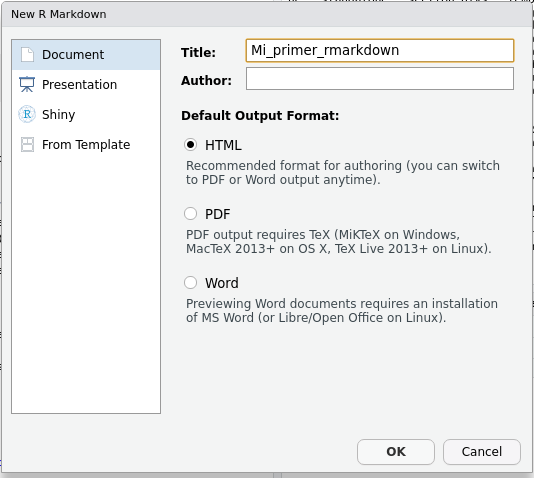

# Introducción a RMarkdown

Es posible que en tu trabajo tengas que presentar informes o resultados de tu análisis de datos.
Tal vez te hayas encontrando guardando una y otra vez gráficos y tablas o copiando resultados de un archivo al otro hasta que el informe quedó como querías.
Los archivos y el paquete **RMarkdown** vienen al rescate.

Un archivo de R Markdown (generalmente con la extensión `.Rmd`), a diferencia de un script `.R`, es un archivo de texto plano que combina código de R que genera resultados (gráficos, tablas, etc...) y el texto que lo describe.
Al poder intercalar cálculos y gráficos con su análisis o explicación, se unifica el flujo de trabajo y deja de ser necesario guardar figuras o tablas para luego insertarlas en un documento de texto.
Esto es muy importante si buscamos que nuestro trabajo sea reproducible, pero además ahorra tiempo.

## Creando archivos .Rmd

En RStudio podés crear un nuevo archivo de R Markdown con el menú desplegable:

::: {.alert .alert-secondary}
File → New File → R Markdown
:::

Y se abrirá un menú donde podés agregar el título de tu informe y tu nombre.
Por ahora vamos a usar el formato HTML como salida, pero más adelante vas a ver que hay muchos otros formatos de salida posibles.



Al aceptar, se abrirá un nuevo archivo con una plantilla de ejemplo (en inglés).

::: {.alert .alert-info}
**Primer desafío: Creá un nuevo archivo R Markdown**

Revisá la plantilla que trae el documento.
¿Podés identificar los bloques de código?
:::

Para generar el archivo de salida, el paquete **knitr** (que viene de *tejer* en inglés) ejecutará el código en una sesión independiente de R e interpretará el texto, su formato y cualquier otra cosa que agreguemos (por ejemplo imágenes o links externos).
Esto significa que nuestro archivo debe tener **todo** lo necesario para generar el análisis y si nos olvidamos de algo va a dar error.

Por esta razón es recomendable *knitear* el archivo seguido, para encontrarnos con los errores a tiempo y de paso asegurarnos que el análisis es reproducible.

::: {.alert .alert-info}
**Segundo desafío: kniteá tu R Markdown**

Aprovechando la plantilla de RStudio, obtené el archivo de salida en formato HTML haciendo click en el botón **knit** (el que tiene un ovillo de lana y un par de agujas!).
:::

## Estructura de un .Rmd

Cualquier archivo de este tipo tiene 3 partes principales:


(Podés encontrar este archivo de ejemplo [acá](files/mi-primer-rmarkdown.Rmd).)

### Encabezado

El encabezado es una serie de instrucciones organizadas entre tres guiones (`---`) que determinan las propiedades globales del documento, como el título, el formato de salida, información de autoría, etc... También ahí se pueden cambiar opciones asociadas al formato de salida, como el estilo de la tabla de contenidos o índice.

Éstas propiedades se definen en un formato llamado [YAML](https://es.wikipedia.org/wiki/YAML), el cual permite definir listas jerarquizadas de una forma humanamente legible.
Por ejemplo:

``` {.yaml}
---
title: "Mi primer RMarkdown"
output: 
  html_document:
    code_download: true
    toc: true
    toc_float: false
---
```

define dos variables principales, "title" y "output".
"Output" a su vez contiene un elemento "htm_document", el cual contiene tres elementos: "code_download", "toc" y "toc_float".

::: {.alert .alert-success}
Es muy importante mantener el escalonado, o *identación* de los elementos, ya que ésta define la jerarquía de cada elemento.
Muchos de los errores a la hora de knitear ocurren porque el archivo tiene problemas en la identación del encabezado.
:::

### Bloques de código

El código de R que va a leer datos, analizarlos y generar figuras, tablas o números se organiza en bloques (o `chunks`) delimitados por tres acentos graves (```` ``` ````) y se diferencia del resto de archivo con un fondo gris.
Todo lo que incluyas entre estos delimitadores será interpretado por R como código e intentará ejecutarlo al *knitear* el archivo.
Cualquier resultado del código (gráficos, tablas, texto, etc...) será insertado en el documento final en el mismo orden que están en el archivo R Markdown.

::: {.alert .alert-success}
Para insertar un nuevo chunk podés:

-   Usar el botón **Insert**
-   El atajo de teclado Ctrl+Alt+I
-   Escribir a mano!
:::

El código en cada bloque se ejecuta como si fuera ejecutado en la terminal y todo resultado se muestra en el documento (ya vamos a ver formas de controlar esto).
Por ejemplo, este bloque de código

    ```{r sumar}`r ''`
    1 + 1
    ```

va a insertar esto en el documento de salida:

    [1] 2

::: {.alert .alert-success}
Es muy importante no romper los límites de los bloques.
Un problema común es accidentalmente eliminar un acento grave al final de un bloque de código y que luego el documento no knitee correctamente.
Si al knitear te sale un error como "attempt to use zero-length variable name", revisá bien que todos tus bloques de código estén correctamente definidos.
:::

Los bloques pueden tener nombre, lo cual es útil para identificar donde ocurren los errores al momento de *knitear* pero también para tener una pista de lo que hace el código que incluye.

Si bien el código se corre cuando uno knitea, cuando estés escribiendo un informe es muy cómodo ir corriendo bloques individuales interactivamente como si fuera en la consola.

Para correr una línea de código, tendrás que pararte sobre esa línea y apretar:

::: {.alert .alert-secondary}
Ctrl+Enter
:::

Pero también podés correr el código de todo el chunk con:

::: {.alert .alert-secondary}
Ctrl+Shift+Enter
:::

Los resultados van a aparecer inmediatamente debajo del bloque.

::: {.alert .alert-info}
**Cuarto desafío: Sumá un chunk a tu archivo**

Usando el archivo con el que venís trabajando insertá un nuevo chunk y:

1.  Cargá el paquete readr.
2.  Creá una variable que se llame `variable_prueba` y asignale un valor.
3.  Mostrá ese valor.
4.  Volvé a *knitear* el archivo para ver el resultado
:::

Finalmente, es posible que te encuentres mencionando resultados en el texto, por ejemplo algo así como "el porcentaje de ocupación para el mes de enero fue del 95%".
Y también es posible que ese valor cambie si utilizas una base de datos distinta o si luego generas un informe pero para un mes siguiente.
Las chances de de que te olvides de actualizar ese "95" son super altas, por eso R Markdown también tiene la posibilidad de incorporar código en línea con el texto.

Si tenés una una variable `ocupacion` que vale "95%":

```{r}
ocupacion <- "95%"
```

Para mencionarla en el texto entonces escribirías:

> El porcentaje de ocupación para el mes de enero fue del `` ``r "r"` ocupacion` ``.
 
y el resultado en el documento kniteado sería 

> El porcentaje de ocupación para el mes de enero fue del `r ocupacion`.


prueba: `` `r ocupacion` ``


### El texto propio del documento.

Este es el texto dirigido a las personas que van a leer el reporte.
Incluirá una introducción, descripción de los datos y de los resultados; es lo que escribirías en el archivo de Word.

A diferencia de Word, el formato del texto se define usando [markdown](<https://es.wikipedia.org/wiki/Markdown>), que es un lenguaje simple que permite indicar si un texto va en negrita, cursiva, es un título, etc...usando símbolos especiales dentro del texto.

## Markdown

Markdown permite escribir en texto plano pero definiendo el formato usando símbolos.
Por ejemplo podés resaltar con **negrita** usando dos asteriscos así: `**negrita**` o *italizada* con un asterisco de cada lado: `*itálicas*`.

También podés hacer una lista de elementos utilizando asteriscos:

    * la negrita se consigue con dos asteriscos
    * la italizada con un asterisco
    * y para resaltar código se usa el acento grave `

o guiones medios:

    - la negrita se consigue con dos asteriscos
    - la italizada con un asterisco
    - y para resaltar código se usa el acento grave `

Ambas listas se van a ver de esta manera:

-   la negrita se consigue con dos asteriscos
-   la italizada con un asterisco
-   y para resaltar código se usa el acento grave \`

Si en realidad querés una lista numerada, simplemente comenzá el renglón un número y un punto.
Podrías usar siempre el mismo número, markdown se encarga del resto:

    1. la negrita se consigue con dos asteriscos
    1. la italizada con un asterisco
    1. y para resaltar código se usa el acento grave `

Ahora la lista numerada se ve así:

1.  la negrita se consigue con dos asteriscos
2.  la italizada con un asterisco
3.  y para resaltar código se usa el acento grave \`

Podés agregar títulos con distinta jerarquía agregando `#` al comienzo.
Esto además define secciones dentro del documento:

    # Título
    ## El primer subtítulo
    ### Otro subtítulo de menor jerarquía
    #### Otro más, y podría seguir!

Podés escribir estos símbolos a mano o usando el Editor Visual de RStudio (sólo disponible para la versión 1.4 en adelante) haciendo click en el ícono de compás que está a la derecha del documento () . 
El Editor Visual permite dar formato al texto usando markdown sin saber usar markdown.


::: {.alert .alert-info}
**Tercer desafío: Agregale texto a tu archivo**

Borrá el contenido del archivo `.Rmd` que creaste (pero no el encabezado!) y probá escribir algo y darle formato.
Luego volvé a apretar el botón **knit** para ver el resultado.
:::

Markdown permite muchas otras cosas, por ejemplo:

Podés agregar un link a una página externa: `[texto que se muestra con el link](http://google.com)`. 
Resultado: [texto que se muestra con el link](http://google.com)

Podés incluir una imagen: ``: Resultado: 


Y también podés agregar ecuaciones (usando [LaTeX](https://es.wikipedia.org/wiki/LaTeX)) en la misma línea (esto:`$E = mc^2$` se ve así: $E = mc^2$) o en una línea propia.
Esto:

    $$
    y = \mu + \sum_{i=1}^p \beta_i x_i + \epsilon
    $$

se ve así:

$$
y = \mu + \sum_{i=1}^p \beta_i x_i + \epsilon
$$

::: {.alert .alert-success}
Podés revisar la guía rápida de Markdown desde RStudio (en inglés):

Help → Markdown Quick Reference
:::
