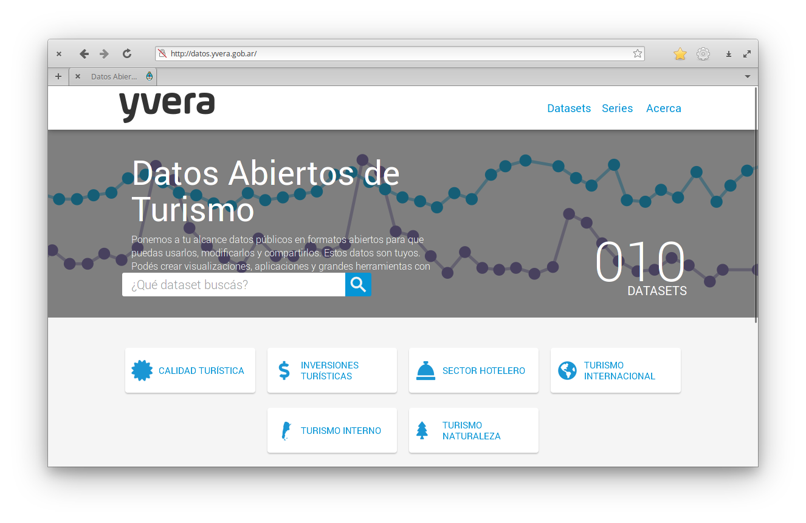
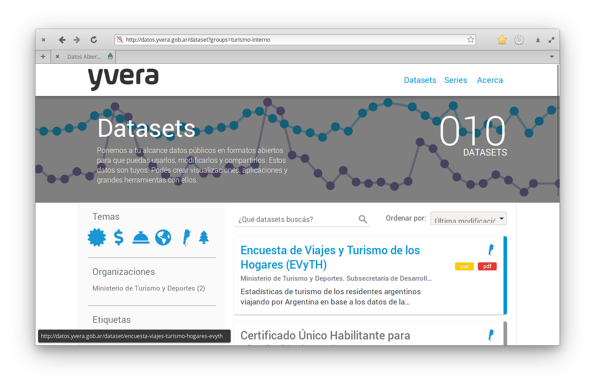
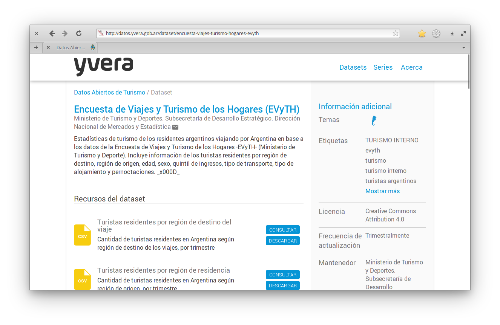
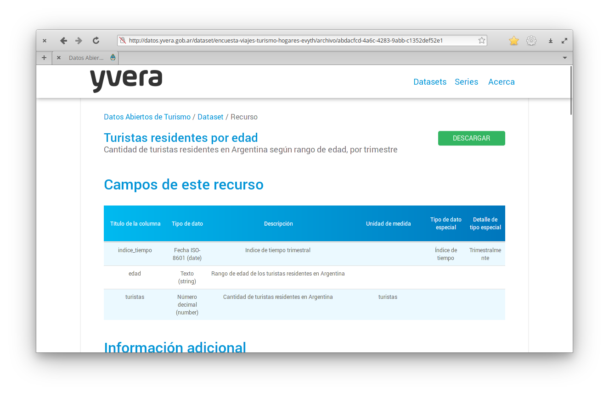
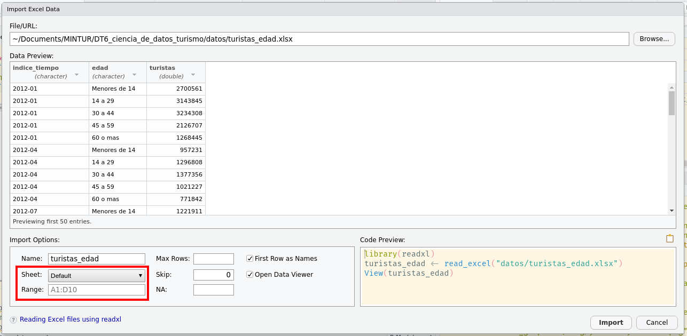

# Lectura de datos ordenados

## Descargando datos 

Antes de poder leer cualquier dato en R, primero hay que encontrarlo y descargarlo. 
El Ministerio de Turismo mantiene un portal de datos abierto llamado [Yvera](http://datos.yvera.gob.ar/) donde podés buscar y descargar datos relacionados con el turismo en Argentina. 

En esta sección vamos a descargar una serie de tiempo a partir de la Encuesta de Viajes y Turismo de los Hogares (EVyTH).

Primero, ingresá a [http://datos.yvera.gob.ar/](http://datos.yvera.gob.ar/), donde te vas a encontrar con la páigna principal de Yvera.

(ref:yvera-principal-alt) Captura de pantalla de la página principal de la plataforma de datos abiertos Yvera.

```{r echo=FALSE, fig.alt="(ref:yvera-principal-alt)"}

```

La base de datos que vamos a descargar está en el área de Turismo Interno así que hacé click en [ese ícono](http://datos.yvera.gob.ar/dataset?groups=turismo-interno) para navegar a la sección de datasets correspondiente.  

(ref:yvera-edad-alt) Captura de pantalla de la página principal de búsqueda de yvera, mostrando los datos asociados a Turismo Interno.

```{r echo=FALSE, fig.alt="(ref:yvera-edad-alt)"}

```


Al momento que escribimos esta guía el primer set de datos que aparece es la Encuesta de Viajes y Turismo de los Hogares (EVyTH). Hacé click ahí para ir a [la página de este set de datos](http://datos.yvera.gob.ar/dataset/encuesta-viajes-turismo-hogares-evyth).

(ref:yvera-edad-data-alt) Captura de pantalla de la página con los datos relacionados la EVyTH.

```{r echo=FALSE, fig.alt="(ref:yvera-edad-data-alt)"}

```

Este set de datos tiene distintos recursos.
Varios son datos, como "Turistas residentes por región de destino del viaje" o "Turistas residentes por edad", pero también hay un recurso llamado "Ficha Técnica: EVyTH". 
Este es [un PDF](http://datos.yvera.gob.ar/dataset/945e10f1-eee7-48a2-b0ef-8aff11df8814/resource/f41af122-ca31-4654-907b-a9cd57b80651/download/2021.01.05_evyth.pdf) con la descripción de los datos así como consideraciones metodológicas relevantes. 
Es importante que si vas a usar datos siempre mires la ficha técnica para hacerte una idea de las limitaciones metodológicas que pueden tener estos datos. 

Por ahora vamos a descargar la [serie de Turistas residentes por edad](http://datos.yvera.gob.ar/dataset/encuesta-viajes-turismo-hogares-evyth/archivo/abdacfcd-4a6c-4283-9abb-c1352def52e1). 

(ref:yvera-edad-serie-alt) Captura de pantalla de la página de la serie de tiempo de turistas residentes por edad.

```{r echo=FALSE, fig.alt="(ref:yvera-edad-serie-alt)"}

```


En esta pantalla te vas a encontrar con una descripción del set de datos y sus variables. 
Para descargar los datos hay que hacer click en el botón que dice "[DESCARGAR](http://datos.yvera.gob.ar/dataset/945e10f1-eee7-48a2-b0ef-8aff11df8814/resource/abdacfcd-4a6c-4283-9abb-c1352def52e1/download/tur_int_turistas_residentes_edad_serie.csv)". 
Guardalo en una carpeta dentro del proyecto (recomedamos organizar los datos en una carpeta llamada "datos") y ya está listo para leer. 


Pero si tuvieras que realizar un informe mensual sobre estos datos tendrías que hacer toda esta descarga manual cada vez que se actualiza el informe. 
La gracia de usar código es automatizar todo lo más posible, así que en vez de descargar manualmente el archivo, se puede descargar automáticamente desde el código de R. 

Para eso, primero necesitás la dirección (URL) del set de datos.
Eso se consigue yendo a [la página del set de datos](http://datos.yvera.gob.ar/dataset/encuesta-viajes-turismo-hogares-evyth/archivo/abdacfcd-4a6c-4283-9abb-c1352def52e1) y en vez de hacer click en DESCAGAR, haciendo 

::: {.alert .alert-secondary}
Click derecho → Copiar dirección del enlace
:::

La URL de la esta serie es `http://datos.yvera.gob.ar/dataset/945e10f1-eee7-48a2-b0ef-8aff11df8814/resource/abdacfcd-4a6c-4283-9abb-c1352def52e1/download/tur_int_turistas_residentes_edad_serie.csv`. 
Guaramos eso en una variable en R

```{r}
turistas_edad_url <- "http://datos.yvera.gob.ar/dataset/945e10f1-eee7-48a2-b0ef-8aff11df8814/resource/abdacfcd-4a6c-4283-9abb-c1352def52e1/download/tur_int_turistas_residentes_edad_serie.csv"
```

Y también definimos la ruta donde descargar el archivo


```{r}
turistas_edad_archivo <- "datos/turistas_edad.csv"
```

Y finalmente usamos la función `download.file()` para descargar el archivo. 

```{r, eval=FALSE}
download.file(url = turistas_edad_url, destfile = turistas_edad_archivo)  
```

Y esto va a descargar la última versión de los datos. 

## Leer datos csv

Existen muchas funciones distintas para leer datos dependiendo del formato en el que están guardados.
Para datos tabulares, la forma más útil es el formato csv, que es un archivo de texto plano con datos separados por coma.

Para importar datos hace falta escribir el código correspondiente pero también podés aprovechar el entorno gráfico de RStudio:

::: {.alert .alert-secondary}
File → Import Dataset → From Text (readr)...
:::

Esto te va abrir una ventana donde podrás elegir el archivo a importar (en este caso el archivo `turistas_edad.csv` que está dentro de la capeta `datos` del proyecto) y otros detalles.

```{r, fig.alt = "Diálogo de importar datos de RStudio."}

```

En la pantalla principal vas a poder previsualizar los datos y ver que pinta tienen.
Abajo a la izquierda tenés varias opciones: el nombre que vas a usar para la variable (en este caso llamaremos `turistas_edad`), si la primera fila contiene los nombres de las columnas (`First Row as Names`), qué delimitador tienen los datos (en este caso `comma`, pero podría ser punto y coma u otro), etc...

Y abajo a la derecha es el código que vas a necesitar para efectivamente importar los datos.
Podrías apretar el botón "Import" para leer los datos pero si bien es posible, al mismo tiempo esas líneas de código no se guardan en ningún lado y entonces nuestro trabajo luego no se puede reproducir.
Por eso, te proponemos que copies ese código, cierres esa ventana con el botón "Cancel", y pegues el código en el archivo donde estés trabajando.
Cuando lo ejecutes, se va a generar la variable `turistas_edad` con los datos.

```{r}
library(readr)
turistas_edad <- read_csv("datos/turistas_edad.csv")
```

::: {.alert .alert-success}
**Nota**: Notá que en este caso el código para leer los datos consta de dos líneas.
La primera carga el paquete **readr** y el segundo usa la función `read_csv()` (del paquete readr) para leer el archivo .csv.
No es necesario cargar el paquete cada vez que vas a leer un archivo, pero asegurate de incluir esta línea en el primer bloque de código de tu archivo.
:::

::: {.alert .alert-success}
**Nota**: La interfaz de usuario de RStudio sirve para autogenerar el código que lee el archivo.
Una vez que lo tenés, no necesitás abrirla de nuevo.
:::

Todo ese texto naranja/rojo es intimidante pero no te preocupes, es sólo un mensaje que nos informa que los datos se leyeron y qué tipo de dato tiene cada columna.
Podemos explorar la estructura de la variable `turistas_edad` usando la función `str()` (de *structure* en inglés).

```{r}
str(turistas_edad)
```

Esto nos dice un montón.
La primera línea dice que es una `tibble`, que es un caso especial de la estructura de datos tabular básica de R llamada `data.frame`.
Tiene `r nrow(turistas_edad)` filas (las **observaciones**) y `r ncol(turistas_edad)` columnas (o **variables** que describen las observaciones).
Las siguientes líneas nos dicen los nombres de las columnas (`r knitr::combine_words(colnames(turistas_edad), and = "y ")`), su tipo de dato (`chr` o `num`), la longitud (`r paste0("[1:", nrow(turistas_edad), "]")`) y sus primeros elementos.

## Leer datos de excel

Si tenés la vista avispada, habrás notado que en el menú de "Import Dataset" hay una opción para leer datos de Excel.
En efecto, RStudio provee la misma ayuda para leer este tipo de datos:

::: {.alert .alert-secondary}
File → Import Dataset → From Excel...
:::

**CAMBIAR**
```{r, fig.alt = "Diálogo de importar datos de RStudio."}

```

Notá que entre las opciones de abajo a la izquierda aparecen dos variables importantes.
Podés seleccionar de qué hoja leer los datos y qué rango usar.
Esto seguro que te va a ser muy útil para esos archivos de Excel con múltiples tablas en un archivo, o incluso múltiples tablas en cada hoja!

En este caso turistas_edad.xlsx es un Excel buena onda, y el código para leer los datos es muy simple:

```{r}
library(readxl)
turistas_edad <- read_excel("datos/turistas_edad.xlsx")
```

Con la función `str()` podés confirmar que los datos leídos son los mismos que para el csv.

```{r}
str(turistas_edad)
```

::: {.alert .alert-info}
**Desafío: Lee un archivo**

1.  Lee el archivo `turistas_edad.xlsx`, pero solo las primeras 30 lineas
2.  ¿Qué cambió en código que devuelve RStudio?
3.  Revisa la documentación de la función `read_excel()` para identificar otros argumentos que puedan resultarte útiles.
:::

