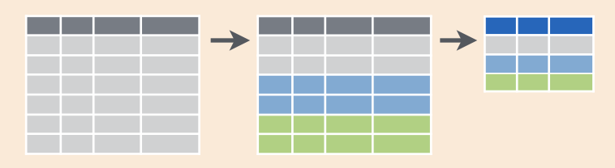

# Manipulación de datos ordenados

El paquete **dplyr** provee una enorme cantidad de funciones útiles para manipular y analizar datos de manera intuitiva y expresiva.

El espíritu detrás de dplyr es que la enorme mayoría de los análisis, por más complicados que sean, involucran combinar y encadenar una serie relativamente acotada de acciones (o verbos).
En este curso vamos a centrarnos las cinco más comunes:

-   `select()`: selecciona columnas de una tabla.
-   `filter()`: selecciona (o filtra) filas de una tabla a partir de una o más condiciones lógicas.
-   `group_by()`: agrupa una tabla en base al valor de una o más columnas.
-   `mutate()`: agrega nuevas columnas a una tabla.
-   `summarise()`: calcula estadísticas para cada grupo de una tabla.

::: {.alert .alert-success}
**dplyr y tablas dinámicas:**

A grosso modo, las operaciones de dplyr permiten hacer en R lo que se hace en tablas dinámicas (pivot tables) en Excel.
`filter()` vendría a ser como la sección de "Filtros", `group_by()`, la sección de "Filas", `select()`, la sección de "Columnas" y `summarise()`, la parte de "Valores".
:::


::: {.alert .alert-info}
**Primer desafío:**

Te dieron una tabla con datos de cantidad mensual de visitantes residentes y visitantes no residentes para cada provincia. 
Las columnas son: `año`, `mes`, `provincia`, `visitantes_residentes` y `visitantes_no_residentes`. 
En base a esos datos, te piden que computes la proporción promedio de visitantes que son residentes para cada provincia en enero. 

¿En qué orden ejecutarías estos pasos para obtener el resultado deseado?

-   usar `summarise()` para calcular la estadística `mean(proporcion_residentes)` para cada `provincia`
-   usar `group_by()` para agrupar por la columna `provincia`
-   usar `mutate()` para agregar una columna llamada `proporcion_residentes` que sea `visitantes_residentes/(visitantes_residentes + visitantes_no_residentes)`.
-   usar `filter()` para seleccionar solo las filas donde la columna `mes` es igual a 1. 
:::

Para usar dplyr primero hay que instalarlo (esto hay que hacerlo una sola vez por computadora) con el comando:

```{r, eval = FALSE}
install.packages("dplyr")
```

y luego cargarlo en memoria con

```{r message=FALSE, warning=FALSE}
library(dplyr)
```

Volvé a cargar los datos de turistas por edad (para un recordatorio, podés ir a [Lectura de datos ordenados](lectura-de-datos-ordenados.html)):

```{r message=FALSE, warning=FALSE}
library(readr)
turistas_edad <- read_csv("datos/turistas_edad.csv")
```

## Seleccionando columnas con `select()`

Para quedarse únicamente con las columnas de índice de tiempo y turistas, usá `select()`

```{r}
select(turistas_edad, indice_tiempo, turistas)
```

¿Dónde quedó este resultado?
Si te fijás en la variable `turistas_edad`, ésta está intacta:

```{r}
turistas_edad
```

`select()` y el resto de las funciones de dplyr siempre generan una nueva tabla y nunca modifican la tabla original.
Para guardar la tabla con las dos columnas `indice_tiempo` y `turistas` tenés que asignar el resultado a una nueva variable.

```{r}
turistas_edad2 <- select(turistas_edad, indice_tiempo, turistas)
turistas_edad2
```


## Filtrando filas con `filter()`

Ahora podés usar `filter()` para quedarte con sólo unas filas.
Por ejemplo, para quedarse con los turistas menores de 14 años

```{r}
filter(turistas_edad, edad == "Menores de 14")
```

La mayoría de los análisis consisten en varios pasos que van generando tablas intermedias (en el primer desafío usaste 4 pasos para calcular la proporción media de visitantes residentes)
La única tabla que te interesa es la última, por lo que ir asignando variables nuevas en cada paso intermedio es tedioso y poco práctico.
Para eso se usa el operador 'pipe' (`%>%`).

El operador 'pipe' (`%>%`) agarra el resultado de una función y se lo pasa a la siguiente.
Esto permite escribir el código como una cadena de funciones que van operando sobre el resultado de la anterior.

Las dos operaciones anteriores (seleccionar tres columnas y luego filtrar las filas correspondientes a Argentina) se pueden escribir uno después del otro y sin asignar los resultados intermedios a nuevas variables de esta forma:

```{r}
turistas_edad %>% 
  filter(edad == "Menores de 14") %>% 
  select(indice_tiempo, turistas)
```

La forma de "leer" esto es "Tomá la variable `turistas_edad`, **después** aplicale `s filter(edad == "Menores de 14")`, **después** aplicale `fselect(indice_tiempo, turistas)`". 

Cómo vimos, el primer argumento de todas las funciones de dplyr es el data frame sobre el cual van a operar, pero notá que en las líneas con `select()` y `filter()` no escribís la tabla explícitamente.  
Esto es porque la pipe implícitamente pasa el resultado de las líneas anteriores como el primer argumento de la función siguiente. 

Toma el data frame `turistas_edad` y se lo pasa al primer argumento de `select()`.
Luego el data frame resultante de esa operación pasa como el primer argumento de la función `filter()` gracias al `%>%`.


::: {.alert .alert-success}
**Tip:**

En RStudio podés escribir `%>%` usando el atajo de teclado Ctr + Shift + M.
¡Probalo!
:::

::: {.alert .alert-info}
**Desafío:**

Completá esta cadena para producir una tabla que contenga los datos de turistas de 60 o más años

```{r, eval = FALSE}
turistas_edad %>% 
  filter(edad == ___) %>% 
  select(_____, ____)
```
:::

## Agrupando y reduciendo con `group_by() %>% summarise()`

Si querés calcular la cantidad promedio de turistas por cada rango de edad, tenés que usar el combo `group_by() %>% summarise()`.
Es decir, primero agrupar la tabla según la columna `edad` y luego calcular el promedio de `turistas` para cada grupo.

Para agrupar la tabla países según el continente usamos el siguiente código:

```{r}
turistas_edad %>% 
  group_by(edad) 
```

A primera vista parecería que la función no hizo nada, pero fijate que el resultado ahora dice que tiene grupos ("Groups: "), y nos dice qué columna es la que agrupa los datos ("edad") y cuántos grupos hay ("5").
Las operaciones subsiguientes que le hagamos a esta tabla van a hacerse *para cada grupo*.

Para ver esto en acción, usá `summarise()` para computar el promedio de turistas 

```{r}
turistas_edad %>% 
  group_by(edad) %>% 
  summarise(turistas_promedio = mean(turistas))
```

¡Tadá!
`summarise()` devuelve una tabla con una columna para la edad y otra nueva, llamada "turistas_promedio" que contiene el promedio de `turistas` para cada grupo.
Esta operación es equivalente a esta tabla dinámica en Excel:

**rehacer el video**
<figure>

<video width=770px controls>

<source src="img/pivot-vid.webm" type="video/webm">

</video>

</figure>

`group_by()` permite agrupar en base a múltiples columnas y `summarise()` permite generar múltiples columnas de resumen.
El siguiente código calcula la cantidad promedio de turistas y su desvío estándar para cada continente y cada año.

```{r}
turistas_edad %>% 
  group_by(edad, mes = substr(indice_tiempo, 6, 7)) %>% 
  summarise(turistas_promedio = mean(turistas),
            turistas_desvio = sd(turistas))
```

::: {.alert .alert-success}
**Tip:**

Este código usa `substr(indice_tiempo, 6, 7)` para definir el mes. 
Esta línea lo que hace es quedarse con el texto de `indice_tiempo` que está entre la posición 6 y la 7. 
De esta manera, del texto `"2012-01"` se queda con "`01`", que representa el mes. 

Esta no es la mejor manera de trabajar con fechas, pero es suficiente por ahora.
:::

El resultado va a siempre ser una tabla con la misma cantidad de filas que grupos y una cantidad de columnas igual a la cantidad de columnas usadas para agrupar y los estadísticos computados.

::: {.alert .alert-info}
**Desafío:**

¿Cuál te imaginás que va a ser el resultado del siguiente código?
¿Cuántas filas y columnas va a tener?
(Tratá de pensarlo antes de correrlo.)

```{r, eval = FALSE}
turistas_edad %>% 
   summarise(turistas_promedio = mean(turistas))
```
:::

El combo `group_by() %>% summarise()` se puede resumir en esta figura.
Las filas de una tabla se dividen en grupos, y luego cada grupo se "resume" en una fila en función del estadístico usado.



Al igual que hicimos "cuentas" usando algunas variables numéricas para obtener información nueva, también podemos utilizar variables categóricas.
No tiene sentido calcular `mean(edad)` ya que en esta tabla la edad está codificada como texto, pero tal vez te interese *contar* la cantidad de observaciones por edad:

```{r}
turistas_edad %>% 
  group_by(edad) %>% 
  summarise(cantidad = n())
```

En este caso se ve que hay 36 observaciones (36 fechas) para todos los rangos etáreos. 

## Creando nuevas columnas con `mutate()`

Todo esto está bien para hacer cálculos con columnas previamente existentes, pero muchas veces tenés que crear nuevas columnas.

La tabla `turistas_edad` tiene información temporal codificada como texto en el formato "año-mes". 
Sería mucho mejor que esté codificada como una fecha. 
Una forma muy simple de convertir caracteres a fechas es usando el paquete **lubridate**. 
Este paquete tiene un montón de funciones que te facilitan la vida al trabajar con fechas, pero en este caso vamos a usar la función `ym()` que transforma en fecha cualquier texto que tenga una fecha codificada con el año seguido del mes. 

Para agregar una columna llamada `tiempo` a la tabla `turistas_edad`, vamos a usar la función `mutate()`

```{r}
turistas_edad %>% 
  mutate(tiempo = lubridate::ym(indice_tiempo))
```


¿Notás la diferencia entre la columna `indice_tiempo` y `tiempo`?

Recordá que las funciones de dplyr nunca modifican la tabla original.
`mutate()` devolvió una nueva tabla que es igual a la tabla `turistas_edad` pero con la columna "tiempo" agregada.
La tabla `turistas_edad` sigue intacta.

::: {.alert .alert-success}
**Tip:**

Para usar la función `ym()` del paquete lubridate el código de arriba usa `lubridate::ym()`.
Esta es una forma de usar funciones de paquetes sin tener que cargarlos con `library()`.
:::


## Desagrupando con `ungroup()`

En general, la mayoría de las funciones de dplyr "entienden" cuando una tabla está agrupada y realizan las operaciones para cada grupo.

::: {.alert .alert-info}
**Desafío:**

¿Cuál de estos dos códigos agrega una columna llamada "turistas_promedio" con la cantidad de turistas promedios para cada rango de dades?
¿Qué hace el otro?

```{r, eval = FALSE}
turistas_edad %>% 
  group_by(edad) %>% 
  mutate(turistas_promedio = mean(turistas)) 

turistas_edad %>% 
  mutate(turistas_promedio = mean(turistas)) 
```
:::

En otras palabras, los resultados de `mutate()`, `filter()`, `summarise()` y otras funciones cambian según si la tabla está agrupada o no.
Como a veces uno se puede olvidar que quedaron grupos, es conveniente usar la función `ungroup()` una vez que dejás de trabajar con grupos:

```{r}
turistas_edad %>% 
  group_by(edad) %>% 
  mutate(turistas_promedio = mean(turistas)) %>% 
  ungroup()
```
