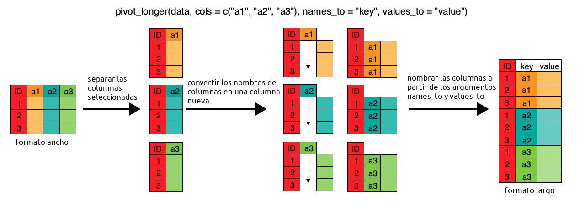
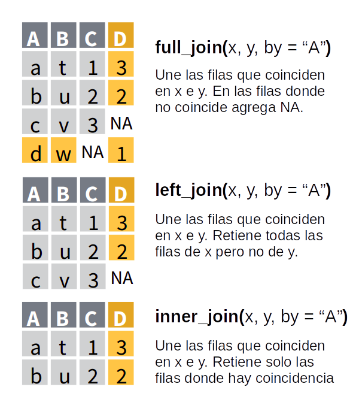

## Manipulación de datos ordenados usando {dplyr} y {tidyr} II

En [la última sección de lectura de datos](04-lectura-datos.html#Formatos_de_tablas) viste el concepto de datos "anchos" y "largos".

Los datos en formato "largo" o "tidy", son aquellos en los cuales:

-   cada fila es una observación
-   cada columna es una variable

En el formato "ancho" es un poco más complejo de definirlo pero la idea general es que:

-   cada fila es un "item"
-   cada columna es una variable


Una tabla en formato largo va a tener una cierta cantidad de columnas que cumplen el rol de *identificadores* y cuya combinación identifican una única observación y una única columna con el valor de la observación.
En el ejemplo de arriba, `pais` y `anio` son las columnas identificadoras y `casos` es la columna que contiene el valor de las observaciones.

En una tabla ancha, cada observación única se identifica a partir de la intersección de filas y columnas.
En el ejemplo, los países están en las filas y los años en las columnas.

En general, el formato ancho es más compacto y legible por humanos mientras que el largo es más fácil de manejar con la computadora.
Si te fijás en las tablas de arriba, es más fácil comparar los valores entre países y entre años en la tabla ancha.
Pero el nombre de las columnas ("1999", "2000") en realidad ¡son datos!
Además este formato se empieza a complicar en cuanto hay más de dos identificadores.

Un mismo set de datos puede ser representado de forma completamente "larga", completamente "ancha" o --lo que es más común-- en un formato intermedio pero no existe una forma "correcta" de organizar los datos; cada una tiene sus ventajas y desventajas.
Por esto es que es muy normal que durante un análisis los datos vayan y vuelvan entre distintos formatos dependiendo de los métodos estadísticos que se le aplican.
Entonces, aprender a transformar datos anchos en largos y viceversa es un habilidad muy útil.

::: {.alert .alert-info}
**Desafío**

En las tablas de ejemplo cada país tiene el un valor observado de "casos" para cada año.
¿Cómo agregarías una nueva variable con información sobre "precios"?
Dibujá un esquema en papel y lápiz en formato ancho y uno en formato largo.
¿En qué formato es más "natural" esa extensión?
:::

En esta sección vas a usar el paquete {tidyr} para manipular datos.
Si no lo tenés instalado, instalalo con el comando:

```{r eval = FALSE}
install.packages("tidyr")
```

(como siempre, recordá que esto hay que hacerlo una única vez)

Y luego cargá {tidyr} y {dplyr} (que usaste en [una sección anterior](05-dplyr-I.html)) con:

```{r}
library(tidyr)
library(dplyr)
```

## De ancho a largo con `pivot_longer()`

En secciones anteriores usaste una versión de los datos de [gapminder](https://www.gapminder.org/).
Ahora vas a leer los datos en su formato original:

```{r}
paises_ancho <- readr::read_csv("datos/paises_ancho.csv")
paises_ancho
```

::: {.alert .alert-success}
¿Notaste que en el código anterior no usaste `library(readr)` para cargar el paquete y luego leer?
Con la notación `paquete::funcion()` podés acceder a las funciones de un paquete sin tener que cargarlo.
Es una buena forma de no tener que cargar un montón de paquetes innecesarios si vas a correr una única función de un paquete pocas veces.
:::

Esta tabla, increíblemente ancha, es muy difícil de manejar.
Por ejemplo, es imposible hacer una serie de tiempo de una variable, o calcular el promedio por variable y país; ni hablar de calcular una regresión lineal.

Para convertirlo en una tabla más larga, se usa `pivot_longer()` ("longer" es "más largo" en inglés):

```{r}
paises_largo <- pivot_longer(paises_ancho,
                             cols = c(starts_with('pob'), 
                                      starts_with('esperanza'), 
                                      starts_with('pib_per')),
                             names_to = "variable_anio", 
                             values_to = "valor"
)
paises_largo
```

El primer argumento de`pivot_longer()` es la tabla que va a modificar: `paises_ancho`.
El segundo argumento se llama `cols` y es un vector con las columnas que tienen los valores a "alargar".
Podría ser un vector escrito a mano (algo como `c("pib_per_capita_1952", "pib_per_capita_1957"...)`) pero con más de 30 columnas, escribir todo eso sería tedioso y probablemente estaría lleno de errores.
Por eso {tidyr} provee funciones de ayuda para seleccionar columnas en base a patrones.
El código de arriba usa `starts_with()` que, como su nombre en inglés lo indica, selecciona las columnas que *empiezan con* una determinada cadena de caracteres.
El vector `c(starts_with('pob'), starts_with('esperanza'), starts_with('pib_per'))` le dice a `pivot_longer()` que seleccione las columnas que empieza con "pob", las que empiezan con "esperanza" y las que empiezan con "pib_per".

::: {.alert .alert-success}
Estas funciones accesorias para seleccionar muchas funciones se llaman "tidyselect".
Si querés leer más detalles de las distintas formas que podés seleccionar variables leé la documentación usando `?tidyselect::language`.
:::

El tercer y cuarto argumento son los nombres de las columnas de "nombre" y de "valor" que va a tener la nueva tabla.
Como la nueva columna de identificación tiene los datos de la variable y el año a medir, "variable_anio" es un buen nombre.
Y la columna de valor va a tener... bueno, el valor.

Tomate un momento para visualizar lo que acaba de pasar.
La tabla ancha tenía un montón de columnas con distintos datos.
Ahora estos datos están uno arriba de otro en la columna "valor", pero para identificar el nombre de la columna de la cual vinieron, se agrega la columna "variable_anio".



La columna `variable_anio` todavía no es muy útil porque contiene 2 datos, la variable (población, expectativa de vida o PBI per cápita) y el año.
Sería mejor separar esta información en dos columnas llamadas "variable" y "anio".
Para eso está la función `separate()`.

```{r}
separate(paises_largo, 
         col = variable_anio, 
         into = c("variable", "anio"), 
         sep = -4)
```

El primer argumento, como siempre, es la tabla a procesar.
El segundo, `col`, es la columna a separar en dos (o más) columnas nuevas.
El tercero, `into` es el nombre de las nuevas columnas que `separate()` va a crear.
El último argumento es `sep` que define cómo realizar la separación.
Por defecto, `sep` es una [expresión regular](https://es.wikipedia.org/wiki/Expresi%C3%B3n_regular) que captura cualquier caracter no alfanumérico.
En el caso de `variable_anio` no sirve, porque para valores como `"esperanza_de_vida_1952"`, separaría en `"esperanza"`, `"de"`, `"vida"` y `"1952"`.
Como el año tiene siempre 4 caracteres, una solución simple es usar `sep = -4`, que significa que la separación es 4 caracteres contando desde el final.

Habrás notado un problema.
El texto en la columnas `variable` todavía tiene un "\_" al final.
Podrías usar `mutate()` y un poco de funciones de manipulación de caracteres para quitarlo, pero hay una forma un poco más simple y es separando la columna `variable_anio` en tres, incluyendo una columna con el guión:

```{r}
paises_largo <- separate(paises_largo, 
         col = variable_anio, 
         into = c("variable", "guion", "anio"), 
         sep = c(-5, -4))
paises_largo
```

Y ya casi.
Hay que eliminar la columna `guion`, que no sirve para nada.
Pero fijate que debajo de la columna `anio` dice `<chr>`; eso significa que el tipo de la columna es caracter, pero los años son números.
Usando `mutate()` podés eliminar la columna `guion` asignándole el valor `NULL` (nulo) y coercer (recordá [esta sección](04-lectura-datos.html#Vectores)) la columna `anio` a entero usando `as.integer()`:

```{r}
paises_largo <- mutate(paises_largo, 
                       guion = NULL,
                       anio = as.integer(anio))
paises_largo
```

::: {.alert .alert-info}
**Desafío**

Juntá todos los pasos anteriores en una sola cadena de operaciones usando `%>%`.
:::

## De largo a ancho con `pivot_wider()`

Ahora la variable `paises_largo` está en el formato más largo posible.
Tiene 5 columnas, de las cuales sólo una es la columnas con valores.
Pero con los datos así no podrías hacer un gráfico de puntos que muestre la relación entre el PBI per cápita y la expectativa de vida como en la [sección de gráficos](06-graficos-I.html#Segunda_capa:_geometrías).
Fijate que los valores de la columna `valor` no tienen todos las mismas unidades, por lo que operar con ese vector podría dar resultados sin sentido.
Muchas veces es conveniente y natural tener los datos en un formato intermedio en donde hay múltiples columnas con los valores de distintas variables observadas.

Pasa "ensanchar" una tabla está la función `pivot_wider()` ("wider" es "más ancha" en inglés) y el código para conseguir este formato intermedio es:

```{r}
paises_medio <- pivot_wider(paises_largo, names_from = variable, values_from = valor)
paises_medio
```

Nuevamente el primer argumento es la tabla original.
El segundo, `names_from` es la columna cuyos valores únicos van a convertirse en nuevas columnas.
La columna `variable` tiene los valores `"población"`, `"esperanza_de_vida"` y `"pib_per_capita"` y entonces la tabla nueva tendrá tres columnas con esos nombres.
El tercer argumento, `values_from`, es la columna de la cual sacar los valores.

Para volver al formato más ancho, basta con agregar más columnas en el argumento `names_from`:

```{r}
pivot_wider(paises_largo, 
            names_from = c(variable, anio), 
            names_sep = "_",
            values_from = valor)
```

En esta llamada también está el argumento `names_sep`, que determina el caracter que se usa para crear el nombre de las nuevas columnas.

::: {.alert .alert-info}
**Desafío**

-   Creá una nueva tabla, llamada `paises_superduper_ancho` que tenga una columna para cada variable, anio y país.
    (Consejo: la tabla final tiene que tener 5 filas).

-   ¿Cómo es la tabla más ancha posible que podés generar con estos datos?
    ¿Cuántas filas y columnas tiene?
:::

## Uniendo tablas

Hasta ahora todo lo que usaste de {dplyr} involucra trabajar y modificar con una sola tabla a la vez, pero es muy común tener dos o más tablas con datos relacionados.
En ese caso, tenemos que *unir* estas tablas.
a partir de una o más variables en común o *keys*.
En Excel u otro programa de hojas de cálculo, esto se resuelve con la función "VLOOKUP" o "BUSCARV", en R y en particular dentro del mundo de {dplyr} hay que usar la familia de funciones `*_join()`.
Hay una función cada tipo de unión que queramos hacer.

Asumiendo que querés unir dos data.frames o tablas `x` e `y` que tienen en común una variable `A`:


-   `full_join()`: devuelve todas las filas y todas las columnas de ambas tablas `x` e `y`.
    Cuando no coinciden los elementos en `x1`, devuelve `NA` (dato faltante).
    Esto significa que no se pierden filas de ninguna de las dos tablas aún cuando no hay coincidencia.
    Está es la manera más segura de unir tablas.

-   `left_join()`: devuelve todas las filas de `x` y todas las columnas de `x` e `y`.
    Las filas en `x` que no tengan coincidencia con `y` tendrán `NA` en las nuevas columnas.
    Si hay múltiples coincidencias entre `x`e `y`, devuelve todas las coincidencias posibles.

-   `right_join()`: es igual que `left_join()` pero intercambiando el orden de `x` e `y`.
    En otras palabras, `right_join(x, y)` es idéntico a `left_join(y, x)`.

-   `inner_join()`: devuelve todas las filas de `x` donde hay coincidencias con `y` y todas las columnas de `x` e `y`.
    Si hay múltiples coincidencias entre `x` e `y`, entonces devuelve todas las coincidencias.
    Esto significa que eliminará las filas (observaciones) que no coincidan en ambas tablas, lo que puede ser peligroso.



Ahora vamos a seguir trabajando con las base de datos de `paises` pero nos vamos a quedar solo con las observaciones del 2007 y de paso unirlo a una nueva base de datos `co2` que contiene información de la emisión de dióxido de carbono de cada país para ese mismo año.

```{r, message=FALSE}
paises_2007 <- readr::read_csv("datos/paises.csv") %>% 
  filter(anio == 2007) 

co2_2007 <- readr::read_csv("datos/co2_2007.csv")
co2_2007
```

Esta nueva tabla tiene 3 columnas: `codigo_iso` tiene el código ISO de 3 letras de (abreviaturas que se usan internacionalmente), `emision_co2` tiene las emisiones anuales per cápita de CO2 en toneladas, `pais` tiene el nombre del país.
Esta última columna también está presente en la tabla `paises_2007` y es la que va a servir como variable llave para unir las dos tablas.

Para unir las dos tablas, cualquier función *join* requiere cierta información:

-   las tablas a unir: son los dos primeros argumentos.
-   qué variable o variables (se puede usar más de una!) usar para identificar coincidencias: el argumento `by`.

Unamos `paises_2007` y `co2_2007` primero con `full_join()`:

```{r}
paises_co2_2007 <- full_join(paises_2007, co2_2007, by = "pais")
paises_co2_2007
```

Si miramos de cerca la tabla unida veremos un par de cosas:

-   Todas las columnas de `paises_2007` y de `co2_2007` están presentes.
-   Todas las observaciones están presentes, aún los países que están presentes en `co2_2007` pero no en `paises_2007` y viceversa. En esos casos ahora tenemos `NA`. Esto genera una tabla con 241 filas.

Esta es la opción más segura si no sabemos si todas las observaciones de una tabla están presente en a otra.

Si solo nos interesa conservar las filas de la tabla *de la izquierda*, en este caso `paises_2007` entonces:

```{r}
paises_co2_2007 <- left_join(paises_2007, co2_2007, by = "pais")
paises_co2_2007
```

Ahora esperamos que la tabla resultante tenga la misma cantidad de filas que `paises_2007` y efectivamente eso ocurre.
Pero al mismo tiempo varios países en esa tabla no encontraron coincidencia en `co2_2007` y por esa razón, la columna nueva columna `emisiones_co2` tiene `NA`.

Finalmente, si quisiéramos quedarnos solo con las observaciones que están presentes en ambas tablas usamos `inner_join()`.

```{r}
paises_co2_2007 <- inner_join(paises_2007, co2_2007, by = "pais")
paises_co2_2007
```

En este caso, perdemos las filas de `co2_2007` que no encontraron coincidencia en `paises_2007` y viceversa y la tabla resultante tiene aún menos filas (119).

::: {.alert .alert-info}
**Desafío**

Estuvimos trabajando con una parte de la base de datos de emisiones.
Pero también está disponible `co2_completo.csv` que contiene las emisiones para distintos años.
El objetivo es que unas `paises` y `co2` teniendo en cuenta tanto el país como el año.
Para eso:

1.  Lee la base de datos `co2_completo.csv` en una nueva variable que se llame `co2`.
2.  Revisá el nombre de las variables en esta base de datos, ¿se llaman igual que las variables en `paises`?
3.  Uní las dos tablas usando `full_join()`, tené en cuenta que ahora usamos dos variables llave `pais` y `anio`. Buscá en la documentación cómo indicarle eso a la función `full_join()`.\
:::

