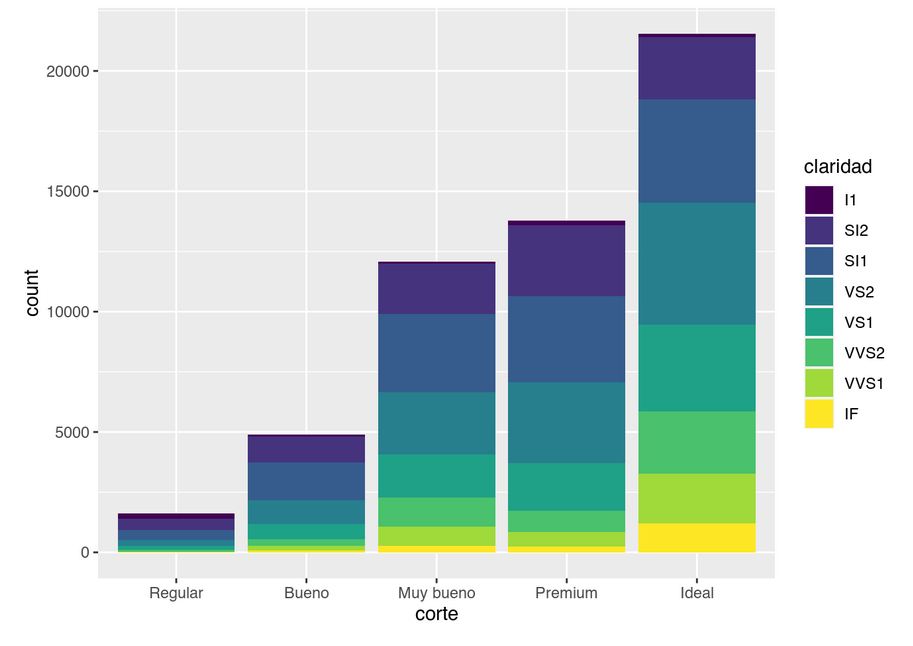
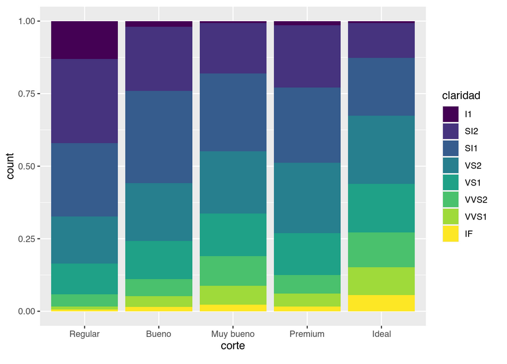
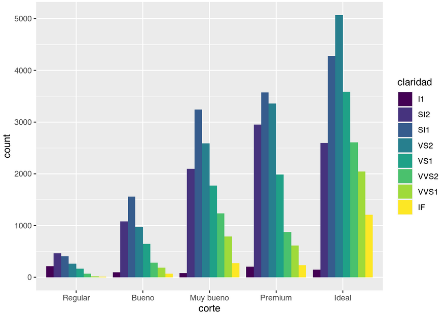
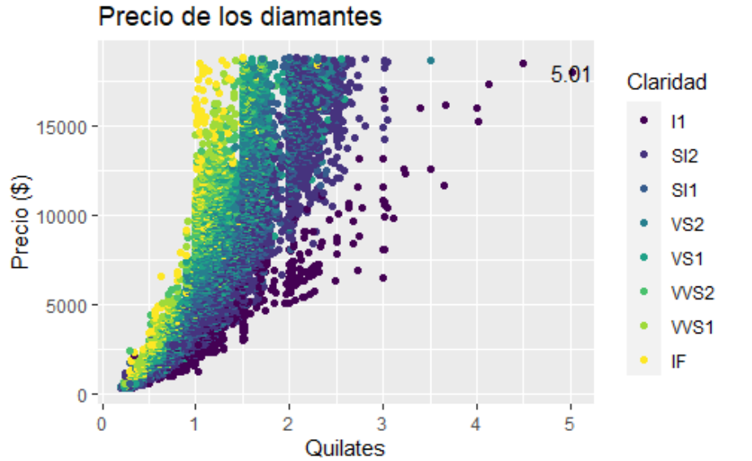

# (APPENDIX) Apéndice {-}

# Desafíos de práctica

En esta sección te proponemos desafíos y ejercicios para prácticar o revisar lo que vimos en los distintos capítulos. Cada una de las subsección estará asociada a un conjunto de capítulos y buscan relacionar los distintos temas y herramientas. 

## Desafío 1 {-}

**Capítulos asociados:** Instalación de R y Rstudio, Uso de proyectos, Reportes con RMarkdown y lectura de datos. 

1. Seguí las instrucciones que encontrarás en el [Apéndice B](instalando-r-y-rstudio.html) para instalar R y Rstudio. 
Tené en cuenta que la instalación en computadoras con Windows requieren algunos pasos extra. 

2. Abrí RStudio y creá tu primer proyecto. 
Este proyecto te acompañará a lo largo de todos los desafíos y ejercicios de este libro, por lo que va a necesitar un nombre fácil de recordar. 
Podés revisar las instrucciones [acá](trabajar-con-proyectos-en-rstudio.html). 

3. Ahora es momento de instalar algunos paquetes para poder usar luego. 
Por ahora instalemos readr, remotes y datos. 

```{r eval=FALSE, include=TRUE}
install.packages("readr")
install.packages("remotes")
remotes::install_github("cienciadedatos/datos")
```

La tercera linea, si bien distinta a las anteriores, también instala un paquete. 
La diferencia es que instala el paquete desde un repositorio de GitHub donde suelen estar los paquetes en desarrollo en vez de desde el repositorio oficial de R (CRAN).

4. Creá un nuevo archivo R Markdown que se llame "01-lectura.Rmd" desde File -> New File -> R Markdown.
Si bien el archivo puede tener cualquer nombre, siempre que sea informativo, te proponemos nombrarlos como número-nombre para poder ordenarlos y que te resulte más fácil encontrarlo dentro del proyecto.
Es posible que necesites darle permiso a RStudio para que instale nuevos paquetes asociados a R Markdown.
Te va a aparecer la plantilla por defecto; borrá todas las líneas empezando por la que dice `## R Markdown` (inclusive) y guardá el archivo.
(Para guardar tenés podés ir a File -> Save o hacer click en en el disquette 💾).
 

5. Aprovechemos el archivo recién creado para leer datos. 
Te proponemos que revises el capítulo de [lectura de datos](lectura-de-datos-ordenados.html) y sigas las instrucciones para leer los datos. 

6. ¡Listo! En la próxima sección practicaremos con esos y otros datos.

## Desafío 2 {-}

**Capítulos asociados:** Manipulación de datos con dplyr 

Armá un nuevo archivo de R Markdown, borrá todas las líneas empezando por la que dice `## R Markdown` (inclusive) y guardá el archivo con algún nombre descriptivo. 

1. Creá un nuevo bloque de código y pegá estas líneas de código. 

```{r, eval = FALSE}
library(datos)
vuelos <- vuelos
```

Corré el bloque.
Va a cargar una tabla de ejemplo que vienen en el paquete datos. 

Escribí el código que resuelve cada uno de los siguientes puntos en su propio bloque.

1. Fijate qué es cada columna de la tabla vuelos. Escribí `?vuelos` en la consola. 

2. Usando la función `filter()`, encontrá todos los vuelos que:  
    a. Tuvieron un retraso de llegada de dos o más horas
    b. Volaron a Houston (IAH oHOU)
    c. Fueron operados por United, American o Delta
    d. Llegaron más de dos horas tarde, pero no salieron tarde
    e. Partieron entre la medianoche y las 6 a.m. (incluyente)

3. Las variables `horario_salida` y `salida_programada` tienen un formato conveniente para leer, pero es difícil realizar cualquier cálculo con ellas porque no son realmente números continuos. (Ayuda: para hacer la transformación hay que hacer `(horario %/% 100 * 60 + horario %% 100) %% 1440`)

4. Calculá el tiempo de vuelo usando `horario_llegada - horario_salida`. ¿Es igual a `tiempo_vuelo`? ¿Cuál es el problema?

5. Calculá el tiempo de vuelo promedio para cada aeropuerto de origen. 

6. Calculá el retraso medio para cada aerolínea.

7. 🔥🔥¡Esta es la prueba de fuego! 🔥🔥: Kniteá el documento haciendo click en el botón knitr. Si tu código es reproducible, tiene que ejecutar todo sin errores y devolver un documento html con el resultado.


## Desafío 3 {-}

**Capítulos asociados:** Gráficos con ggplot2

Usando el dataset diamantes del paquete datos intenten replicar los gráficos que aparecen a continuación:

* Gráfico 1: Cantidad de diamantes por corte y claridad


* Gráfico 2: Proporción de diamantes por corte y claridad



* Gráfico 3: Cantidad de diamantes por corte y claridad




* Grafico 4: Replicar el siguiente gráfico

Este gráfico presenta los quilates en relación con el precio y la claridad.  En el gráfico se marca el valor 5.01 que corresponde al máximo valor de quilates.




**Desafío opcional**


* Sobre el gráfico 1:

  - Agregar título: Cantidad de diamantes por tipo y claridad

  - Agregar como nota al pie: Fuente: conjunto de datos diamantes del paquete datos.

  - Cambiar los títulos de los ejes x, y y la leyenda.  Nombres en español y con la primera letra en mayúsculas.

* Sobre el gráfico 2:

  - Agregar título: Diamantes por corte y claridad

  - Agregar subtítulo: proporciones de la claridad en cada tipo de corte.

  - Agregar como nota al pie: Fuente: conjunto de datos diamantes del paquete datos.

  - Cambiar los títulos de los ejes x, y y la leyenda.  Nombres en español significativos y con la primera letra en mayúsculas.

* Sobre el gráfico 3:

  - Agregar título: Diamantes por corte y claridad

  - Agregar subtítulo: cantidades de acuerdo a la claridad en cada tipo de corte.

  - Agregar como nota al pie: Fuente: conjunto de datos diamantes del paquete datos.

  - Cambiar los títulos de los ejes x, y y la leyenda.  Nombres en español significativos y con la primera letra en mayúsculas.

## Desafío 4 {-}

**Capítulos asociados:** Tablas, gráficos e informes para publicar.

Llegaste al final del libro y con suerte al final de los desafíos. Es hora de generar el informe final para presentar todo lo que estuviste haciendo en este tiempo.

1. Abrí tu proyecto
Abrí tu proyecto desde el explorador de archivos (haciendo doble click en el archivo .Rproj) o desde a interfaz de RStudio. 
Trabajá sobre el mismo Rmd, que ya va tomando forma.

2. Seleccioná los gráficos y/o tablas que quieran incluir en tu "informe final" y copia **todo** el código necesario para generarlos. 
Esto incluye el codigo que leer y modifica los datos. 

3. Agregá títulos y mejorá las etiquetas en tus gráficos, si querés, también podés cambiar el tema o alguna escala para que tenga una apariencia distinta (tenés todo [acá](gráficos-con-ggplot2.html)).

Si generaste tablas, podés mejorar su apariencia con alguna de las opciones de {kable} o {kableExtra} que vimos en el capítulode [tablas](tablas.html).

4. Decidí en que formato vas a querer tu informe, html, word o pdf. ¿Necesita un indice?

Además hace las modificaciones que consideres necesarias para que tenga la apariencia que mejor se adapte a tus objetivos, ¿es necesario que se vea el código? ¿necesitás los mensajes que devuelve R?. Podés usar [esté capítulo](informes-reproducibles.html) como guía.

Y finalmente… kniteá el documento!
