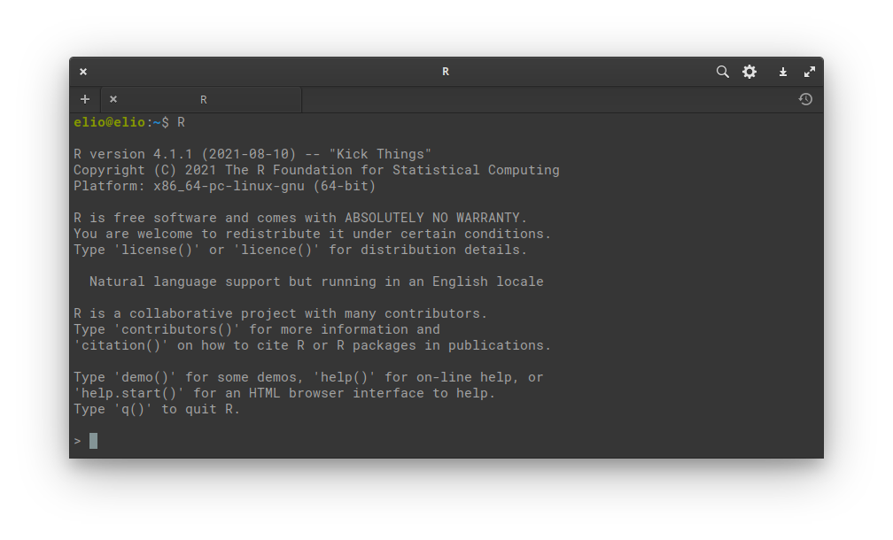
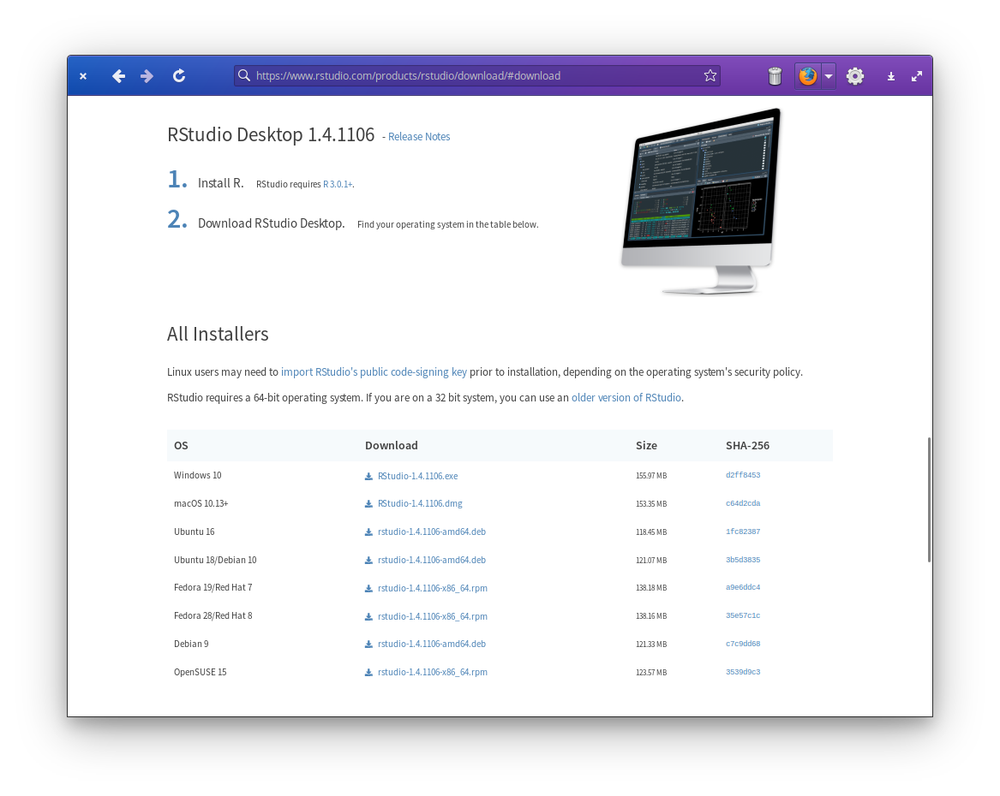
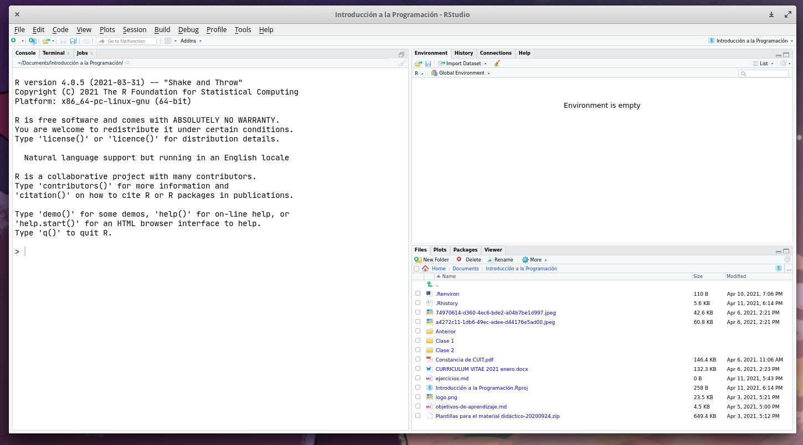

# Instalando R y RStudio

En esta sección presentamos instrucciones de instalación de R y RStudio para Windows y derivados de Ubuntu. 
Notá que dado que tanto R como RStudio publican nuevas versiones periódicamente, es posible que estas instrucciones queden desactualizadas con el tiempo. 

## Instalando R {-}

### Windows {-}

1. Entrá a https://cran.r-project.org/bin/windows/base/ y bajate el instalador haciendo click en el link grandote que dice “Download R x.x.x for Windows”. 


2. Una vez que se bajó, hacé doble click en el archivo y seguí las instrucciones del instalador.

Una vez que se termine de instalar, te va a aparecer un ícono como este en el escritorio o en los programas instalados: {height=20px}.

Al ejecutarlo, les tiene que aparecer algo como esto: 

```{r, echo=FALSE, fig.alt = "Captura de la consola de R en windows."}
knitr::include_graphics("img/r-en-windows.png")
```

Si ves una ventana así significa que ya tenés instalado R, pero seguí leyendo! 
**Todavía falta unos pasos** para poder sacarle todo el jugo.

Para instalar algunos paquetes de R vas a necesitar instalar un programa adicional llamado rtools. 

1. Entrá a https://cran.r-project.org/bin/windows/Rtools/ y descargate el instalador en donde dice "On Windows 64-bit:  rtoolsxx-x86_64.exe (recommended: includes both i386 and x64 compilers)"

2. Abrí la consola de R, poné esto y apretá enter:

```{r, eval = FALSE}
writeLines('PATH="${RTOOLS40_HOME}\\usr\\bin;${PATH}"', con = "~/.Renviron")
```

3. Finalmente, para chequear que todo esté bien, cerrá R, volvé a abrirlo, escribí esto en la cosola y apretá enter:

```{r, eval = FALSE}
Sys.which("make")
```

Debería salir algo como esto:
```{r, echo=FALSE}
c(make = "C:\\rtools40\\usr\\bin\\make.exe")
```


### Ubuntu o derivados {-}

Para tener la última versión, tenés que agregar los repositorios de CRAN. Para hacerlo, vas a tener que tener permisos de administrador. 
Los detalles están en [esta](https://cran.r-project.org/bin/linux/ubuntu/) página, pero el resumen es:

```bash
sudo apt update -qq
sudo apt install --no-install-recommends software-properties-common dirmngr
sudo apt-key adv --keyserver keyserver.ubuntu.com --recv-keys E298A3A825C0D65DFD57CBB651716619E084DAB9
sudo add-apt-repository "deb https://cloud.r-project.org/bin/linux/ubuntu $(lsb_release -cs)-cran40/"
sudo sudo apt install r-base r-base-dev
```

Si todo salió bien, tenés que tener instalado R en tu máquina y podés ejecutarlo con el comando `R` en la consola.


```{r, echo=FALSE, fig.alt = "Terminal de linux corriendo R."}

```

## Mac

1. Descarga e instala R para macOS: https://cran.r-project.org

2. Descarga e instala RStudio: https://www.rstudio.com

La primera vez que abrimos RStudio nos ofrece instalar las herramientas de XCode para línea de comandos. Aceptamos haciendo clic en instalar.

## Instalando RStudio {-}

Andá a https://www.rstudio.com/products/rstudio/download/#download. 
Abajo de todo está el listado de instaladores para cada plataforma; descargá la que corresponda a tu sistema operativo.


```{r, echo=FALSE, fig.alt = "Página de descarga de RStudio."}

```


### Windows {-}

Como siempre, doble click en el archivo y seguir los pasos de instalación.

### Ubuntu o derivados {-}

Si tenés instalada una interfaz gráfica para instalar archivos .deb, ejecutando el archivo que descargaste ya vas a poder instalar RStudio. 
Si no, abrí una terminal en el directorio donde bajaste el archivo y ejecutá

```bash
sudo dpkg -i ARCHIVO
```

Reemplazando ARCHIVO por el nombre del archivo instalador.

Es posible que salte algún error por falta de alguna dependencia, en ese caso usá

```bash
sudo apt-get -f install
```

Y debería estar arreglado.

Una vez instalado, al ejecutar RStudio les tiene que aparecer una ventana como esta:

```{r, echo=FALSE, fig.alt = "Pantalla principal de RStudio."}

```