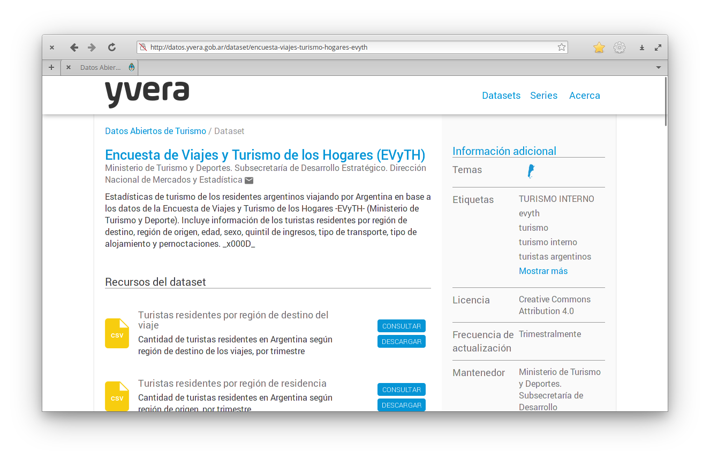
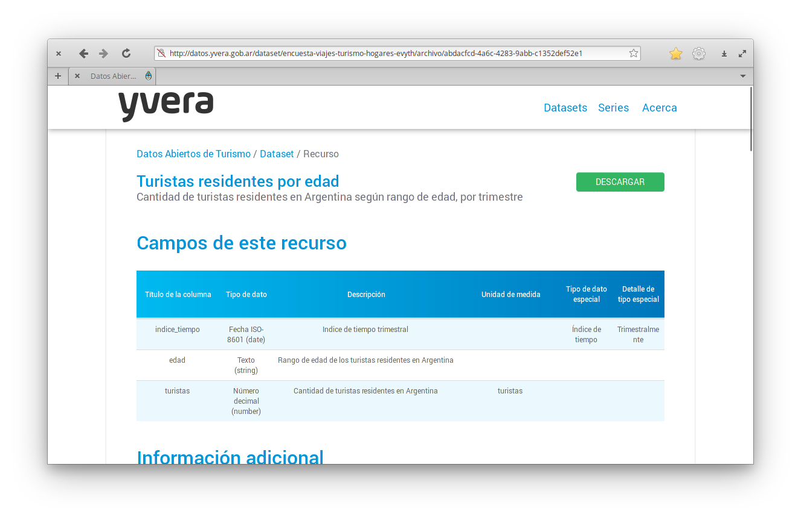
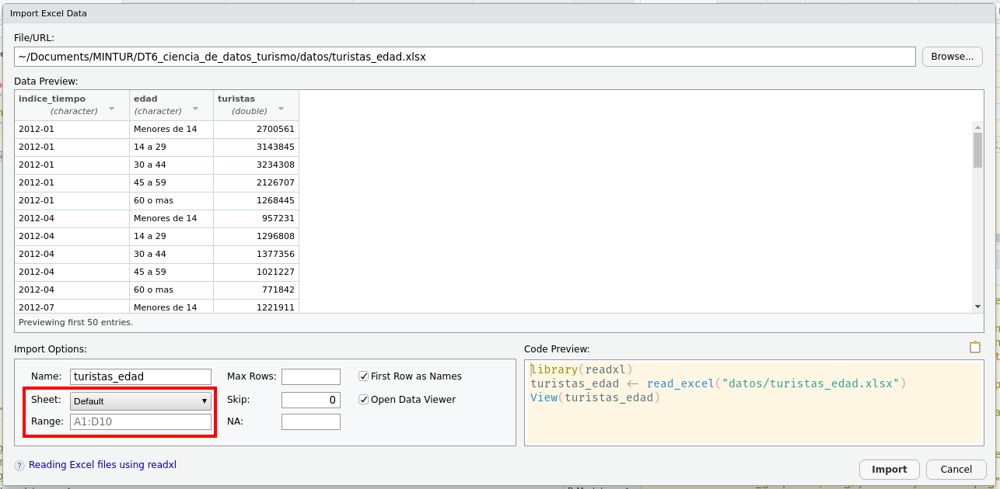

# Presentación {.unnumbered}

El presente documento, **Ciencia de Datos para Turismo**, se enmarca en el proyecto de Armonización de las Estadísticas de Turismo en las Provincias de la [Dirección Nacional de Mercados y Estadística de la Subsecretaría de Desarrollo Estratégico del Ministerio de Turismo y Deportes](https://www.yvera.tur.ar/estadistica/). El objetivo general de este proyecto es contribuir con propuestas metodológicas para los sistemas de estadísticas de turismo provinciales que orienten a producir indicadores provinciales básicos y comparables.

Además de este, se encuentra disponible una serie de documentos técnicos que abordan otras problemáticas vinculadas a la producción de estadística de turismo:

-   [Documento Técnico \#1](https://dnme-minturdep.github.io/DT1_medicion_turismo/): Conceptos y elementos básicos para la medición provincial de los turistas

-   [Documento Técnico \#2](https://dnme-minturdep.github.io/DT2_encuestas/): Propuestas metodológicas para las encuestas de ocupación en alojamientos turísticos

-   [Documento Técnico \#3](https://dnme-minturdep.github.io/DT3_registros_adminsitrativos/): Descripción, análisis y utilización de los Registros Administrativos para la medición del Turismo

-   [Documento Técnico \#4](https://dnme-minturdep.github.io/DT4_perfiles/): Propuestas Metodológicas para las Encuestas de Perfil del Visitante

-   [Documento Técnico \#5](https://dnme-minturdep.github.io/DT5_actividad_empleo/){target="_blank"}: Medición de la contribución económica del turismo: actividad y empleo

### Documento Técnico Nº6 - Resumen {.unnumbered}

La ciencia de datos es una disciplina que ha brindado nuevas y maravillosas posibilidades a muchas industrias por medio de la explotación de datos. Junto con estas posibilidades, también ha traído consigo cambios y desafíos constantes. La industria del turismo no es una excepción.

En este documento técnico realizaremos una introducción al concepto de ciencia de datos y su proceso. Introduciremos el lenguaje de programación R como la caja de herramientas principales para poder llevar adelante cada tarea y etapa de este proceso.

El documento se divide en xx capítulos con ejemplos prácticos y ejercicios (desafíos) para introducir y practicar los conceptos mencionados.


```{r include=FALSE}
# automatically create a bib database for R packages
knitr::write_bib(c(
  .packages(), 'bookdown', 'knitr', 'rmarkdown'
), 'packages.bib')

knitr::opts_chunk$set(out.width = '100%', fig.align = 'center')
```


<!--chapter:end:index.Rmd-->

# Ciencia de Datos

> "Disciplina **emergente** que se basa en el conocimiento en **metodología estadística y ciencias de la computación** para crear predicciones, clasificaciones e ideas impactantes para una amplia gama de campos tradicionales"

No existe un acuerdo sobre una definición formal de ciencia de datos, pero la mayoría de estas definiciones concuerda en que tiene al menos tres pilares: el conocimiento estadístico, el conocimiento de ciencias de la computación y el conocimiento de área sobre el cual se va a aplicar.
En este caso el turismo.

El proceso de ciencia de datos en el cual nos vamos a basar se puede ver en el siguiente diagrama:

<!--  -->

Primero, debes **importar** tus datos hacia la herramienta donde vas a procesarlos.
Típicamente, esto implica tomar datos que están guardados en un archivo o base de datos y cargarlos en tu software para poder trabajar con ellos.

Una vez que has importado los datos, el siguiente paso es **ordenarlos** para que tengan un formato adecuado para su análisis.
Este formato pensado para el análisis tiene la característica que, en los conjuntos de datos ordenados, *cada columna es una variable y cada fila una observación*.
Tener datos ordenados nos provee una estructura consistente, preparada para analizarlos y podemos enfocar nuestros esfuerzos en las preguntas que queremos contestar con nuestros datos y no tener que acomodarlos cada vez que la pregunta cambie.

Cuando tus datos están ordenados, podemos necesitar *transformarlos*.
La transformación implica quedarte con las observaciones que sean de interés (como todos los hoteles de una ciudad o todos los datos del último año), crear nuevas variables que a partir de variables ya existentes (como calcular el porcentaje de ocupación a partir de la cantidad de plazas totales y las ocupadas) y calcular una serie de estadísticos de resumen (como recuentos y medias).

Una vez que tienes los datos ordenados con las variables que necesitas, hay dos principales fuentes generadoras de conocimiento: la **visualización** y el **modelado**.
Ambas tienen fortalezas y debilidades complementarias, por lo que cualquier análisis va a utilizarlas varias veces aprovechando los resultados de una para alimentar a la otra.

La visualización es una herramienta fundamental.
Una buena visualización te mostrará el patrón de los datos, cosas que tal vez no esperabas o te hará surgir nuevas preguntas.
También puede ayudarte a replantear tus preguntas o darte cuenta si necesitas recolectar datos diferentes.

Los modelos son herramientas complementarias a la visualización.
Una vez que tus preguntas son lo suficientemente precisas, puedes utilizar un modelo para responderlas.
Los modelos son herramientas estadísticas o computacionales y tienen supuestos para poder aplicarlos, así que la tarea de seleccionar el modelo adecuado para nuestro problema es una parte importante de este proceso, como también lo es su implantación e interpretación posterior.

El último paso en el proceso de la ciencia de datos es la **comunicación**, una parte crítica de cualquier proyecto de análisis de datos, porque es cuando vas a mostrar tus resultados a otras personas y necesitas que puedan comprenderlos y encontrarlos útiles para utilizarlos.

Alrededor de todas estas herramientas se encuentra la **programación** como herramienta transversal en el proyecto de ciencia de datos.
No necesitás ser una persona experta en programación para hacer ciencia de datos, pero aprender más sobre programar te ayudará a automatizar tareas recurrentes, compartir tu trabajo de forma reusable y aprovechar el trabajo de otros para resolver problemas similares con mayor facilidad y rapidez.

En este cuadernillo te mostraremos como realizar cada una de estas etapas utilizando el software R y te dejaremos links donde puedes aprender y profundizar más cada aspecto de este proceso.

## ¿Por qué R?

Excel es un software admirable.
Es genial para hacer data entry, para ver los datos crudos y para hacer gráficos rápidos.
Si venís usándolo hace tiempo, seguro que aprendiste un montón de trucos para sacarle el jugo al máximo, habrás aprendido a usar fórmulas, tablas dinámicas, e incluso macros.
Pero seguro que también sufriste sus limitaciones.

En una hoja de Excel no hay un límite claro entre datos y análisis.
Sobrescribir datos es un peligro muy real y análisis complicados son imposibles de entender, especialmente si abrís una hoja de cálculo armada por otra persona (que quizás es tu vos del pasado).
Además, repetir el análisis en datos distintos o cambiando algún parámetro se puede volver muy engorroso.

Si lo que necesitás son reportes frecuentes y automáticos, y análisis de datos con muchas partes móviles, estaría bueno poder escribir una receta paso a paso y que la computadora corra todo automáticamente cada vez que se lo pedís.
Para poder hacer eso, ese paso a paso tiene que estar escrito en un lenguaje que la computadora pueda entender, ese lenguaje es R.

La forma en la que interactuás con la computadora con R es diametralmente distinta que con Excel.
Esto lo hace extremadamente poderoso, pero el precio a pagar es básicamente el de tener que aprender un nuevo idioma.

## Cómo decirle a R qué hacer

### Orientándose en RStudio

En principio se podría escribir código de R con el Bloc de Notas y luego ejecutarlo, pero nosotros vamos a usar RStudio, que brinda una interfaz gráfica con un montón de herramientas extra para hacernos la vida más fácil.

Cuando abras RStudio te vas a encontrar con una ventana con cuatro paneles como esta:


Los dos paneles de la izquierda son las dos formas principales de interactuar con R.
El panel de abajo a la izquierda es **la consola**.
Es el lugar que te permite *conversar* con R.
Podés escribir comandos que se van a ejecutar inmediátamente cuando aprietes Enter y cuyo resultado se va a mostrar en la consola.

Por ejemplo, hacé click en la consola, escribí `2 + 2` y apretá Enter.
Vas a ver algo como esto:

```{r}
2 + 2
```

Le dijiste a R que sume 2 y 2 y R te devolvió el resultado: 4 (no te preocupes del `[1]` por ahora).
Eso está bueno si querés hacer una cuenta rápida o chequear algo pequeño, pero no sirve para hacer un análisis complejo y reproducible.

En el panel de arriba a la izquierda tenemos esencialmente un editor de texto.
Ahí es donde vas a escribir si querés guardar instrucciones para ejecutarlas en otro momento y donde vas a estar el 87% de tu tiempo usando R.

A la derecha hay paneles más bien informativos y que tienen varias solapas que vamos a ir descubriendo a su tiempo.
Para destacar, arriba a la derecha está el "environment", que es forma de ver qué es lo que está "pensando" R en este momento.
Ahí vas a poder ver un listado de los datos que están abiertos y otros objetos que están cargados en la memoria de R.
Ahora está vacío porque todavía no cargaste ni creaste ningún dato.
Abajo a la derecha tienen un explorador de archivos rudimentario y también el panel de ayuda, que es donde vas a pasar el otro 13% del tiempo usando R.

Entonces, para resumir:


### Hablando con R

Ya viste cómo usar R como una calculadora.

```{r}
2 + 2
```

Si usaste fórmulas en Excel, esto es muy parecido a poner `=2+2` en una celda.
R entiende un montón de operaciones aritméticas escritas como seguramente ya te imaginás:

-   `+`: sumar
-   `-`: restar
-   `*`: multiplicar
-   `/`: dividir
-   `^`: exponenciar

Pero además conoce muchas otras operaciones.
Para decirle a R que calcule el seno de 1 hay que escribir esto:

```{r}
sin(1)
```

Esto es similar a poner `=SIN(1)` en Excel.
La sintaxis básica para aplicar cualquier función es `nombre_funcion(argumentos)`.

::: {.alert .alert-success}
**Nota**: En Excel el nombre de las funciones dependen del idioma en el que está instalado.
Si lo usás en español, la función seno es `SEN()`.
En R, las funciones siempre se escriben igual (que coincide con el inglés).
:::

::: {.alert .alert-info}
**Desafío**

Decile a R que compute las siguientes operaciones:

-   2 multiplicado por 2
-   3 al cuadrado
-   dos tercios
-   5 por 8 más 1
:::

Al hacer todas estas operaciones, lo único que hiciste fue decirle a R que haga esos cálculos.
R te devuelve el resultado, pero no lo guarda en ningún lado.
Para decirle que guarde el resultado de una operación hay que decirle con qué "nombre" querés guardarlo.
El siguiente código hace eso:

```{r}
x <- 2 + 2
```

La "flechita" `<-` es el operador de asignación, que le dice a R que tome el resultado de la derecha y lo guarde en una variable con el nombre que está a la izquierda.
Vas a ver que no te devele el resultado.
Para verlo, ejecutamos

```{r}
x
```

Esto le dice a R que te "imprima" el contenido de la variable x.

::: {.alert .alert-info}
**Desafío**

¿Qué te imaginás que va a pasar cuando ahora corra el siguiente código?

```{r, eval = FALSE}
x + 2
```
:::

Ponerle nombre a las variables es a veces la parte más difícil de escribir código.
A R le viene bien cualquier nombre de variable siempre y cuando no empiece con un número o un "\_".
Pero a los seres humanos que lean el código y tengan que interpretarlos les va a resultas más fácil entender qué hace la variable `promedio_noches_estadia` que la variable `xxy1`.

El consejo es tratar en lo posible usar nombre descriptivos y consistentes.
Por ejemplo, siempre usar minúsculas y separar palabras con "\_".

::: {.alert .alert-success}
**Tip**: Para hacerse la vida más fácil existen "guías de estilo" para programar que explicitan reglas específicas para escribir código.
Por ejemplo [esta](https://rpubs.com/FvD/guia-estilo-r){.alert-link} o [esta otra](https://github.com/eliocamp/tesis/blob/master/docs/gu%C3%ADa_de_estilo.md){.alert-link}.
Se trata de reglas únicamente para los ojos humanos, y que no afectan en absoluto la eficiencia o correctitud de la programación.
En general, no existen guías buenas o malas, la idea es elegir una y ser consistente.
De esta manera, vas a poder entender tu código con más facilidad.
:::

### Extendiendo R

R es un lenguaje creado por personas que practican la estadística y pensado para la estadística, por lo que ya viene con un montón de métodos estadísticos incorporados, como `mean()` o `median()`.
Pero hay tantos métodos estadísticos como gente haciendo estadística así que es imposible que estén todos.
La solución es que podés "agregarle" a R funciones que no vienen instaladas por defecto pero que escribieron otras personas en forma de "paquetes".
¡Este es el poder de **la comunidad de R**!

Para instalar paquetes de R, la forma mas fácil es con la función `install.packages()`.
Entonces, por ejemplo,

```{r, eval=FALSE}
install.packages("readr")
```

te instala un paquete que contiene funciones para leer datos.
Luego, usando el comando

```{r}
library(readr)
```

le decís a R que cargue las funciones que vienen en el paquete readr para usarlas.

::: {.alert .alert-info}
**Desafío**: Instalá el paquete {readr} con el comando `install.packages("readr") en la consola.`
:::

::: {.alert .alert-success}
**Nota**: Si cerrás y volveś a abrir R, vas a tener que usar `library(readr)` nuevamente para acceder a la funcionalidad del paquete readr.
Sólo hace falta correr `install.packages("readr")` una vez por máquina.
:::

### Buscando ayuda

Entre la enorme cantidad de funciones que tiene R por defecto y las que se pueden agregar instalando paquetes externos, es imposible recordar todas las funciones y cómo usarlas.
Por eso, una gran proporción del tiempo que uses R vas a pasarlo leyendo documentación de funciones, ya sea para aprender a usarlas o porque no te acordás algún detalle.

Para acceder a la ayuda de una función usamos el signo de pregunta:

```{r}
?sin
```

::: {.alert .alert-success}
**Nota**: Otra forma de acceder a la ayuda de una función es poniendo el cursor sobre ella y apretando F1
:::

Esto va a abrir el documento de ayuda para la función `sin()` que, como verás, tiene la documentación de las funciones trigonométricas que trae R por defecto.
Todas las ayudas de R vienen divididas en secciones:

Description

:   Una descripción breve de la función o funciones que se documentan.

Usage

:   Nombre de los argumentos de la función.
    La mayoría de las funciones trigonométricas tienen un solo argumento, que se llama `x`.
    La función `atan2()` tiene dos argumentos, llamados `x` e `y`.

Arguments

:   Una descripción de cada argumento.
    En este caso `x` e `y` son vectores numéricos o complejos.
    Aunque todavía no sepas qué es un "vector", de esta descripción ya podés intuir que las funciones trigonométricas aceptan números complejos.

Details

:   Una descripción detallada de las funciones.
    Por ejemplo, detalla qué es lo que devuelve la función `atan2()`, describe las unidades en las que tienen que estar `x` e `y`, etc..

Value

:   Describe qué tipo de valor devuelve la función.

Examples

:   (abajo de todo) Es la sección más importante y probablemente la que vas a buscar primero cuando te encuentres con una función nueva que no sabés cómo usar.
    Acá vas a encontrar código de R de que ejemplifica el uso típico de la función.
    Podes copiar y pegar el código en la consola y ver el resultado para entender como funciona.

(Otras secciones)

:   Pueden haber otras secciones que detallen distintas particularidades de la función, o referencias a los métodos implementados.

::: {.alert .alert-info}
**Desafío**

Abrí y leé la ayuda de la función `sd()`.
Puede que haya cosas que aún no entiendas, pero tratá de captar la idea general.
¿Qué hace esa función?
¿Qué argumentos acepta?
:::

<!--chapter:end:01-introduccion.Rmd-->

# Trabajar con proyectos en RStudio

Trabajar con proyectos de RStudio no solo hace tus análisis más ordenados y reproducibles, también hacen tu vida más simple.

Al comienzo posiblemente tengas un script y uno o dos archivos con datos, pero es posible que rápidamente te encuentres con una docena de archivos con nombres parecidos pero que pertenecen a análisis totalmente distintos.
Antes de que la cosa comience a complicarse te proponemos trabajar con proyectos.

### ¿Qué ventajas tiene?

-   Te permite "cuidar" los datos que usas al ordenarnos en carpetas que diferencien entre la versión original o cruda y los datos limpios o los resultados finales.
-   Te permite compartir tu trabajo fácilmente con otras personas. Solo tendrías que compartir la carpeta del proyecto sabiendo que incluye todo lo necesario para que cualquiera reproduzca tu análisis.
-   Te permite publicar de manera ordenada tu código si vas a presentar o publicar tu trabajo.
-   Te permite continuar con lo que estabas haciendo hace una semana o hace un mes como si el tiempo no hubiera pasado. De alguna manera es un regalo para tu yo futuro.

::: {.alert .alert-info}
**Primer desafío: Crea un nuevo proyecto en RStudio**

1.  Hacé click en el menú "Archivo" ("File") y luego en "Nuevo Proyecto" ("New Project").
2.  Hacé click en "Nueva Carpeta" ("New Directory").
3.  Hacé click en "Nuevo Proyecto" ("New Project").
4.  Escribí el nombre de la carpeta que alojará a tu proyecto, por ejemplo "mi_proyecto"
5.  Si aparece (y sabés usarlo), seleccioná "Crear un repositorio de git" ("Create a git repository").
6.  Hacé click en "Crear Proyecto" ("Create Project").
:::

Si todo salió bien, ahora deberías tener una nueva carpeta que se llama *mi_proyecto*.
Pero si bien es una carpeta común y corriente, le llamamos proyecto porque además contiene un archivo con el mismo nombre *mi_proyecto.Rproj* (o solo *mi_proyecto* si en tu computadora no ves la extensión de los archivos).

### Abrir un proyecto

La manera más simple de abrir un proyecto es abriendo la carpeta que lo contiene y haciendo doble click sobre el archivo *mi_proyecto.Rproj*.
Al hacer esto se abrirá RStudio y la sesión de R en la misma carpeta y, por defecto, cualquier archivo que quieras abrir o guardar lo hará en esa misma ubicación.
Esto ayuda a mantener tu trabajo ordenado y que luego sea simple retomar o compartir lo que hiciste.

RStudio permite tener varios proyectos abiertos, y esto es posible porque justamente cada proyecto tiene su propia carpeta.
Si en algún momento trabajas con proyectos en paralelo vas a poder hacerlo sin que el código o los resultados de un análisis interfieran con otro.

::: {.alert .alert-info}
**Segundo desafío: Abrí tu nuevo proyecto desde el explorador de archivos**

1.  Cerrá RStudio
2.  Desde el explorador de archivos, buscá la carpeta donde creaste tu proyecto.
3.  Hacé doble click en el archivo que tiene el nombre de tu proyecto (y que termina con *.Rproj*) que encontrarás en esa carpeta.
:::

### ¿Cómo se organiza?

No existe una "mejor" forma de organizar un proyecto pero acá van algunos principios generales que nos hacen la vida más simple::

-   **Tratar los datos como sólo de lectura** Es posible que la toma de los datos que querés analizar te haya costado mucho trabajo, o te haya costado conseguirlos. Trabajar con datos de forma interactiva (por ejemplo, en Excel) tiene la ventaja de permitirte hacer algunos análisis rápidamente pero al mismo tiempo tiene la desventaja de que esos datos pueden ser modificados fácilmente. Esto significa que a veces no conozcas de la procedencia de los datos, o no recuerdes cómo los modificaste desde que los obtuviste. Por lo tanto, es una buena idea tratar los datos como "sólo de lectura" y nunca modificar los archivos originales.
-   **Limpieza de datos** En muchos casos tus datos estarán "sucios", necesitarán un preprocesamiento importante para organizarlos en un formato que R (o cualquier otro lenguaje de programación) pueda analizados fácilmente. Esta tarea se denomina a veces "amasado" o "masticado de datos". Es una buena costumbre guardar el código que te permitió limpiar estos datos por si los volvieras a necesitar. También es recomendable guardar esa versión de los datos limpios, de "sólo lectura", para que puedas usarlos en tu análisis sin necesidad de repetir cada vez todo el proceso de limpieza de los datos.
-   **Tratar las salidas o resultados generados como descartables** Cualquier resultado (gráficos, tablas, valores) debe poder repetirse o rehacerse a partir del código guardado. Si bien las pruebas rápidas para *ver si el código funciona* se pueden hacer en la consola, es importante guardar el código que genera los resultados y asegurarnos de que sean reproducibles. Aún mejor, si organizas esos resultados en distintas sub-carpetas, luego tendrás todo aún más ordenado.

### Ordenando aún más

Si tenés alguna experiencia programando con R es posible que tengas estás lineas al comienzo de alguno de tus scripts o si nunca las usaste, seguro viste que alguien más lo hacia:

```{r eval=FALSE}

setwd("/Users/pao/una_carpeta/al/proyecto_importante")
rm(list = ls())

```

La primera línea *setea* o le avisa a R cual será la carpeta donde va a trabajar. _Con el uso de proyectos esto está prácticamente solucionado_ porque al abrir el proyecto ya sea desde el explorador de archivos haciendo doble click en el archivo con extensión *Rproj* o desde RStudio, R sabrá que ese directorio será el de trabajo. 

Pero también te dijimos que era una buena práctica organizar las diferentes partes del proyecto en subcarpetas, como por ejemplo colocar los datos en una subcarpeta llamada "datos", los informes en otra y tal vez las figuras en una subcarpeta distinta dentro del proyecto. ¿Cómo hacemos para que R lea un archivo que no está en la carpeta de trabajo? Podríamos escribir el camino hacia ese archivo, por ejemplo `"datos/mi_archivo_de_datos.csv"` pero si queremos compartir el código a otra persona que tal vez tiene un sistema operativo distinto y usa la barra invertida `\` va a estar en problemas al intentar correr esa línea. 

Para solucionar estos problemas existe el paquete `{here}`, que funciona independientemente del sistema operativo. Su función principal `here()` recibe como argumentos el camino hacia el archivo que se quiere leer, siempre entre comillas y separados por comas, así:

```{r eval=FALSE}

mis_datos <- read_csv(here("datos", "mi_archivo_de_datos.csv"))

```

Internamente este paquete puede identificar cual es el directorio de trabajo (por ejemplo detectando que hay un archivo *.Rproj*) y busca a partir de ahí la subcarpeta "datos" y adentro de ella el archivo "mi_archivo_de_datos.csv". 

La segunda línea del código inicial se usa para borrar los elementos que creamos en el análisis normalmente cuando cambiamos de tema o empezamos a trabajar con algo distinto. Esto está bien porque no queremos arrastrar análisis que hicimos en un proyecto a otro, necesitamos que sean autocontenidos y *reproducibles*. El problema es que este comando **no** borra los paquetes activados o las opciones usuario que hayamos seteado. 


### Borrón y cuenta nueva... todos los días!

¿Cómo nos aseguramos de que el análisis sea realmente reproducible?
Esta es una pregunta bastante amplia y hay muchas herramientas para resolver este problema.
Por ahora nos vamos a concentrar en que al menos en tu computadora puedas repetir los cálculos o el análisis desde cero.
Y además de organizar proyectos y no modificar los datos originales, ¿cómo podés asegurarte de que guardaste todo el código que estuviste escribiendo y usaste?
La manera más directa es reiniciar la sesión de R y correr el código de nuevo, si da error o no devuelve lo que esperabas significa que te faltó guardar algún paso.

::: {.alert .alert-success}
Tip: Podés reiniciar la sesión de R con el atajo `Ctrl+Shif+F10`
:::

Esto puede pasar si por ejemplo leés una base de datos en memoria pero no guardás el código que lo hace.
Mientras estemos trabajando, R tendrá esa base de datos en memoria y podremos hacer cálculos y gráficos.
Por defecto además RStudio va a recordar las variables que estés usando mañana o pasado en un archivo oculto (.RData) a menos que le indiques lo contrario.
Y si bien suena práctico volver a R al otro día y tener el análisis tal cual lo dejamos, esto puede significar que nunca nos demos cuenta que nos faltó guardar una línea de código clave en nuestro análisis.

::: {.alert .alert-info}
**Tercer desafío: Configurá RStudio**

1.  Hacé click en el menú "Herramientas ("Tools") y luego "Opciones globales" ("Global Options").
2.  Destildá la opción "Recuperar .RData al inicio de la sesión" ("Restore .RData into workspace at startup").
3.  Hacé click en "Aplicar" ("Apply").
:::

<!--chapter:end:02-proyectos.Rmd-->

# Introducción a {RMarkdown}

Es posible que en tu trabajo tengas que presentar informes o resultados de tu análisis de datos.
Tal vez te hayas encontrando guardando una y otra vez gráficos y tablas o copiando resultados de un archivo al otro hasta que el informe quedó como querías.
Los archivos y el paquete `RMarkdown` vienen al rescate.

Un archivo `RMarkdown` a diferencia de un script `.R` permite incluir código en bloques o *chunks* y texto plano o con formato simple de leer usando [markdown](https://markdown.es/sintaxis-markdown/).
A poder intercalar cálculos y gráficos con su análisis o explicación, se unifica el flujo de trabajo y deja de ser necesario guardar figuras o tablas para luego insertarlas en un documento de texto.
Esto es muy importante si buscamos que nuestro trabajo sea reproducible, pero además ahorra tiempo.

Aún si nunca necesitaras presentar un informe, trabajar con archivos de este tipo te permite volcar todo tu trabajo en un solo lugar y te asegura que cundo vuelvas a revisar mañana o el año que viene, tendrás el código y tus ideas organizadas.

### Creando archivos .Rmd

Para crear un nuevo archivo de R Markdown usá el menú desplegable de RStudio:

::: {.alert .alert-secondary}
File → New File → R Markdown
:::

Y se abrirá un menú donde podés agregar el título y tu nombre.
Por ahora vamos a usar el formato html como salida, charlaremos de las distintas posibilidades que ofrece más adelante.


Al aceptar, se abrirá un nuevo archivo pero que no está vacío.
RStudio ofrece una plantilla a partir de la cual empezar a trabajar.

::: {.alert .alert-info}
**Primer desafío: Crea un nuevo archivo R Markdown**

Revisá la plantilla que trae el documento.
¿Podés identificar los bloques de código?
:::

Para generar el archivo de salida el paquete `knitr` (que viene de *tejer* en inglés) y algunos otros ejecutará el código en una sesión independiente de R e interpretará el texto, su formato y cualquier otra cosa que agreguemos (por ejemplo imágenes o links externos).
Esto significa que nuestro archivo debe tener **todo** lo necesario para generar el análisis y si nos olvidamos de algo va a dar error.

Por esta razón es recomendable *knitear* el archivo seguido, para encontrarnos con los errores a tiempo y de paso asegurarnos que el análisis es reproducible.

::: {.alert .alert-info}
**Segundo desafío: "knitea" tu R Markdown**

Aprovechando la plantilla de RStudio, obtené el archivo de salida en formato html haciendo click en el botón **knit** (el que tiene un ovillo de lana y un par de agujas!)
:::

### Estructura de un .Rmd

Cualquier archivo de este tipo tiene 3 partes principales:

-   El encabezado o *yaml* que determina que pinta tendrá el archivo de salida, por ejemplo en formato html. También se puede incluir información sobre el autor, la fecha, si queremos o no una tabla de contenidos y muchas cosas más.
-   El texto o textos ya que puede estar a lo largo de todo el documento. Para darle formato a los títulos o por ejemplo resaltar parte del texto usando negrita se usa `Markdown`, un *lenguaje* que a diferencia de html es legible aún si no está compilado o en su versión final.
-   El código en bloques o `chuncks`. Dentro de un chunk el código de R puede ejecutarse al igual que en un script normal y cualquier comentario o explicación debe tener al principio un `#` para que R lo interprete correctamente.


Podés encontrar este archivo de ejemplo [acá](files/mi-primer-rmarkdown.Rmd).

::: {.alert .alert-success}
Al agregar nuevas opciones en el YAML, se crean jerarquías que se identifican escalonando (o *indentando*) los renglones.
Por ejemplo:

``` {.yaml}
---
title: "Mi primer RMarkdown"
output: 
  html_document:
    code_download: true
    toc: true
    toc_float: false
---
```

Es muy importante que no modifiques esto ya que de otra forma al hacer `knit` dará error.
:::

### Markdown

Markdown permite escribir una página web al igual que html pero de manera simple de leer.
Si nuestro archivo de salida es un html, luego el paquete `knitr` se encargará de reemplazar las marcas de markdown por el código de html correspondiente.
Pero como dijimos más arriba también será posible generar otro tipo de archivos de salida.

Por ejemplo podrás resaltar con **negrita** usando dos asteriscos así: `**negrita**` o *italizada* con un asterisco de cada lado: `*italics*`.

También podés hacer una lista de elementos utilizando asteriscos:

    * la negrita se consigue con dos asteriscos
    * la italizada con un asterisco
    * y para resaltar código se usa el acento grave `

o guiones medios:

    - la negrita se consigue con dos asteriscos
    - la italizada con un asterisco
    - y para resaltar código se usa el acento grave `

Ambas listas se van a ver de esta manera:

-   la negrita se consigue con dos asteriscos
-   la italizada con un asterisco
-   y para resaltar código se usa el acento grave \`

Si en realidad querés una lista numerada, simplemente comenzá el renglón un número y un punto.
Podrías usar siempre el mismo número, markdown se encarga del resto:

    1. la negrita se consigue con dos asteriscos
    1. la italizada con un asterisco
    1. y para resaltar código se usa el acento grave `

Ahora la lista numerada se ve así:

1.  la negrita se consigue con dos asteriscos
2.  la italizada con un asterisco
3.  y para resaltar código se usa el acento grave \`

Podés agregar títulos con distinta jerarquía agregando `#` al comienzo.
Esto además define secciones dentro del documento:

    # Título
    ## El primer subtítulo
    ### Otro subtítulo de menor jerarquía
    #### Otro más, y podría seguir!

::: {.alert .alert-info}
**Tercer desafío: Agregale texto a tu archivo**

Borrá el contenido del archivo `.Rmd` que creaste (pero no el encabezado!) y probá escribir algo y darle formato.
Luego volvé a apretar el botón **knit** para ver el resultado.
:::

Markdown permite muchas otras cosas, por ejemplo:

Podés agregar un link a una página externa: `[texto que se muestra con el link](http://the-web-page.com)`.

Podés incluir una imagen: ``

Y también podés agregar ecuaciones en LaTeX en la misma línea (esto:`$E = mc^2$` se ve así: $E = mc^2$) o en una línea propia.
Esto:

    $$
    y = \mu + \sum_{i=1}^p \beta_i x_i + \epsilon
    $$

se ve así:

$$
y = \mu + \sum_{i=1}^p \beta_i x_i + \epsilon
$$

::: {.alert .alert-success}
Podés revisar la guía rápida de Markdown desde RStudio (en inglés):

Help → Markdown Quick Reference
:::

### Bloques de código

Los bloques de código o **chunks** se definen usando 3 acentos grave al principio y al final:

    `r ''````{r nombre-del-chunk}

Y se diferencia del resto de archivo con un fondo gris.

::: {.alert .alert-success}
Para insertar un nuevo chunk podés:

-   Usar el botón **Insert**
-   El atajo de teclado Ctrl+Alt+I
-   Escribir a mano!
:::

Como viste en el ejemplo, los chucks pueden tener nombre y esto es útil para identificar donde ocurren los errores al momento de *knitear* pero también para tener una pista de lo que hace el código que incluye.

Todo lo que incluyas entre los acentos graves será interpretado por R como código e intentará ejecutarlo al *knitear* el archivo.
Pero también podemos correr el código interactivamente como en la consola, con la diferencia de que ahora el resultado (ya sea un valor, un gráfico o cualquier otra cosa) aparecerá inmediatamente por debajo del bloque de código.
Para correr una línea de código, tendrás que pararte sobre esa línea y apretar:

::: {.alert .alert-secondary}
Ctrl+Enter
:::

Pero también podés correr el código de todo el chunk con:

::: {.alert .alert-secondary}
Ctrl+Shift+Enter
:::

::: {.alert .alert-info}
**Cuarto desafío: Sumá un chunk a tu archivo**

Usando el archivo con el que venís trabajando insertá un nuevo chunk y:

1.  Cargá el paquete {readr}.
2.  Creá una variable que se llame `variable-prueba` y asignale un valor.
3.  Mostrá ese valor.
4.  Volvé a *knitear* el archivo para ver el resultado
:::

### Texto en línea

Finalmente es posible que te encuentres mencionando resultados en el texto, por ejemplo algo así como "el porcentaje de ocupación para el mes de enero fue del 95%".
Y también es posible que ese valor cambie si utilizas una base de datos distinta o si luego generas un informe pero para un mes siguiente.
Las chances de de que te olvides de actualizar ese "95" son super altas, por eso RMarkdown también tiene la posibilidad de incorporar texto en línea.

Imaginemos que tenés una variable `ocupacion` a la cual le asignamos el valor "95":

```{r}
ocupacion <- 95
```

Para mencionarla en el texto entonces tenemos que poner el nombre de esa variable entre dos acentos graves y avisar que se trata de código de R des esta manera `` ``r "r"` ocupacion` ``.
Entonces si en algún momento cambia el valor de la variable, la próxima vez que *knites* el documento se actualizará en el texto. 


<!--chapter:end:03-reportes-I.Rmd-->

# Lectura de datos ordenados

## Descargando datos 

Antes de poder leer cualquier dato en R, primero hay que encontrarlo y descargarlo. 
El Ministerio de Turismo mantiene un portal de datos abierto llamado [Yvera](http://datos.yvera.gob.ar/) donde podés buscar y descargar datos relacionados con el turismo en Argentina. 

En esta sección vamos a descargar una serie de tiempo a partir de la Encuesta de Viajes y Turismo de los Hogares (EVyTH).

Primero, ingresá a [http://datos.yvera.gob.ar/](http://datos.yvera.gob.ar/), donde te vas a encontrar con la páigna principal de Yvera.

(ref:yvera-principal-alt) Captura de pantalla de la página principal de la plataforma de datos abiertos Yvera.

```{r echo=FALSE, fig.alt="(ref:yvera-principal-alt)"}
knitr::include_graphics("imagenes/yvera-principal.png")
```

La base de datos que vamos a descargar está en el área de Turismo Interno así que hacé click en [ese ícono](http://datos.yvera.gob.ar/dataset?groups=turismo-interno) para navegar a la sección de datasets correspondiente.  

(ref:yvera-edad-alt) Captura de pantalla de la página principal de búsqueda de yvera, mostrando los datos asociados a Turismo Interno.

```{r echo=FALSE, fig.alt="(ref:yvera-edad-alt)"}
knitr::include_graphics("img/yvera-interno.png")
```


Al momento que escribimos esta guía el primer set de datos que aparece es la Encuesta de Viajes y Turismo de los Hogares (EVyTH). Hacé click ahí para ir a [la página de este set de datos](http://datos.yvera.gob.ar/dataset/encuesta-viajes-turismo-hogares-evyth).

(ref:yvera-edad-data-alt) Captura de pantalla de la página con los datos relacionados la EVyTH.

```{r echo=FALSE, fig.alt="(ref:yvera-edad-data-alt)"}

```

Este set de datos tiene distintos recursos.
Varios son datos, como "Turistas residentes por región de destino del viaje" o "Turistas residentes por edad", pero también hay un recurso llamado "Ficha Técnica: EVyTH". 
Este es [un PDF](http://datos.yvera.gob.ar/dataset/945e10f1-eee7-48a2-b0ef-8aff11df8814/resource/f41af122-ca31-4654-907b-a9cd57b80651/download/2021.01.05_evyth.pdf) con la descripción de los datos así como consideraciones metodológicas relevantes. 
Es importante que si vas a usar datos siempre mires la ficha técnica para hacerte una idea de las limitaciones metodológicas que pueden tener estos datos. 

Por ahora vamos a descargar la [serie de Turistas residentes por edad](http://datos.yvera.gob.ar/dataset/encuesta-viajes-turismo-hogares-evyth/archivo/abdacfcd-4a6c-4283-9abb-c1352def52e1). 

(ref:yvera-edad-serie-alt) Captura de pantalla de la página de la serie de tiempo de turistas residentes por edad.

```{r echo=FALSE, fig.alt="(ref:yvera-edad-serie-alt)"}

```


En esta pantalla te vas a encontrar con una descripción del set de datos y sus variables. 
Para descargar los datos hay que hacer click en el botón que dice "[DESCARGAR](http://datos.yvera.gob.ar/dataset/945e10f1-eee7-48a2-b0ef-8aff11df8814/resource/abdacfcd-4a6c-4283-9abb-c1352def52e1/download/tur_int_turistas_residentes_edad_serie.csv)". 
Guardalo en una carpeta dentro del proyecto (recomedamos organizar los datos en una carpeta llamada "datos") y ya está listo para leer. 


Pero si tuvieras que realizar un informe mensual sobre estos datos tendrías que hacer toda esta descarga manual cada vez que se actualiza el informe. 
La gracia de usar código es automatizar todo lo más posible, así que en vez de descargar manualmente el archivo, se puede descargar automáticamente desde el código de R. 

Para eso, primero necesitás la dirección (URL) del set de datos.
Eso se consigue yendo a [la página del set de datos](http://datos.yvera.gob.ar/dataset/encuesta-viajes-turismo-hogares-evyth/archivo/abdacfcd-4a6c-4283-9abb-c1352def52e1) y en vez de hacer click en DESCAGAR, haciendo 

::: {.alert .alert-secondary}
Click derecho → Copiar dirección del enlace
:::

La URL de la esta serie es `http://datos.yvera.gob.ar/dataset/945e10f1-eee7-48a2-b0ef-8aff11df8814/resource/abdacfcd-4a6c-4283-9abb-c1352def52e1/download/tur_int_turistas_residentes_edad_serie.csv`. 
Guaramos eso en una variable en R

```{r}
turistas_edad_url <- "http://datos.yvera.gob.ar/dataset/945e10f1-eee7-48a2-b0ef-8aff11df8814/resource/abdacfcd-4a6c-4283-9abb-c1352def52e1/download/tur_int_turistas_residentes_edad_serie.csv"
```

Y también definimos la ruta donde descargar el archivo


```{r}
turistas_edad_archivo <- "datos/turistas_edad.csv"
```

Y finalmente usamos la función `download.file()` para descargar el archivo. 

```{r, eval=FALSE}
download.file(url = turistas_edad_url, destfile = turistas_edad_archivo)  
```

Y esto va a descargar la última versión de los datos. 

## Leer datos csv

Existen muchas funciones distintas para leer datos dependiendo del formato en el que están guardados.
Para datos tabulares, la forma más útil es el formato csv, que es un archivo de texto plano con datos separados por coma.

Para importar datos hace falta escribir el código correspondiente pero también podés aprovechar el entorno gráfico de RStudio:

::: {.alert .alert-secondary}
File → Import Dataset → From Text (readr)...
:::

Esto te va abrir una ventana donde podrás elegir el archivo a importar (en este caso el archivo `turistas_edad.csv` que está dentro de la capeta `datos` del proyecto) y otros detalles.

```{r, fig.alt = "Diálogo de importar datos de RStudio."}

```

En la pantalla principal vas a poder previsualizar los datos y ver que pinta tienen.
Abajo a la izquierda tenés varias opciones: el nombre que vas a usar para la variable (en este caso llamaremos `turistas_edad`), si la primera fila contiene los nombres de las columnas (`First Row as Names`), qué delimitador tienen los datos (en este caso `comma`, pero podría ser punto y coma u otro), etc...

Y abajo a la derecha es el código que vas a necesitar para efectivamente importar los datos.
Podrías apretar el botón "Import" para leer los datos pero si bien es posible, al mismo tiempo esas líneas de código no se guardan en ningún lado y entonces nuestro trabajo luego no se puede reproducir.
Por eso, te proponemos que copies ese código, cierres esa ventana con el botón "Cancel", y pegues el código en el archivo donde estés trabajando.
Cuando lo ejecutes, se va a generar la variable `turistas_edad` con los datos.

```{r}
library(readr)
turistas_edad <- read_csv("datos/turistas_edad.csv")
```

::: {.alert .alert-success}
**Nota**: Notá que en este caso el código para leer los datos consta de dos líneas.
La primera carga el paquete **readr** y el segundo usa la función `read_csv()` (del paquete readr) para leer el archivo .csv.
No es necesario cargar el paquete cada vez que vas a leer un archivo, pero asegurate de incluir esta línea en el primer bloque de código de tu archivo.
:::

::: {.alert .alert-success}
**Nota**: La interfaz de usuario de RStudio sirve para autogenerar el código que lee el archivo.
Una vez que lo tenés, no necesitás abrirla de nuevo.
:::

Todo ese texto naranja/rojo es intimidante pero no te preocupes, es sólo un mensaje que nos informa que los datos se leyeron y qué tipo de dato tiene cada columna.
Podemos explorar la estructura de la variable `turistas_edad` usando la función `str()` (de *structure* en inglés).

```{r}
str(turistas_edad)
```

Esto nos dice un montón.
La primera línea dice que es una `tibble`, que es un caso especial de la estructura de datos tabular básica de R llamada `data.frame`.
Tiene `r nrow(turistas_edad)` filas (las **observaciones**) y `r ncol(turistas_edad)` columnas (o **variables** que describen las observaciones).
Las siguientes líneas nos dicen los nombres de las columnas (`r knitr::combine_words(colnames(turistas_edad), and = "y ")`), su tipo de dato (`chr` o `num`), la longitud (`r paste0("[1:", nrow(turistas_edad), "]")`) y sus primeros elementos.

## Leer datos de excel

Si tenés la vista avispada, habrás notado que en el menú de "Import Dataset" hay una opción para leer datos de Excel.
En efecto, RStudio provee la misma ayuda para leer este tipo de datos:

::: {.alert .alert-secondary}
File → Import Dataset → From Excel...
:::

**CAMBIAR**
```{r, fig.alt = "Diálogo de importar datos de RStudio."}

```

Notá que entre las opciones de abajo a la izquierda aparecen dos variables importantes.
Podés seleccionar de qué hoja leer los datos y qué rango usar.
Esto seguro que te va a ser muy útil para esos archivos de Excel con múltiples tablas en un archivo, o incluso múltiples tablas en cada hoja!

En este caso turistas_edad.xlsx es un Excel buena onda, y el código para leer los datos es muy simple:

```{r}
library(readxl)
turistas_edad <- read_excel("datos/turistas_edad.xlsx")
```

Con la función `str()` podés confirmar que los datos leídos son los mismos que para el csv.

```{r}
str(turistas_edad)
```

::: {.alert .alert-info}
**Desafío: Lee un archivo**

1.  Lee el archivo `turistas_edad.xlsx`, pero solo las primeras 30 lineas
2.  ¿Qué cambió en código que devuelve RStudio?
3.  Revisa la documentación de la función `read_excel()` para identificar otros argumentos que puedan resultarte útiles.
:::


<!--chapter:end:04-lectura-datos.Rmd-->

# Manipulación de datos ordenados

El paquete **dplyr** provee una enorme cantidad de funciones útiles para manipular y analizar datos de manera intuitiva y expresiva.

El espíritu detrás de dplyr es que la enorme mayoría de los análisis, por más complicados que sean, involucran combinar y encadenar una serie relativamente acotada de acciones (o verbos).
En este curso vamos a centrarnos las cinco más comunes:

-   `select()`: selecciona columnas de una tabla.
-   `filter()`: selecciona (o filtra) filas de una tabla a partir de una o más condiciones lógicas.
-   `group_by()`: agrupa una tabla en base al valor de una o más columnas.
-   `mutate()`: agrega nuevas columnas a una tabla.
-   `summarise()`: calcula estadísticas para cada grupo de una tabla.

::: {.alert .alert-success}
**dplyr y tablas dinámicas:**

A grosso modo, las operaciones de dplyr permiten hacer en R lo que se hace en tablas dinámicas (pivot tables) en Excel.
`filter()` vendría a ser como la sección de "Filtros", `group_by()`, la sección de "Filas", `select()`, la sección de "Columnas" y `summarise()`, la parte de "Valores".
:::


::: {.alert .alert-info}
**Primer desafío:**

Te dieron una tabla con datos de cantidad mensual de visitantes residentes y visitantes no residentes para cada provincia. 
Las columnas son: `año`, `mes`, `provincia`, `visitantes_residentes` y `visitantes_no_residentes`. 
En base a esos datos, te piden que computes la proporción promedio de visitantes que son residentes para cada provincia en enero. 

¿En qué orden ejecutarías estos pasos para obtener el resultado deseado?

-   usar `summarise()` para calcular la estadística `mean(proporcion_residentes)` para cada `provincia`
-   usar `group_by()` para agrupar por la columna `provincia`
-   usar `mutate()` para agregar una columna llamada `proporcion_residentes` que sea `visitantes_residentes/(visitantes_residentes + visitantes_no_residentes)`.
-   usar `filter()` para seleccionar solo las filas donde la columna `mes` es igual a 1. 
:::

Para usar dplyr primero hay que instalarlo (esto hay que hacerlo una sola vez por computadora) con el comando:

```{r, eval = FALSE}
install.packages("dplyr")
```

y luego cargarlo en memoria con

```{r}
library(dplyr)
```

Volvé a cargar los datos de parques (para un recordatorio, podés ir a [Lectura de datos ordenados](lectura-de-datos-ordenados.html)):

```{r}
library(readr)
parques <- read_csv("datos/parques.csv")
```

## Seleccionando columnas con `select()`

Para quedarse únicamente con las columnas de índice de tiempo, residentes y no residentes, usá `select()`

```{r}
select(parques, indice_tiempo, residentes, no_residentes)
```

¿Dónde quedó este resultado?
Si te fijás en la variable `parques`, ésta está intacta:

```{r}
parques
```

`select()` y el resto de las funciones de dplyr siempre generan una nueva tabla y nunca modifican la tabla original.
Para guardar la tabla con las tres columnas `indice_tiempo`, `residentes` y `no_residentes` tenés que asignar el resultado a una nueva variable.

```{r}
parques_visitantes <- select(parques, indice_tiempo, residentes, no_residentes)
parques_visitantes
```


## Filtrando filas con `filter()`

Ahora podés usar `filter()` para quedarte con sólo unas filas.
Por ejemplo, para ver los meses con más de 500000 visitantes residentes. 

```{r}
filter(parques_visitantes, residentes > 500000)
```

La mayoría de los análisis consisten en varios pasos que van generando tablas intermedias (en el primer desafío usaste 4 pasos para calcular la proporción media de visitantes residentes)
La única tabla que te interesa es la última, por lo que ir asignando variables nuevas en cada paso intermedio es tedioso y poco práctico.
Para eso se usa el operador 'pipe' (`%>%`).

El operador 'pipe' (`%>%`) agarra el resultado de una función y se lo pasa a la siguiente.
Esto permite escribir el código como una cadena de funciones que van operando sobre el resultado de la anterior.

Las dos operaciones anteriores (seleccionar tres columnas y luego filtrar las filas correspondientes a Argentina) se pueden escribir uno después del otro y sin asignar los resultados intermedios a nuevas variables de esta forma:

```{r}
parques %>% 
  select(indice_tiempo, residentes, no_residentes) %>% 
  filter(residentes > 500000)
```

La forma de "leer" esto es "Tomá la variable `parques`, **después** aplicale `select(indice_tiempo, residentes, no_residentes)`, **después** aplicale `filter(residentes > 500000)`". 

Cómo vimos, el primer argumento de todas las funciones de dplyr es el data frame sobre el cual van a operar, pero notá que en las líneas con `select()` y `filter()` no escribís la tabla explícitamente.  
Esto es porque la pipe implícitamente pasa el resultado de las líneas anteriores como el primer argumento de la función siguiente. 

Toma el data frame `paises` y se lo pasa al primer argumento de `select()`.
Luego el data frame resultante de esa operación pasa como el primer argumento de la función `filter()` gracias al `%>%`.


::: {.alert .alert-success}
**Tip:**

En RStudio podés escribir `%>%` usando el atajo de teclado Ctr + Shift + M.
¡Probalo!
:::

::: {.alert .alert-info}
**Desafío:**

Completá esta cadena para producir una tabla que contenga los meses donde no hubo visitantes residentes de Buenos Aires y 

```{r, eval = FALSE}
parques %>% 
  filter(buenos_aires_residentes == ___) %>% 
  select(____, _____)
```
:::

## Agrupando y reduciendo con `group_by() %>% summarise()`

Si querés calcular la expectativa de vida media para cada continente, tenés que usar el combo `group_by() %>% summarise()`.
Es decir, primero agrupar la tabla según la columna continente y luego calcular un promedio para cada grupo.

Para agrupar la tabla países según el continente usamos el siguiente código:

```{r}
paises %>% 
  group_by(continente) 
```

A primera vista parecería que la función no hizo nada, pero fijate que el resultado ahora dice que tiene grupos ("Groups: "), y nos dice qué columna es la que agrupa los datos ("continente") y cuántos grupos hay ("5").
Las operaciones subsiguientes que le hagamos a esta tabla van a hacerse *para cada grupo*.

Para ver esto en acción, usá `summarise()` para computar el promedio de la esperanza de vida:

```{r}
paises %>% 
  group_by(continente) %>% 
  summarise(esperanza_de_vida_media = mean(esperanza_de_vida))
```

¡Tadá!
`summarise()` devuelve una tabla con una columna para el continente y otra nueva, llamada "esperanza_de_vida_media" que contiene el promedio de `esperanza_de_vida` para cada grupo.
Esta operación es equivalente a esta tabla dinámica en Excel:

<figure>

<video width=770px controls>

<source src="img/pivot-vid.webm" type="video/webm">

</video>

</figure>

`group_by()` permite agrupar en base a múltiples columnas y `summarise()` permite generar múltiples columnas de resumen.
El siguiente código calcula la esperanza de vida media y su desvío estándar para cada continente y cada año.

```{r}
paises %>% 
  group_by(continente, anio) %>% 
  summarise(esperanza_de_vida_media = mean(esperanza_de_vida),
            esperanza_de_vida_sd = sd(esperanza_de_vida))
```

El resultado va a siempre ser una tabla con la misma cantidad de filas que grupos y una cantidad de columnas igual a la cantidad de columnas usadas para agrupar y los estadísticos computados.

::: {.alert .alert-info}
**Desafío:**

¿Cuál te imaginás que va a ser el resultado del siguiente código?
¿Cuántas filas y columnas va a tener?
(Tratá de pensarlo antes de correrlo.)

```{r, eval = FALSE}
paises %>% 
  summarise(esperanza_de_vida_media = mean(esperanza_de_vida))
```
:::

El combo `group_by() %>% summarise()` se puede resumir en esta figura.
Las filas de una tabla se dividen en grupos, y luego cada grupo se "resume" en una fila en función del estadístico usado.


Al igual que hicimos "cuentas" usando algunas variables numéricas para obtener información nueva, también podemos utilizar variables categóricas.
No tiene sentido calcular `mean(continente)` ya que contienen caracteres, pero tal vez nos interese *contar* la cantidad de observaciones por continente:

```{r}
paises %>% 
  group_by(continente) %>% 
  summarise(cantidad = n())
```

## Creando nuevas columnas con `mutate()`

Todo esto está bien para hacer cálculos con columnas previamente existentes, pero muchas veces tenés que crear nuevas columnas.

La tabla `paises` tiene información de PBI per cápita y de población, por lo que es posible computar el PBI de cada país multiplicando los valores de estas columnas.
`mutate()` permite agregar una nueva columna llamada "pbi" con esa información:

```{r}
paises %>% 
  mutate(pbi = pib_per_capita*poblacion)
```

Recordá que las funciones de dplyr nunca modifican la tabla original.
`mutate()` devolvió una nueva tabla que es igual a la tabla `paises` pero con la columna "pbi" agregada.
La tabla `paises` sigue intacta.

## Desagrupando con `ungroup()`

En general, la mayoría de las funciones de dplyr "entienden" cuando una tabla está agrupada y realizan las operaciones para cada grupo.

::: {.alert .alert-info}
**Desafío:**

¿Cuál de estos dos códigos agrega una columna llamada "pbi_continente" con el pbi promedio del continente correspondiente a cada país?
¿Qué hace el otro?

```{r, eval = FALSE}
paises %>% 
  group_by(continente) %>% 
  mutate(pbi_continente = mean(pib_per_capita*poblacion)) 

paises %>% 
  mutate(pbi_continente = mean(pib_per_capita*poblacion)) 
```
:::

En otras palabras, los resultados de `mutate()`, `filter()`, `summarise()` y otras funciones cambian según si la tabla está agrupada o no.
Como a veces uno se puede olvidar que quedaron grupos, es conveniente usar la función `ungroup()` una vez que dejás de trabajar con grupos:

```{r}
paises %>% 
  group_by(continente) %>% 
  mutate(pbi_continente = mean(pib_per_capita*poblacion)) %>% 
  ungroup()
```

<!--chapter:end:05-dplyr-I.Rmd-->

# Gráficos con ggplot2

Visualizar datos es útil para identificar a relación entre distintas variables pero también para comunicar el análisis de los datos y resultados.
El paquete `ggplot2` permite generar gráficos de gran calidad en pocos pasos.
Cualquier gráfico de ggplot tendrá como mínimo 3 componentes: los **datos**, un **sistema de coordenadas** y una **geometría** (la representación visual de los datos) y se irá construyendo por capas.

## Primera capa: el área del gráfico

Cómo siempre será necesario cargar los paquetes que vamos a usar y ya que estamos los datos con los que venimos trabajando:

```{r message=FALSE, warning=FALSE}
library(readr)
library(ggplot2)
library(dplyr)

turistas_destinos_url <- "http://datos.yvera.gob.ar/dataset/945e10f1-eee7-48a2-b0ef-8aff11df8814/resource/b8f0f46d-eb2f-4d68-a182-e66778bbf89a/download/tur_int_turistas_residentes_destino_serie.csv"
turistas_destinos <- readr::read_csv(turistas_destinos_url)

turistas_destinos <- turistas_destinos %>% 
  mutate(indice_tiempo = lubridate::ym(indice_tiempo))
```

La función principal de ggplot2 es justamente `ggplot()` que nos permite *iniciar* el gráfico y además definir las características *globales*.
El primer argumento de esta función serán los datos que queremos visualizar, siempre en un data.frame.
En este caso usamos `paises`.

El segundo argumento se llama mapping justamente porque *mapea* o *dibuja* los ejes del gráfico y **siempre** va acompañado de la función `aes()`.
La función `aes()` recibe las propiedades estéticas del gráfico (o *aesthetic* en inglés) a partir de las variables (o columnas) del data frame estamos usando.
En este caso le indicamos que en el eje **x** querremos graficar la variable `pib_per_capita` y en eje **y** la variable `esperanza_de_vida`.

Pero esta sola función no es suficiente, solo genera la primera capa: el área del gráfico.

```{r}
ggplot(data = turistas_destinos, mapping = aes(x = indice_tiempo, y = turistas))
```

## Segunda capa: geometrías

Necesitamos agregar una nueva capa a nuestro gráfico, los elementos geométricos o *geoms* que representaran los datos.
Para esto *sumamos* una función geom, por ejemplo si queremos representar los datos con puntos usaremos `geom_point()`

```{r}
ggplot(data = turistas_destinos, mapping = aes(x = indice_tiempo, y = turistas)) +
  geom_point()
```

¡Nuestro primer gráfico!

::: {.alert .alert-info}
**Primer desafío**

Ahora es tu turno.
Modifica el gráfico anterior para visualizar cómo cambia la esperanza de vida a lo largo de los años.

¿Te parece útil este gráfico?
:::

Este gráfico tiene muchísima información porque tiene un punto por cada país para cada año para visualizar la esperanza de vida.
Pero por ahora no podemos identificar esos países, necesitamos agregar información al gráfico.

```{r}
# ggplot(data = paises, mapping = aes(x = anio, y = esperanza_de_vida)) +
#   geom_point()
```

## Mapear variables a elementos

Una posible solución sería utilizar otras variables de nuestros datos, por ejemplo `continente` y *mapear* el color de los puntos de a cuerdo al continente que pertenecen.

```{r}
ggplot(data = turistas_destinos, mapping = aes(x = indice_tiempo, y = turistas)) +
  geom_point(aes(color = region_destino))
```

Ahh, ahora está un poco mejor.
Por ejemplo ya podemos ver que muchos países de Europa (los puntos celestes) tienen en promedio mayor esperanza de vida a lo largo de los años que muchos países de África (los puntos rojos).
Aún no podemos identificar los países individualmente pero podemos sacar algo más de información de nuestros datos.

Algo muy importante a tener en cuenta: **los puntos toman un color de acuerdo a una variable de los datos**, y para que ggplot2 identifique esa variable (en este caso `continente`) es necesario incluirla dentro de una función `aes()`.

## Otras geometrías

Este gráfico posiblemente no sea muy adecuado si queremos visualizar la *evolución* de una variable a lo largo del tiempo, necesitamos cambiar la geometría a lineas usando `geom_line()`

```{r}
ggplot(data = turistas_destinos, mapping = aes(x = indice_tiempo, y = turistas)) +
  geom_line(aes(color = region_destino))
```

Por suerte las funciones `geom_*()` tienen más o menos nombres amigables.
Pero el gráfico sigue teniendo problemas, al parecer dibujó una línea por continente.
Si estuviéramos dibujando este gráfico con lápiz y papel muy posiblemente hubiéramos identificado los puntos que corresponden a cada país y los hubiéramos "unido con líneas", necesitamos que ggplot2 haga esto.
¿Cómo le indicamos que puntos corresponde a cada país?
Necesitamos que los *agrupe* por la variable `pais` (¡qué bueno que tenemos toda esa información en nuestra base de datos!).

```{r}
ggplot(data = paises, mapping = aes(x = anio, y = esperanza_de_vida)) +
  geom_line(aes(color = continente, group = pais))
```

Usamos el argumento `group =` y de nuevo, lo incluimos dentro de la función `aes()` para indicarle a ggplot2 que busque la variable `pais` dentro del data.frame que estamos usando.

Y ahora si, conseguimos el gráfico que estamos buscando.

::: {.alert .alert-info}
**Segundo desafío**

Cuando mencionamos que ggplot2 construye gráficos por capas, lo decíamos en serio!
Hasta ahora tenemos dos capas: el área del gráfico y una geometría (las líneas).

1.  Sumá una tercera capa para visualizar puntos además de las líneas.
2.  ¿Porqué los puntos ahora no siguen los colores de los continentes?
3.  ¿Qué cambio podrías hacer para que los puntos también tengan color según el continente?
:::

Acá surge una característica importante de las capas: pueden tener apariencia independiente si solo *mapeamos* el color en la capa de las líneas y no en la capa de los puntos.
Al mismo tiempo, si quisiéramos que todas las capas tenga la misma apariencia podemos incluir el argumento `color =`en la función global `ggpplot()` o repetirlo en cada capa.

```{r}
# ggplot(paises, aes(anio, esperanza_de_vida)) +
#   geom_line(aes(color = continente, group = pais)) +
#   geom_point()
```

::: {.alert .alert-success}
Si te preguntabas a donde fueron a parar el `data =`, el `mapping =` y los nombres de los argumentos adentro de la función `aes()`, `x =` e `y =`, resulta que estamos aprovechando que tanto ggplot2 como nosotros ahora sabemos en que orden recibe la información cada función.
Siempre el primer elemento que le *pasemos* o indiquemos a la función `ggplot()` será el data.frame.
:::

Algunos argumentos para cambiar la apariencia de las geometrías son:

-   `color` o `colour` modifica el color de líneas y puntos
-   `fill`modifica el color del área de un elemento, por ejemplo el relleno de un punto
-   `linetype` modifica el tipo de línea (punteada, continua, con guiones, etc.)
-   `pch` modifica el tamaño del punto
-   `size` modifica el tamaño de los elementos (por ejemplo el tamaño de puntos o el grosor de líneas)
-   `alpha` modifica la transparencia de los elementos (1 = opaco, 0 = transparente)
-   `shape` modifica el tipo de punto (círculos, cuadrados, triángulos, etc.)

El *mapeo* entre una variable y un parámetro de geometría se hace a través de una **escala**.
La escala de colores es lo que define, por ejemplo, que los puntos donde la variable `continente` toma el valor `"África"` van a tener el color rosa ([●]{style="color:#F77D75"}), donde toma el valor `"Américas"`, mostaza ([●]{style="color:#B7B940"}), etc...

::: {.alert .alert-success}
**Modificar elementos utilizando un valor único**

Es posible que en algún momento necesites cambiar la apariencia de los elementos o geometrías independientemente de las variables de tu data.frame.
Por ejemplo podrías querer que todos los puntos sean de un único color: rojos.
En este caso `geom_point(aes(color = "red"))` no va a funcionar -ojo que los colores van en inglés-.
Lo que ese código dice es que mapee el parámetro geométrico "color" a una variable que contiene el valor `"red"` para todas las filas.
El mapeo se hace a través de la escala, que va a asignarle un valor (rosa [●]{style="color:#F77D75"}) a los puntos correspondientes al valor `"red"`.

Ahora que no nos interesa *mapear* el color a una variable, podemos mover ese argumento **afuera** de la función `aes()`: `geom_point(color = "red")`.
:::

## Relación entre variables

Muchas veces no es suficiente con mirar los datos crudos para identificar la relación entre las variables; es necesario usar alguna transformación estadística que resalte esas relaciones, ya sea ajustando una recta o calculando promedios.

Para alguna transformaciones estadísticas comunes, {ggplot2} tiene geoms ya programados, pero muchas veces es posible que necesitemos manipular los datos antes de poder hacer un gráfico.
A veces esa manipulación será compleja y entonces para no repetir el cálculo muchas veces, guardaremos los datos modificados en una nueva variable.
Pero también podemos *encadenar* la manipulación de los datos y el gráfico resultante.

Por ejemplo, calculemos la esperanza de vida media por continente y para cada año usando [`dplyr`](05-dplyr-I.html) y luego grafiquemos la `esperanza_de_vida_media` a los largo de los `anios`:

```{r}
library(dplyr)

paises %>% 
  group_by(continente, anio) %>% 
  summarise(esperanza_de_vida_media = mean(esperanza_de_vida)) %>% 
  ggplot(aes(anio, esperanza_de_vida_media)) +  # Acá se acaban los %>% y comienzan los "+"
  geom_point()
```

Esto es posible gracias al operador `%>%` que le *pasa* el resultado de `summarise()` a la función `ggplot()`.
Y este resultado no es ni más ni menos que el data.frame que necesitamos para hacer nuestro gráfico.
Es importante notar que una vez que comenzamos el gráfico ya **no** se puede usar el operador `%>%` y las capas del gráfico se *suman* como siempre con `+`.

Este gráfico entonces parece mostrar que la esperanza de vida fue aumentado a lo largo de los años pero sería interesante ver esa relación más explícitamente agregando una nueva capa con `geom_smooth()`.

```{r}
paises %>% 
  group_by(continente, anio) %>% 
  summarise(esperanza_de_vida_media = mean(esperanza_de_vida)) %>% 
  ggplot(aes(anio, esperanza_de_vida_media)) +  
  geom_point() +
  geom_smooth()
```

Como dice en el mensaje, por defecto `geom_smooth()` suaviza los datos usando el método *loess* (regresión lineal local) cuando hay menos de 1000 datos.
Seguramente va a ser muy común que quieras ajustar una regresión lineal global.
En ese caso, hay que poner `method = "lm"`:

```{r}
paises %>% 
  group_by(continente, anio) %>% 
  summarise(esperanza_de_vida_media = mean(esperanza_de_vida)) %>% 
  ggplot(aes(anio, esperanza_de_vida_media)) +  
  geom_point() +
  geom_smooth(method = "lm")
```

En gris nos muestra el intervalo de confianza al rededor de este suavizado que en este caso es bastante grande porque tenemos pocos datos!

Cómo cualquier geom, podemos modificar el color, el grosor de la línea y casi cualquier cosa que se te ocurra.

::: {.alert .alert-info}
**Tercer desafío**

Modificá el siguiente código para obtener el gráfico que se muestra más abajo.

```{r eval=FALSE}
paises %>% 
  group_by(continente, _____) %>% 
  summarise(esperanza_de_vida_media = mean(esperanza_de_vida)) %>% 
  ggplot(aes(anio, ________________)) +  
  geom_point(aes(color = continente), size = 3, shape = _____) +
  geom_smooth(color = continente) 
```

```{r echo=FALSE}
paises %>% 
  group_by(continente, anio) %>% 
  summarise(esperanza_de_vida_media = mean(esperanza_de_vida)) %>% 
  ggplot(aes(anio, esperanza_de_vida_media)) +  
  geom_smooth(aes(color = continente)) +
  geom_point(aes(color = continente), shape = 8, size = 3) 
```
:::

## Transformaciones estadísticas

Hasta ahora visualizamos los datos tal cual vienen en la base de datos o con ayuda de {dplyr} para transformarlos.
Pero como adelantamos con `geom_smooth()`, hay ciertas transformaciones comunes que se pueden hacer usando ggplot2.

De paso vamos a usar datos incluidos en el paquete `datos` (muchos paquetes traen bases de datos para probar cosas, ¡este en particular son todas bases de datos en español!) que podés descargar como siempre con `install.packages("datos")`.
Los datos `diamantes` contiene información sobre \~ 54.000 diamantes, incluido el `precio`, el `quilate`, el `color`, la `claridad` y el `corte` de cada uno.

```{r message=FALSE}
library(ggplot2)
library(dplyr)
library(datos)
str(diamantes)
```

## Gráficos de frecuencias

Este es un gráfico de barras construido usando la función `geom_bar()`.
En el eje x muestra el `corte` de los diamantes y en el eje y la cantidad (*count* en inglés) de diamantes en cada categoría.
Pero `diamantes` no tiene una variable que se llame `count` y tampoco la generamos nosotros.
¡Es calculada internamente por {ggplot2}!

```{r}
ggplot(data = diamantes, aes(x = corte)) +
  geom_bar()
```

Cómo el gráfico de barras, también podemos graficar histogramas con `geom_histogram()` y polígonos de frecuencia con `geom_density()` para visualizar la cantidad de observaciones que caen en cada categoría (si la variable es discreta como el caso del corte de los diamantes) o rango de valores (para variables continuas).

Un ejemplo de variable continua es el `precio` de los diamantes, veamos como se ve un histograma y de paso le cambiamos el color a las barras, pero ojo, solo al borde.

```{r}
ggplot(diamantes, aes(precio)) +
  geom_histogram(color = "darkorange")
```

::: {.alert .alert-info}
**Primer desafío**

¿Notaste el mensaje que devuelve el gráfico?

\``stat_bin()` using `bins = 30`.
Pick better value with `binwidth`.\`

Esta geometría tiene dos argumentos importantes `bins` y `binwidth`.
Cambiá el valor de alguno de los dos argumentos y volvé a generar el gráfico, ¿que rol juegan los argumentos?

También podés revisar la documentación.
:::

Además de contar la cantidad de elementos, {ggplot2} puede calcular muchas otras transformaciones sobre los datos.
Por ejemplo si quisiéramos el porcentaje o la proporción que le corresponde a cada categoría de `corte` respecto del total podemos hacerlo *mapeando* esa transformación `prop` al eje y con la función `stat()`.

```{r}
ggplot(data = diamantes, aes(x = corte)) +
  geom_bar(aes(y = stat(prop), group = 1))
```

Fijate que la variable `prop` no es una columna de `diamantes` sino que es el nombre de una variable computada por `geom_bar()`, por eso hay que rodearla de la función `stat()`.
El nombre de las variables computadas por cada geoms está en su documentación (abajo de todo, antes de los ejemplos).

Ahora podríamos decir que el 40% de los diamantes en la base de datos tienen un corte *ideal*.
Además de la función `stat()` agregamos `group = 1` y esto no fue sin querer.
Probá correr el gráfico sin ese argumento.

Al incluir `group = 1`, {ggplot2} junta todas las observaciones en un único grupo (con el valor `1`) y calcula la proporción o el porcentaje que representa cada corte respecto del total de diamantes.
Si no incluimos eso, {ggplot2} asumirá que cada categoría de corte es un grupo independiente y el cálculo del porcentaje también lo hará por separado.

### Posición

Ya vimos que la estética del `color` sólo modifica el borde de las barras, si quisieras modificar el relleno necesitamos cambiar el `fill` y al igual que antes podemos *mapear* una variable a esta estética.

```{r}
ggplot(data = diamantes) +
  geom_bar(aes(x = corte, fill = claridad))
```

Al *mapear* una variable distinta, la claridad de los diamantes, podemos visualizar información extra.
Este "apilamiento" de las barras es la opción de posición por defecto `position = "stack"`, pero podrías usar una de las otras tres opciones: `"identity"`, `"dodge"` o `"fill"`.

-   `position = "identity"` colocará cada barra comenzando en cero quedando todas superpuestas. Para ver esa superposición, debemos hacer que las barras sean ligeramente transparentes configurando el `alpha` a un valor pequeño.

```{r}
ggplot(diamantes) +
  geom_bar(aes(x = corte, fill = claridad), alpha = 0.2, position = "identity")
```

-   `position = "fill"` apila las barras al igual que `position = "stack"`, pero transforma los datos para que cada conjunto de barras apiladas tenga la misma altura. Esto hace que sea más fácil comparar proporciones entre grupos.

```{r}
ggplot(diamantes) +
  geom_bar(aes(x = corte, fill = claridad), position = "fill")
```

-   `position = "dodge"` coloca las barras una al lado de la otra. Esto hace que sea más fácil comparar valores individuales.

```{r}
ggplot(diamantes) +
  geom_bar(aes(x = corte, fill = claridad), position = "dodge")
```

## Gráficos de líneas suavizas

Cómo vimos antes, los gráficos de líneas suavizadas (smoothers) ajustan un modelo a los datos y luego grafican las predicciones del modelo.
Sin entrar en muchos detalles, se puede aplicar distintos modelos y la elección del mismo dependerá de los datos.

```{r}
ggplot(diamantes, aes(quilate, precio)) +
  geom_point() +
  geom_smooth()
```

## Gráficos de caja

Los diagramas de caja, mejor conocidos como boxplots calculan un resumen robusto de la distribución y luego muestran una caja con formato especial.

La línea central de la caja corresponde a la **mediana** (el valor que toma el dato central) y los extremos de la caja son los **cuartiles 1 y 3**, definiendo así el **rango intercuartil** (IQR).
Los extremos están definidos como el valor observado que no esté más lejos de **1.5\*IQR** de la mediana y los puntos son los las observaciones que se escapan de ese rango, que pueden ser considerados **outliers** o **valores extremos**.

```{r}
ggplot(diamantes, aes(claridad, precio)) +
  geom_boxplot()
```

Los boxplot dan muchísima información sobre los datos pero al mismo tiempo *esconden* la cantidad de observaciones que se usaron para generarlos y en particular cual es la frecuencia a lo largo del eje y.
Por esta razón también existen `geom_violin()` y `geom_jitter()`.

::: {.alert .alert-info}
**Segundo desafío**

1.  Volvé a graficar la distribución del precio para cada tipo de claridad pero ahora usando `geom_violin()` y `geom_jitter()`.
2.  ¿Qué ventajas y desventajas encuentran respecto de `geom_boxplot()`?
:::

```{r}
ggplot(diamantes, aes(claridad, precio)) +
  geom_violin() 
```

```{r}
ggplot(diamantes, aes(claridad, precio)) +
  geom_jitter()
```

::: {.alert .alert-success}
Cuando nuestra base de datos es muy grande corremos el riesgo de generar de que los elementos del gráfico estén tan juntos que se solapen y no se vean.
Esto se conoce como **overplotting**.
La base de datos `diamantes` tiene 53940 observaciones y al graficar un punto por cada una, aún si están separados por la claridad, quedan superpuestos.

Para resolver este problema se suele modificar la estética de los elementos, cambiando el tamaño o `size` para que ocupen menos lugar y se vean mejor, cambiando la forma o `shape` por alguna que no tenga relleno y permita ver los elementos que hay atrás o modificando la transparencia o `alpha` por la misma razón.
En bases de datos tan grandes como la de diamantes, muchas veces hay que utilizar varios de estos recursos.
:::

## Graficando en múltiples paneles

Vimos que es posible graficar más de dos variables en un gráfico *mapeando* una variable al `color` o por ejemplo el tipo de línea o `linetype`

```{r}
ggplot(diamantes, aes(quilate, precio)) +
  geom_point(aes(color = color))
```

En este caso no solo visualizamos la relación entre el precio y el quilate del diamante, también podemos ver que rol juega el color.
También podríamos haber intentando resolver el problema generando un gráfico por cada color filtrando las observaciones correspondientes.

```{r}
diamantes %>% 
  filter(color == "D") %>% 
  ggplot(aes(quilate, precio)) +
  geom_point(aes(color = color))

```

Pero sería muchísimo trabajo si tenemos que hacer esto para cada una de las 7 categorías de color.
La buena noticia es que {ggplot2} tiene un par de funciones justo para resolver este problema:

```{r}
ggplot(diamantes, aes(quilate, precio)) +
  geom_point(aes(color = color)) +
  facet_wrap(~color)
```

Esta nueva capa con `facet_wrap()` divide al gráfico inicial en 7 paneles o *facets*, uno por cada color.
Esta función requiere saber que variable será la responsable de separar los paneles y para eso se usa la **notación de fórmula** de R: `~color`.
Esto se lee como generar paneles *"en función del color"*.

¿Y si quisiéramos generar paneles a partir de 2 variables?
Para eso existe `facet_grid()`.
En este gráfico generamos paneles viendo la *"relación entre el corte y el color"* y por ejemplo en el primer panel arriba a la izquierda podremos observar los diamantes que son al mismo tiempo de color D y corte Regular.
En este caso *mapear* la variable color al color de los diamantes no parece ser necesario ya que cada columna ya nos permite identificar eso, sin embargo en algunos casos ayuda a leer el gráfico más rápido.

```{r}
ggplot(diamantes, aes(quilate, precio)) +
  geom_point(aes(color = color)) +
  facet_grid(corte~color)
```

::: {.alert .alert-info}
**Tercer desafío**

Generá boxplots para analizar como se comporta el `precio` según la `claridad` para cada tipo de `corte` como se ve acá.

```{r echo=FALSE}
ggplot(diamantes, aes(claridad, precio, fill = claridad)) +
  geom_boxplot() +
  facet_wrap(~corte)
```
:::

<!--chapter:end:06-ggplot2.Rmd-->

# Manipulación de datos ordenados usando {dplyr} y {tidyr} II

En [la última sección de lectura de datos](04-lectura-datos.html#Formatos_de_tablas) viste el concepto de datos "anchos" y "largos".

Los datos en formato "largo" o "tidy", son aquellos en los cuales:

-   cada fila es una observación
-   cada columna es una variable

En el formato "ancho" es un poco más complejo de definirlo pero la idea general es que:

-   cada fila es un "item"
-   cada columna es una variable


Una tabla en formato largo va a tener una cierta cantidad de columnas que cumplen el rol de *identificadores* y cuya combinación identifican una única observación y una única columna con el valor de la observación.
En el ejemplo de arriba, `pais` y `anio` son las columnas identificadoras y `casos` es la columna que contiene el valor de las observaciones.

En una tabla ancha, cada observación única se identifica a partir de la intersección de filas y columnas.
En el ejemplo, los países están en las filas y los años en las columnas.

En general, el formato ancho es más compacto y legible por humanos mientras que el largo es más fácil de manejar con la computadora.
Si te fijás en las tablas de arriba, es más fácil comparar los valores entre países y entre años en la tabla ancha.
Pero el nombre de las columnas ("1999", "2000") en realidad ¡son datos!
Además este formato se empieza a complicar en cuanto hay más de dos identificadores.

Un mismo set de datos puede ser representado de forma completamente "larga", completamente "ancha" o --lo que es más común-- en un formato intermedio pero no existe una forma "correcta" de organizar los datos; cada una tiene sus ventajas y desventajas.
Por esto es que es muy normal que durante un análisis los datos vayan y vuelvan entre distintos formatos dependiendo de los métodos estadísticos que se le aplican.
Entonces, aprender a transformar datos anchos en largos y viceversa es un habilidad muy útil.

::: {.alert .alert-info}
**Desafío**

En las tablas de ejemplo cada país tiene el un valor observado de "casos" para cada año.
¿Cómo agregarías una nueva variable con información sobre "precios"?
Dibujá un esquema en papel y lápiz en formato ancho y uno en formato largo.
¿En qué formato es más "natural" esa extensión?
:::

En esta sección vas a usar el paquete {tidyr} para manipular datos.
Si no lo tenés instalado, instalalo con el comando:

```{r eval = FALSE}
install.packages("tidyr")
```

(como siempre, recordá que esto hay que hacerlo una única vez)

Y luego cargá {tidyr} y {dplyr} (que usaste en [una sección anterior](05-dplyr-I.html)) con:

```{r}
library(tidyr)
library(dplyr)
```

## De ancho a largo con `pivot_longer()`

En secciones anteriores usaste una versión de los datos de [gapminder](https://www.gapminder.org/).
Ahora vas a leer los datos en su formato original:

```{r}
paises_ancho <- readr::read_csv("datos/paises_ancho.csv")
paises_ancho
```

::: {.alert .alert-success}
¿Notaste que en el código anterior no usaste `library(readr)` para cargar el paquete y luego leer?
Con la notación `paquete::funcion()` podés acceder a las funciones de un paquete sin tener que cargarlo.
Es una buena forma de no tener que cargar un montón de paquetes innecesarios si vas a correr una única función de un paquete pocas veces.
:::

Esta tabla, increíblemente ancha, es muy difícil de manejar.
Por ejemplo, es imposible hacer una serie de tiempo de una variable, o calcular el promedio por variable y país; ni hablar de calcular una regresión lineal.

Para convertirlo en una tabla más larga, se usa `pivot_longer()` ("longer" es "más largo" en inglés):

```{r}
paises_largo <- pivot_longer(paises_ancho,
                             cols = c(starts_with('pob'), 
                                      starts_with('esperanza'), 
                                      starts_with('pib_per')),
                             names_to = "variable_anio", 
                             values_to = "valor"
)
paises_largo
```

El primer argumento de`pivot_longer()` es la tabla que va a modificar: `paises_ancho`.
El segundo argumento se llama `cols` y es un vector con las columnas que tienen los valores a "alargar".
Podría ser un vector escrito a mano (algo como `c("pib_per_capita_1952", "pib_per_capita_1957"...)`) pero con más de 30 columnas, escribir todo eso sería tedioso y probablemente estaría lleno de errores.
Por eso {tidyr} provee funciones de ayuda para seleccionar columnas en base a patrones.
El código de arriba usa `starts_with()` que, como su nombre en inglés lo indica, selecciona las columnas que *empiezan con* una determinada cadena de caracteres.
El vector `c(starts_with('pob'), starts_with('esperanza'), starts_with('pib_per'))` le dice a `pivot_longer()` que seleccione las columnas que empieza con "pob", las que empiezan con "esperanza" y las que empiezan con "pib_per".

::: {.alert .alert-success}
Estas funciones accesorias para seleccionar muchas funciones se llaman "tidyselect".
Si querés leer más detalles de las distintas formas que podés seleccionar variables leé la documentación usando `?tidyselect::language`.
:::

El tercer y cuarto argumento son los nombres de las columnas de "nombre" y de "valor" que va a tener la nueva tabla.
Como la nueva columna de identificación tiene los datos de la variable y el año a medir, "variable_anio" es un buen nombre.
Y la columna de valor va a tener... bueno, el valor.

Tomate un momento para visualizar lo que acaba de pasar.
La tabla ancha tenía un montón de columnas con distintos datos.
Ahora estos datos están uno arriba de otro en la columna "valor", pero para identificar el nombre de la columna de la cual vinieron, se agrega la columna "variable_anio".


La columna `variable_anio` todavía no es muy útil porque contiene 2 datos, la variable (población, expectativa de vida o PBI per cápita) y el año.
Sería mejor separar esta información en dos columnas llamadas "variable" y "anio".
Para eso está la función `separate()`.

```{r}
separate(paises_largo, 
         col = variable_anio, 
         into = c("variable", "anio"), 
         sep = -4)
```

El primer argumento, como siempre, es la tabla a procesar.
El segundo, `col`, es la columna a separar en dos (o más) columnas nuevas.
El tercero, `into` es el nombre de las nuevas columnas que `separate()` va a crear.
El último argumento es `sep` que define cómo realizar la separación.
Por defecto, `sep` es una [expresión regular](https://es.wikipedia.org/wiki/Expresi%C3%B3n_regular) que captura cualquier caracter no alfanumérico.
En el caso de `variable_anio` no sirve, porque para valores como `"esperanza_de_vida_1952"`, separaría en `"esperanza"`, `"de"`, `"vida"` y `"1952"`.
Como el año tiene siempre 4 caracteres, una solución simple es usar `sep = -4`, que significa que la separación es 4 caracteres contando desde el final.

Habrás notado un problema.
El texto en la columnas `variable` todavía tiene un "\_" al final.
Podrías usar `mutate()` y un poco de funciones de manipulación de caracteres para quitarlo, pero hay una forma un poco más simple y es separando la columna `variable_anio` en tres, incluyendo una columna con el guión:

```{r}
paises_largo <- separate(paises_largo, 
         col = variable_anio, 
         into = c("variable", "guion", "anio"), 
         sep = c(-5, -4))
paises_largo
```

Y ya casi.
Hay que eliminar la columna `guion`, que no sirve para nada.
Pero fijate que debajo de la columna `anio` dice `<chr>`; eso significa que el tipo de la columna es caracter, pero los años son números.
Usando `mutate()` podés eliminar la columna `guion` asignándole el valor `NULL` (nulo) y coercer (recordá [esta sección](04-lectura-datos.html#Vectores)) la columna `anio` a entero usando `as.integer()`:

```{r}
paises_largo <- mutate(paises_largo, 
                       guion = NULL,
                       anio = as.integer(anio))
paises_largo
```

::: {.alert .alert-info}
**Desafío**

Juntá todos los pasos anteriores en una sola cadena de operaciones usando `%>%`.
:::

## De largo a ancho con `pivot_wider()`

Ahora la variable `paises_largo` está en el formato más largo posible.
Tiene 5 columnas, de las cuales sólo una es la columnas con valores.
Pero con los datos así no podrías hacer un gráfico de puntos que muestre la relación entre el PBI per cápita y la expectativa de vida como en la [sección de gráficos](06-graficos-I.html#Segunda_capa:_geometrías).
Fijate que los valores de la columna `valor` no tienen todos las mismas unidades, por lo que operar con ese vector podría dar resultados sin sentido.
Muchas veces es conveniente y natural tener los datos en un formato intermedio en donde hay múltiples columnas con los valores de distintas variables observadas.

Pasa "ensanchar" una tabla está la función `pivot_wider()` ("wider" es "más ancha" en inglés) y el código para conseguir este formato intermedio es:

```{r}
paises_medio <- pivot_wider(paises_largo, names_from = variable, values_from = valor)
paises_medio
```

Nuevamente el primer argumento es la tabla original.
El segundo, `names_from` es la columna cuyos valores únicos van a convertirse en nuevas columnas.
La columna `variable` tiene los valores `"población"`, `"esperanza_de_vida"` y `"pib_per_capita"` y entonces la tabla nueva tendrá tres columnas con esos nombres.
El tercer argumento, `values_from`, es la columna de la cual sacar los valores.

Para volver al formato más ancho, basta con agregar más columnas en el argumento `names_from`:

```{r}
pivot_wider(paises_largo, 
            names_from = c(variable, anio), 
            names_sep = "_",
            values_from = valor)
```

En esta llamada también está el argumento `names_sep`, que determina el caracter que se usa para crear el nombre de las nuevas columnas.

::: {.alert .alert-info}
**Desafío**

-   Creá una nueva tabla, llamada `paises_superduper_ancho` que tenga una columna para cada variable, anio y país.
    (Consejo: la tabla final tiene que tener 5 filas).

-   ¿Cómo es la tabla más ancha posible que podés generar con estos datos?
    ¿Cuántas filas y columnas tiene?
:::

## Uniendo tablas

Hasta ahora todo lo que usaste de {dplyr} involucra trabajar y modificar con una sola tabla a la vez, pero es muy común tener dos o más tablas con datos relacionados.
En ese caso, tenemos que *unir* estas tablas.
a partir de una o más variables en común o *keys*.
En Excel u otro programa de hojas de cálculo, esto se resuelve con la función "VLOOKUP" o "BUSCARV", en R y en particular dentro del mundo de {dplyr} hay que usar la familia de funciones `*_join()`.
Hay una función cada tipo de unión que queramos hacer.

Asumiendo que querés unir dos data.frames o tablas `x` e `y` que tienen en común una variable `A`:


-   `full_join()`: devuelve todas las filas y todas las columnas de ambas tablas `x` e `y`.
    Cuando no coinciden los elementos en `x1`, devuelve `NA` (dato faltante).
    Esto significa que no se pierden filas de ninguna de las dos tablas aún cuando no hay coincidencia.
    Está es la manera más segura de unir tablas.

-   `left_join()`: devuelve todas las filas de `x` y todas las columnas de `x` e `y`.
    Las filas en `x` que no tengan coincidencia con `y` tendrán `NA` en las nuevas columnas.
    Si hay múltiples coincidencias entre `x`e `y`, devuelve todas las coincidencias posibles.

-   `right_join()`: es igual que `left_join()` pero intercambiando el orden de `x` e `y`.
    En otras palabras, `right_join(x, y)` es idéntico a `left_join(y, x)`.

-   `inner_join()`: devuelve todas las filas de `x` donde hay coincidencias con `y` y todas las columnas de `x` e `y`.
    Si hay múltiples coincidencias entre `x` e `y`, entonces devuelve todas las coincidencias.
    Esto significa que eliminará las filas (observaciones) que no coincidan en ambas tablas, lo que puede ser peligroso.


Ahora vamos a seguir trabajando con las base de datos de `paises` pero nos vamos a quedar solo con las observaciones del 2007 y de paso unirlo a una nueva base de datos `co2` que contiene información de la emisión de dióxido de carbono de cada país para ese mismo año.

```{r, message=FALSE}
paises_2007 <- readr::read_csv("datos/paises.csv") %>% 
  filter(anio == 2007) 

co2_2007 <- readr::read_csv("datos/co2_2007.csv")
co2_2007
```

Esta nueva tabla tiene 3 columnas: `codigo_iso` tiene el código ISO de 3 letras de (abreviaturas que se usan internacionalmente), `emision_co2` tiene las emisiones anuales per cápita de CO2 en toneladas, `pais` tiene el nombre del país.
Esta última columna también está presente en la tabla `paises_2007` y es la que va a servir como variable llave para unir las dos tablas.

Para unir las dos tablas, cualquier función *join* requiere cierta información:

-   las tablas a unir: son los dos primeros argumentos.
-   qué variable o variables (se puede usar más de una!) usar para identificar coincidencias: el argumento `by`.

Unamos `paises_2007` y `co2_2007` primero con `full_join()`:

```{r}
paises_co2_2007 <- full_join(paises_2007, co2_2007, by = "pais")
paises_co2_2007
```

Si miramos de cerca la tabla unida veremos un par de cosas:

-   Todas las columnas de `paises_2007` y de `co2_2007` están presentes.
-   Todas las observaciones están presentes, aún los países que están presentes en `co2_2007` pero no en `paises_2007` y viceversa. En esos casos ahora tenemos `NA`. Esto genera una tabla con 241 filas.

Esta es la opción más segura si no sabemos si todas las observaciones de una tabla están presente en a otra.

Si solo nos interesa conservar las filas de la tabla *de la izquierda*, en este caso `paises_2007` entonces:

```{r}
paises_co2_2007 <- left_join(paises_2007, co2_2007, by = "pais")
paises_co2_2007
```

Ahora esperamos que la tabla resultante tenga la misma cantidad de filas que `paises_2007` y efectivamente eso ocurre.
Pero al mismo tiempo varios países en esa tabla no encontraron coincidencia en `co2_2007` y por esa razón, la columna nueva columna `emisiones_co2` tiene `NA`.

Finalmente, si quisiéramos quedarnos solo con las observaciones que están presentes en ambas tablas usamos `inner_join()`.

```{r}
paises_co2_2007 <- inner_join(paises_2007, co2_2007, by = "pais")
paises_co2_2007
```

En este caso, perdemos las filas de `co2_2007` que no encontraron coincidencia en `paises_2007` y viceversa y la tabla resultante tiene aún menos filas (119).

::: {.alert .alert-info}
**Desafío**

Estuvimos trabajando con una parte de la base de datos de emisiones.
Pero también está disponible `co2_completo.csv` que contiene las emisiones para distintos años.
El objetivo es que unas `paises` y `co2` teniendo en cuenta tanto el país como el año.
Para eso:

1.  Lee la base de datos `co2_completo.csv` en una nueva variable que se llame `co2`.
2.  Revisá el nombre de las variables en esta base de datos, ¿se llaman igual que las variables en `paises`?
3.  Uní las dos tablas usando `full_join()`, tené en cuenta que ahora usamos dos variables llave `pais` y `anio`. Buscá en la documentación cómo indicarle eso a la función `full_join()`.\
:::

<!--chapter:end:07-tidyr.Rmd-->

## Manipulación de datos ordenados usando {dplyr} y {tidyr} II

En [la última sección de lectura de datos](04-lectura-datos.html#Formatos_de_tablas) viste el concepto de datos "anchos" y "largos".

Los datos en formato "largo" o "tidy", son aquellos en los cuales:

-   cada fila es una observación
-   cada columna es una variable

En el formato "ancho" es un poco más complejo de definirlo pero la idea general es que:

-   cada fila es un "item"
-   cada columna es una variable


Una tabla en formato largo va a tener una cierta cantidad de columnas que cumplen el rol de *identificadores* y cuya combinación identifican una única observación y una única columna con el valor de la observación.
En el ejemplo de arriba, `pais` y `anio` son las columnas identificadoras y `casos` es la columna que contiene el valor de las observaciones.

En una tabla ancha, cada observación única se identifica a partir de la intersección de filas y columnas.
En el ejemplo, los países están en las filas y los años en las columnas.

En general, el formato ancho es más compacto y legible por humanos mientras que el largo es más fácil de manejar con la computadora.
Si te fijás en las tablas de arriba, es más fácil comparar los valores entre países y entre años en la tabla ancha.
Pero el nombre de las columnas ("1999", "2000") en realidad ¡son datos!
Además este formato se empieza a complicar en cuanto hay más de dos identificadores.

Un mismo set de datos puede ser representado de forma completamente "larga", completamente "ancha" o --lo que es más común-- en un formato intermedio pero no existe una forma "correcta" de organizar los datos; cada una tiene sus ventajas y desventajas.
Por esto es que es muy normal que durante un análisis los datos vayan y vuelvan entre distintos formatos dependiendo de los métodos estadísticos que se le aplican.
Entonces, aprender a transformar datos anchos en largos y viceversa es un habilidad muy útil.

::: {.alert .alert-info}
**Desafío**

En las tablas de ejemplo cada país tiene el un valor observado de "casos" para cada año.
¿Cómo agregarías una nueva variable con información sobre "precios"?
Dibujá un esquema en papel y lápiz en formato ancho y uno en formato largo.
¿En qué formato es más "natural" esa extensión?
:::

En esta sección vas a usar el paquete {tidyr} para manipular datos.
Si no lo tenés instalado, instalalo con el comando:

```{r eval = FALSE}
install.packages("tidyr")
```

(como siempre, recordá que esto hay que hacerlo una única vez)

Y luego cargá {tidyr} y {dplyr} (que usaste en [una sección anterior](05-dplyr-I.html)) con:

```{r}
library(tidyr)
library(dplyr)
```

## De ancho a largo con `pivot_longer()`

En secciones anteriores usaste una versión de los datos de [gapminder](https://www.gapminder.org/).
Ahora vas a leer los datos en su formato original:

```{r}
paises_ancho <- readr::read_csv("datos/paises_ancho.csv")
paises_ancho
```

::: {.alert .alert-success}
¿Notaste que en el código anterior no usaste `library(readr)` para cargar el paquete y luego leer?
Con la notación `paquete::funcion()` podés acceder a las funciones de un paquete sin tener que cargarlo.
Es una buena forma de no tener que cargar un montón de paquetes innecesarios si vas a correr una única función de un paquete pocas veces.
:::

Esta tabla, increíblemente ancha, es muy difícil de manejar.
Por ejemplo, es imposible hacer una serie de tiempo de una variable, o calcular el promedio por variable y país; ni hablar de calcular una regresión lineal.

Para convertirlo en una tabla más larga, se usa `pivot_longer()` ("longer" es "más largo" en inglés):

```{r}
paises_largo <- pivot_longer(paises_ancho,
                             cols = c(starts_with('pob'), 
                                      starts_with('esperanza'), 
                                      starts_with('pib_per')),
                             names_to = "variable_anio", 
                             values_to = "valor"
)
paises_largo
```

El primer argumento de`pivot_longer()` es la tabla que va a modificar: `paises_ancho`.
El segundo argumento se llama `cols` y es un vector con las columnas que tienen los valores a "alargar".
Podría ser un vector escrito a mano (algo como `c("pib_per_capita_1952", "pib_per_capita_1957"...)`) pero con más de 30 columnas, escribir todo eso sería tedioso y probablemente estaría lleno de errores.
Por eso {tidyr} provee funciones de ayuda para seleccionar columnas en base a patrones.
El código de arriba usa `starts_with()` que, como su nombre en inglés lo indica, selecciona las columnas que *empiezan con* una determinada cadena de caracteres.
El vector `c(starts_with('pob'), starts_with('esperanza'), starts_with('pib_per'))` le dice a `pivot_longer()` que seleccione las columnas que empieza con "pob", las que empiezan con "esperanza" y las que empiezan con "pib_per".

::: {.alert .alert-success}
Estas funciones accesorias para seleccionar muchas funciones se llaman "tidyselect".
Si querés leer más detalles de las distintas formas que podés seleccionar variables leé la documentación usando `?tidyselect::language`.
:::

El tercer y cuarto argumento son los nombres de las columnas de "nombre" y de "valor" que va a tener la nueva tabla.
Como la nueva columna de identificación tiene los datos de la variable y el año a medir, "variable_anio" es un buen nombre.
Y la columna de valor va a tener... bueno, el valor.

Tomate un momento para visualizar lo que acaba de pasar.
La tabla ancha tenía un montón de columnas con distintos datos.
Ahora estos datos están uno arriba de otro en la columna "valor", pero para identificar el nombre de la columna de la cual vinieron, se agrega la columna "variable_anio".


La columna `variable_anio` todavía no es muy útil porque contiene 2 datos, la variable (población, expectativa de vida o PBI per cápita) y el año.
Sería mejor separar esta información en dos columnas llamadas "variable" y "anio".
Para eso está la función `separate()`.

```{r}
separate(paises_largo, 
         col = variable_anio, 
         into = c("variable", "anio"), 
         sep = -4)
```

El primer argumento, como siempre, es la tabla a procesar.
El segundo, `col`, es la columna a separar en dos (o más) columnas nuevas.
El tercero, `into` es el nombre de las nuevas columnas que `separate()` va a crear.
El último argumento es `sep` que define cómo realizar la separación.
Por defecto, `sep` es una [expresión regular](https://es.wikipedia.org/wiki/Expresi%C3%B3n_regular) que captura cualquier caracter no alfanumérico.
En el caso de `variable_anio` no sirve, porque para valores como `"esperanza_de_vida_1952"`, separaría en `"esperanza"`, `"de"`, `"vida"` y `"1952"`.
Como el año tiene siempre 4 caracteres, una solución simple es usar `sep = -4`, que significa que la separación es 4 caracteres contando desde el final.

Habrás notado un problema.
El texto en la columnas `variable` todavía tiene un "\_" al final.
Podrías usar `mutate()` y un poco de funciones de manipulación de caracteres para quitarlo, pero hay una forma un poco más simple y es separando la columna `variable_anio` en tres, incluyendo una columna con el guión:

```{r}
paises_largo <- separate(paises_largo, 
         col = variable_anio, 
         into = c("variable", "guion", "anio"), 
         sep = c(-5, -4))
paises_largo
```

Y ya casi.
Hay que eliminar la columna `guion`, que no sirve para nada.
Pero fijate que debajo de la columna `anio` dice `<chr>`; eso significa que el tipo de la columna es caracter, pero los años son números.
Usando `mutate()` podés eliminar la columna `guion` asignándole el valor `NULL` (nulo) y coercer (recordá [esta sección](04-lectura-datos.html#Vectores)) la columna `anio` a entero usando `as.integer()`:

```{r}
paises_largo <- mutate(paises_largo, 
                       guion = NULL,
                       anio = as.integer(anio))
paises_largo
```

::: {.alert .alert-info}
**Desafío**

Juntá todos los pasos anteriores en una sola cadena de operaciones usando `%>%`.
:::

## De largo a ancho con `pivot_wider()`

Ahora la variable `paises_largo` está en el formato más largo posible.
Tiene 5 columnas, de las cuales sólo una es la columnas con valores.
Pero con los datos así no podrías hacer un gráfico de puntos que muestre la relación entre el PBI per cápita y la expectativa de vida como en la [sección de gráficos](06-graficos-I.html#Segunda_capa:_geometrías).
Fijate que los valores de la columna `valor` no tienen todos las mismas unidades, por lo que operar con ese vector podría dar resultados sin sentido.
Muchas veces es conveniente y natural tener los datos en un formato intermedio en donde hay múltiples columnas con los valores de distintas variables observadas.

Pasa "ensanchar" una tabla está la función `pivot_wider()` ("wider" es "más ancha" en inglés) y el código para conseguir este formato intermedio es:

```{r}
paises_medio <- pivot_wider(paises_largo, names_from = variable, values_from = valor)
paises_medio
```

Nuevamente el primer argumento es la tabla original.
El segundo, `names_from` es la columna cuyos valores únicos van a convertirse en nuevas columnas.
La columna `variable` tiene los valores `"población"`, `"esperanza_de_vida"` y `"pib_per_capita"` y entonces la tabla nueva tendrá tres columnas con esos nombres.
El tercer argumento, `values_from`, es la columna de la cual sacar los valores.

Para volver al formato más ancho, basta con agregar más columnas en el argumento `names_from`:

```{r}
pivot_wider(paises_largo, 
            names_from = c(variable, anio), 
            names_sep = "_",
            values_from = valor)
```

En esta llamada también está el argumento `names_sep`, que determina el caracter que se usa para crear el nombre de las nuevas columnas.

::: {.alert .alert-info}
**Desafío**

-   Creá una nueva tabla, llamada `paises_superduper_ancho` que tenga una columna para cada variable, anio y país.
    (Consejo: la tabla final tiene que tener 5 filas).

-   ¿Cómo es la tabla más ancha posible que podés generar con estos datos?
    ¿Cuántas filas y columnas tiene?
:::

## Uniendo tablas

Hasta ahora todo lo que usaste de {dplyr} involucra trabajar y modificar con una sola tabla a la vez, pero es muy común tener dos o más tablas con datos relacionados.
En ese caso, tenemos que *unir* estas tablas.
a partir de una o más variables en común o *keys*.
En Excel u otro programa de hojas de cálculo, esto se resuelve con la función "VLOOKUP" o "BUSCARV", en R y en particular dentro del mundo de {dplyr} hay que usar la familia de funciones `*_join()`.
Hay una función cada tipo de unión que queramos hacer.

Asumiendo que querés unir dos data.frames o tablas `x` e `y` que tienen en común una variable `A`:


-   `full_join()`: devuelve todas las filas y todas las columnas de ambas tablas `x` e `y`.
    Cuando no coinciden los elementos en `x1`, devuelve `NA` (dato faltante).
    Esto significa que no se pierden filas de ninguna de las dos tablas aún cuando no hay coincidencia.
    Está es la manera más segura de unir tablas.

-   `left_join()`: devuelve todas las filas de `x` y todas las columnas de `x` e `y`.
    Las filas en `x` que no tengan coincidencia con `y` tendrán `NA` en las nuevas columnas.
    Si hay múltiples coincidencias entre `x`e `y`, devuelve todas las coincidencias posibles.

-   `right_join()`: es igual que `left_join()` pero intercambiando el orden de `x` e `y`.
    En otras palabras, `right_join(x, y)` es idéntico a `left_join(y, x)`.

-   `inner_join()`: devuelve todas las filas de `x` donde hay coincidencias con `y` y todas las columnas de `x` e `y`.
    Si hay múltiples coincidencias entre `x` e `y`, entonces devuelve todas las coincidencias.
    Esto significa que eliminará las filas (observaciones) que no coincidan en ambas tablas, lo que puede ser peligroso.


Ahora vamos a seguir trabajando con las base de datos de `paises` pero nos vamos a quedar solo con las observaciones del 2007 y de paso unirlo a una nueva base de datos `co2` que contiene información de la emisión de dióxido de carbono de cada país para ese mismo año.

```{r, message=FALSE}
paises_2007 <- readr::read_csv("datos/paises.csv") %>% 
  filter(anio == 2007) 

co2_2007 <- readr::read_csv("datos/co2_2007.csv")
co2_2007
```

Esta nueva tabla tiene 3 columnas: `codigo_iso` tiene el código ISO de 3 letras de (abreviaturas que se usan internacionalmente), `emision_co2` tiene las emisiones anuales per cápita de CO2 en toneladas, `pais` tiene el nombre del país.
Esta última columna también está presente en la tabla `paises_2007` y es la que va a servir como variable llave para unir las dos tablas.

Para unir las dos tablas, cualquier función *join* requiere cierta información:

-   las tablas a unir: son los dos primeros argumentos.
-   qué variable o variables (se puede usar más de una!) usar para identificar coincidencias: el argumento `by`.

Unamos `paises_2007` y `co2_2007` primero con `full_join()`:

```{r}
paises_co2_2007 <- full_join(paises_2007, co2_2007, by = "pais")
paises_co2_2007
```

Si miramos de cerca la tabla unida veremos un par de cosas:

-   Todas las columnas de `paises_2007` y de `co2_2007` están presentes.
-   Todas las observaciones están presentes, aún los países que están presentes en `co2_2007` pero no en `paises_2007` y viceversa. En esos casos ahora tenemos `NA`. Esto genera una tabla con 241 filas.

Esta es la opción más segura si no sabemos si todas las observaciones de una tabla están presente en a otra.

Si solo nos interesa conservar las filas de la tabla *de la izquierda*, en este caso `paises_2007` entonces:

```{r}
paises_co2_2007 <- left_join(paises_2007, co2_2007, by = "pais")
paises_co2_2007
```

Ahora esperamos que la tabla resultante tenga la misma cantidad de filas que `paises_2007` y efectivamente eso ocurre.
Pero al mismo tiempo varios países en esa tabla no encontraron coincidencia en `co2_2007` y por esa razón, la columna nueva columna `emisiones_co2` tiene `NA`.

Finalmente, si quisiéramos quedarnos solo con las observaciones que están presentes en ambas tablas usamos `inner_join()`.

```{r}
paises_co2_2007 <- inner_join(paises_2007, co2_2007, by = "pais")
paises_co2_2007
```

En este caso, perdemos las filas de `co2_2007` que no encontraron coincidencia en `paises_2007` y viceversa y la tabla resultante tiene aún menos filas (119).

::: {.alert .alert-info}
**Desafío**

Estuvimos trabajando con una parte de la base de datos de emisiones.
Pero también está disponible `co2_completo.csv` que contiene las emisiones para distintos años.
El objetivo es que unas `paises` y `co2` teniendo en cuenta tanto el país como el año.
Para eso:

1.  Lee la base de datos `co2_completo.csv` en una nueva variable que se llame `co2`.
2.  Revisá el nombre de las variables en esta base de datos, ¿se llaman igual que las variables en `paises`?
3.  Uní las dos tablas usando `full_join()`, tené en cuenta que ahora usamos dos variables llave `pais` y `anio`. Buscá en la documentación cómo indicarle eso a la función `full_join()`.\
:::


<!--chapter:end:08-dplyr-tidyr-II.Rmd-->

## Reportes II

```{r, include=FALSE}
chunk <- "```"
```

Durante este curso fuiste creando varios documentos con R Markdown en HTML. Este es un formato que tiene un montón de flexibilidad, pero seguramente no es el único que necesitás. Casi seguro que los informes los tengas que presentar en formato PDF o, incluso, ¡en papel impreso! {Rmarkdown}, y todo un amplio ecosistema de otros paquetes, permite generar documentos en múltiples formatos usando el mismo archivo de texto plano. 

## Eligiendo el formato de salida

Ya habrás visto esto cuando creás un archivo markdown nuevo, RStudio te permite elegir entre tres formatos de salida:


Cuál es el formato de salida de un archivo de R Markdown se determina principalmente con la opción `output` en el encabezado yaml. Si mirás el encabezado del [archivo R Markdown de ejemplo](files/mi-primer-rmarkdown.Rmd) vas a ver que la opción `output` dice `html_document`.


Ese `html_document` no es otra cosa que una función de {Rmarkdown} llamada `html_document`. Como te podrás imaginar, {Rmarkdown} tiene una serie de otras funciones que definen formatos de salida. Los dos que seguramente te van a servir más son `pdf_document` y `word_document` que justamente generan PDFs y archivos de Word, respectivamente. 

Para crear un documento de R Markdown que genere un archivo PDF basta con cambiar el `output` en el encabezado por esto:

```yaml
---
output: pdf_document
---
```

Para que el documento se genere correctamente hace falta instalar LaTeX, que es un sistema de composición de textos. Aunque parezca mentira, la mejor forma de instalar LaTeX para usar R Markdown es instalando el paquete {[tinytex](https://yihui.org/tinytex/)} con `install.packages("tinytex")` y luego correr `tinytex::install_tinytex()`. Esto va a instalar una versión pequeña de LaTeX en un lugar donde luego {Rmarkdown} lo puede usar. Esta es la forma altamente recomendada para generar PDFs con R Markdown que va a evitarte un montón de dolores de cabeza. 

Análogamente, podés generar un archivo de word cambiando el `output` así: 

```yaml
---
output: word_document
---
```

Y ya está. En la gran mayoría de los casos no vas a tener que modificar nada más del código ni el texto. 


::: {.alert .alert-info}
**Desafío**

Agarrá el reporte que estuviste armando en los desafíos o alguno que usaste durante el curso y compilalo en PDF y luego en Word.
:::


## Personalizando la salida

Cada función de formato viene con sus opciones de personalización que podés acceder leyendo su documentación. Para ver la documentación de `html_document`, usa este comando:

```{r}
?rmarkdown::html_document
```

Vas a ver que tiene un montón de argumentos que modifican la salida. La forma de setear estos argumentos en un documento de R Markdown es, de nuevo, en el encabezado. Cada argumento de la función de salida (`html_document` en este caso) es un elemento debajo de la función de output. 

Por ejemplo, para que un documento de html tenga una tabla de contenidos hay que setear el argumento `toc` (de **t**able **o**f **c**ontents) a `TRUE`. En el encabezado, esto queda así:


```yaml
---
output: 
  html_document:
    toc: TRUE
---
```

Conviene mirar eso con un poco de detenimiento porque requiere "traducir" código de R --cual los argumentos de una función se fijan entre paréntesis y con `=`-- en código de yaml --donde los argumentos de la función son una lista cuyos elementos se definen con `:`. 

En R lo que vemos como `html_document(toc = TRUE)` se traduce a yaml como

```yaml
html_document:
  toc: TRUE
```

Si vas a la ayuda de `pdf_document` vas a ver que también tiene un argumento llamado `toc`. Algunos argumentos son compartidos, lo cual hace que se aún más fácil generar un mismo reporte en muchos formatos haciendo muy pocos cambios. 

Una forma rápida de hacer tus informes más vistosos es cambiarle el tema visual. `html_document` permite elegir entre una serie de temas usando el argumento `theme`. Por ejemplo, poniendo esto en el encabezado, generás un documento HTML con un fondo oscuro


```yaml
output: 
  html_document:
    toc: TRUE
    theme: darkly
```

::: {.alert .alert-info}
**Desafío**

Andá a la ayuda de `html_document` y fijate cuáles son los valores válidos para el argumento `theme`. ¡Probá algunos!
:::


## Reportes parametrizados

Es muy común tener que hacer un reporte cuyo resultado dependa de ciertos parámetros. 

Por ejemplo, podrías tener un reporte que analiza la evolución de la expectativa de vida de Argentina con el siguiente código

```{r, message=FALSE}
library(readr)
library(dplyr)
library(ggplot2)

paises <- read_csv("datos/paises.csv")

paises %>% 
  filter(pais == "Argentina") %>% 
  ggplot(aes(anio, esperanza_de_vida)) +
  geom_line()
```

Si ahora querés hacer el mismo reporte pero para Uruguay, tenés que abrir el archivo y modificar la llamada a `filter` para quedarte sólo con ese país:

```{r, eval = FALSE}
library(readr)
library(dplyr)
library(ggplot2)

paises <- read_csv("datos/paises.csv")

paises %>% 
  filter(pais == "Uruguay") %>% 
  ggplot(aes(anio, esperanza_de_vida)) +
  geom_line()
```

Si el reporte es largo y usa el nombre del país en múltiples lugares cambiar "Argentina" por "Uruguay" puede ser tedioso y propenso a error, ya que te obliga a modificar muchas partes del código. Y si después tenés que hacer el mismo reporte para Chile... 

En estas situaciones podés crear un reporte parametrizado. La idea es que el reporte tiene una serie de parámetros que puede modificar la salida. Es como si el archivo de R Markdown fuera una gran función con sus argumentos!

Para generar un reporte parametrizado hay que agregar un elemento llamado `params` al encabezado con la lista de parámetros y sus valores por default.


```yaml
params:
  pais: Argentina
```

```{r, include=FALSE}
params <- list(pais = "Argentina")
```

Luego, en el código de R vas a tener acceso a una variable llamada `params` que es una lista que contiene los parámetros y su valor. Para acceder al valor de cada parámetros se usa el operador `$` de la siguiente manera:

```{r}
params$pais
```
De esta manera, el código original se puede modificar para usar el valor del país almacenado en `params$pais`

```{r, eval = FALSE}
library(readr)
library(dplyr)
library(ggplot2)

paises <- read_csv("datos/paises.csv")

paises %>% 
  filter(pais == params$pais) %>% 
  ggplot(aes(anio, esperanza_de_vida)) +
  geom_line()
```


Y ahora el mismo código puede funcionar para distintos países. Para crear reportes distintos para cada país sólo hay que modificar el valor del parámetro en el encabezado:


```yaml
params:
  pais: Uruguay
```


::: {.alert .alert-info}
**Desafío**

Agregá al menos un parámetro al reporte que venís armando. 
:::


## Control de chunks

Si te acordás, en la sección de [reportes I](10-reportes-I.html) te dijimos que un chunk tiene una pinta como esta:

    `r chunk`{r nombre-del-chunk}
    
    `r chunk`
    

Ponerle nombre al chunk no es obligatorio pero está bueno para tener una idea de qué hace cada uno, lo cual se vuelve más importante a medida que un reporte se vuelve más largo y complejo. Pero lo que no dijimos es que además del nombre, entre las llave se pueden poner un montón de opciones que cambian el comportamiento y la apariencia del resultado del chunk. 

Para cambiar las opciones de un chunk, lo único que hay que hacer es listarlas dentro de los corchetes. Por ejemplo:


    `r chunk`{r nombre-del-chunk, echo = FALSE, message = FALSE}
    
    `r chunk`
    


Hay una serie de opciones particularmente importante es la que controla si el código se ejecuta y si el resultado del código va a quedar en el reporte o no:


* `eval = FALSE` evita que se corra el código del chunk, de manera que tampoco va a mostrar resultados. Es útil para mostrar códigos de ejemplo si estás escribiendo, por ejemplo un documento para enseñar R.


* `echo = FALSE` corre el código del chunk y muestra los resultados, pero oculta el código en el reporte. Esto es útil para escribir reportes para personas que no necesitan ver el código de R que generó el gráfico o tabla. 

* `include = FALSE` corre el código pero oculta tanto el código como los resultados. Es útil para usar en chunks de configuración general donde cargas las librerías. 


Si estás escribiendo un informe en el que no querés que se muestre ningún código, agregarle `echo = FALSE` a cada chunk nuevo se vuelve tedioso. La solución es cambiar la opción de forma global de manera que aplique a todos los chunks. Esto se hace mediante la función `knitr::opts_chunk$set()`, que setea las opciones globales de los chunks que le siguen. Si queŕes que todos los chunks tengan `echo = TRUE` crearías un chunk así:


    `r chunk`{r setup, include = FALSE}
    knitr::opts_chunk$set(echo = TRUE)
    `r chunk`
    
Generalmente tiene sentido poner esto en el primer chunk de un documento, que como suele ser cuestiones de configuración del reporte, también conviene ponerle `include = FALSE`.

Habrás visto que a vece algunas funciones escupen mensajes sobre lo que hacen. Por ejemplo, cuando `read_csv` lee un archivo describe el tipo de dato de cada columna:

```{r}
paises <- read_csv("datos/paises.csv")
```

Esto es útil cuando uno está haciendo trabajo interactivo pero en general no quiere que quede en el reporte. Para que no muestre estos mensajes basta con poner la opción `message = FALSE`

    `r chunk`{r message = FALSE}
    paises <- read_csv("datos/paises.csv")
    `r chunk`
    
En general no pasa nada si ignorás los mensajes. Son cuestiones diagnósticas extra que sirven para que vos, como humano, te enteres de lo que hizo una función. Distinto son las advertencias, o "warnings". Una advertencia te está diciendo que hay algo "raro" en el código que puede significar que hay algo mal. No llega al nivel de error, que es algo que literalmente "no computa". Por ejemplo, `sqrt` tira una advertencia cuando recibe números negativos.

```{r}
i <- sqrt(-1)
```

Si un chunk tira una advertencia que es esperable pero no querés que aparezca en el reporte, podés ocultarlas con la opción `warning = FALSE`.

    `r chunk`{r warning = FALSE}
    i <- sqrt(-1)
    `r chunk`
    

Finalmente, una opción tan poderosa como peligrosa es `cache = TRUE`. Lo que hace es que en vez de correr el código de un chunk cada vez que *kniteás* el documento, guarda el resultado del chunk en el disco para reutilizar la próxima vez que crees el reporte. Esto es muy cómo si un chunk se un código que tarda mucho en correr. Por ejemplo el siguiente chunk va a tardar 10 minutos en correr la primera vez que knitees el reporte, pero luego va a ser mucho más rápido: 


    `r chunk`{r cache = FALSE}
    datos <- funcion_que_tarda_10_minutos(x)
    `r chunk`


{knitr} es bastante inteligente y va a invalidar la cache si cambia el código del chunk. Pero, ¿qué pasa si cambiás algo del código previo que cambia el valor de `x` o incluso el funcionamiento de `function_que_targa_10_minutos`? {knitr} no se da cuenta y va a usar la cache, resultando que `datos` va a tener un valor incorrecto. Hay formas de decirle a {knitr} de qué depende cada chunk y así obtener una cache más "inteligente" pero es algo que se vuelve complicado muy rápido. 

El resumen es usar la cache sólo cuando es imprescindible.

::: {.alert .alert-info}
**Desafío**

Guardá el cógido de esta u otra sección yendo a Código → Descargar Rmd arriba de todo a la derecha. Mirá los chunks y las opciones que están puestas. ¿Por qué usamos cada opción en cada chunk?

:::

<div class="btn-group" role="group" aria-label="Navegación">
  <a href= "09-funciones.html" class = "btn btn-primary">Anterior</a>
  <a href= "11-tablas.html" class = "btn btn-primary">Siguiente</a>
</div>

<!--chapter:end:10-reportes-II.Rmd-->

## Tablas

Por defecto, la forma en que R Markdown muestra tablas es bastante feo porque muestra lo que verías si corrieras el código en la consola.

```{r, message=FALSE}
library(dplyr)
paises <- readr::read_csv("datos/paises.csv")
paises_seleccion <- paises %>% 
  filter(pais %in% c("Argentina", "Uruguay", "Chile")) %>% 
  filter(anio %in% c(2007, 2002)) %>%
  select(-continente)
paises_seleccion
```

## Tablas simples con `kable`

Existen varios paquetes para mostrar tablas lindas pero una forma simple y sin vueltas es usando la función `kable` del paquete {knitr}.
Sólo usando esta función ya devuelve una tabla más que razonable:

```{r}
library(knitr)
kable(paises_seleccion)
```

La mayoría de las veces, el nombre de las columnas que queremos mostrar no va a ser igual que el nombre de las columnas en R.
En la tabla `paises`, los nombres están en minúscula, sin espacios y sin "caracteres especiales" como "ñ" o "í".
Esto es útil para comunicarse con R, pero no está bueno para comunicados a seres humanos.
El argumento `col.names` permite especificar el nombre de las columnas para mostrar:

```{r}
kable(paises_seleccion, 
      col.names = c("País", "Año", "Esperanza de vida", "Población", "PBI per cápita"))
```

En Español, en general usamos la coma para separar los decimales y el punto como separador de miles.
Para eso, hay que modificar el argumento `format.args` de esta manera:

```{r}
kable(paises_seleccion, 
      col.names = c("País", "Año", "Esperanza de vida", "Población", "PBI per cápita"),
      format.args = list(decimal.mark = ",", big.mark = "."))
```

Uff... pero ponerle el punto de miles a los años queda raro.
La solución es convertir la columna `anio` en caracter.
De esta manera, no se ve afectada por el formato numérico.

```{r}
paises_seleccion %>% 
  mutate(anio = as.character(anio)) %>% 
  kable(col.names = c("País", "Año", "Esperanza de vida", "Población", "PBI per cápita"),
        format.args = list(decimal.mark = ",", big.mark = "."))
```

hacer `kable`, que es una función diseñada para ser simple y hacer pocas cosas.
Para hacer cosas un poco mas complicadas está el paquete {kableExtra}.

## Supertablas con {kableExtra}

El paquete {kableExtra}, como su nombre lo indica, nació para extender el poder de la función `kable`.

```{r}
library(kableExtra)  # instalar con install.packages("kableExtra")
```

```{r}
paises_tabla <- paises_seleccion %>% 
  mutate(anio = as.character(anio)) %>% 
  kable(col.names = c("País", "Año", "Esperanza de vida", "Población", "PBI per cápita"),
        format.args = list(decimal.mark = ",", big.mark = "."))
```

La primera columna de la tabla de arriba es un tanto redundante.
Sería mejor agrupar las filas según el país.
Esto se consigue con la función `collapse_rows`:

```{r}
paises_tabla %>% 
  collapse_rows(columns = 1, valign = "top")  %>% 
  kable_styling() 
```

El primer argumento es el número de la columna que queremos agrupar.
En este caso, la columna `pais` es la primera.
El segundo argumento es la alineación vertical.
Por defecto, `collapse_rows` pone las etiquetas en el centro, pero la convención más general es ponerlas arriba.

¿Qué es esa `kable_styling()`?
{kableExtra} permite cambiar el estilo de las tablas muy fácilmente.
`kable_styling` es el estilo por defecto, que es igual al que produce `kable`, pero tiene muchos otros.
Si viste tablas hechas en LaTeX, quizás este estilo te resulte familiar:

```{r}
paises_tabla %>% 
  collapse_rows(columns = 1, valign = "top")  %>% 
  kable_classic_2()
```

La función `column_spec` permite cambiar los parámetros gráficos de una o más columnas.
En este caso cambiamos la primera columna (`column = 1`) para que las palabras aparezcan italizadas (`italic = TRUE`):

```{r}
paises_tabla %>% 
  column_spec(column = 1, italic = TRUE) %>%
  collapse_rows(columns = 1, valign = "top")  %>%
  kable_styling() 
```

Lo notable de `column_spec` es que en sus argumentos se pueden poner vectores de manera de generar formato condicional.
Para resaltar con negrita únicamente el país "Argentina":

```{r}
paises_tabla %>% 
  column_spec(column = 1, bold = (paises_seleccion$pais == "Argentina")) %>%
  collapse_rows(columns = 1, valign = "top")  %>%
  kable_styling() 
```

Conviene detenerse para mirar un poco con detalle el código.
La llamada a `column_spec` está cambiando el formato de la columna 1.
En particular, va a determinar si el texto es en negrita (bold) o no.
Y la forma para determinarlo es el vector `paises$pais == "Argentina"`.
¿Qué es ese vector?

```{r}
paises_seleccion$pais == "Argentina"
```

Por lo tanto, `column_spec(column = 1, bold = (paises$pais == "Argentina"))` va a hacer que las dos primera filas de la columna uno estén en negrita, y las demás no.
Luego, `collapse_rows` colapsa las filas según el país y entonces esas dos primeras filas se transforman en una.

Esto da un montón de flexibilidad en el estilo del texto.
Por ejemplo, se puede hacer que el color del texto cambie según el valor usando `column_spec` y `spec_color`.

```{r}
paises_tabla %>% 
  column_spec(3, color = spec_color(paises_seleccion$esperanza_de_vida)) %>% 
  collapse_rows(columns = 1, valign = "top")  %>%
  kable_styling() 
```

La función nueva, `spec_color` genera colores a partir de un vector.
Podés ver cómo funciona en esta linea:

```{r}
spec_color(paises_seleccion$esperanza_de_vida)
```

Esos números son representaciones en hexadecimal de los colores que ves en la tabla.
Podés pasarle cualquier serie de colores, no sólo la creada con `spec_color`.

Así como se puede cambiar el estilo de las columnas con `column_spec`, se puede cambiar el estilo de las filas con `row_spec`.
Por ejemplo, se puede resaltar cada 2 líneas con este código:

```{r}
paises_tabla %>% 
  row_spec(row = seq(2, nrow(paises_seleccion), by = 2), background = "azure") %>% 
  collapse_rows(columns = 1, valign = "top")  %>%
  kable_styling() 
```

`row_spec` está cambiando el fondo (background) al color "azure" (que es ese celestito) a las filas indicadas por `seq(2, nrow(paises_seleccion), by = 2)`.
¿Qué es eso?
`seq` genera una secuencia (de **seq**uence) de números empezando en 2, terminando en la cantidad de filas de `paises_seleccion` y saltando de a dos.
En resumen:

```{r}
seq(2, nrow(paises_seleccion), by = 2)
```

Como caso especial, se puede usar `row = 0` en `row_spec` para cambiar el formato del encabezado.

```{r}
paises_tabla %>% 
  row_spec(row = 0, underline = TRUE) %>% 
  collapse_rows(columns = 1, valign = "top")  %>%
  kable_styling() 
```

Esto es sólo una mínima parte de lo que se puede hacer con el paquete {kableExtra}.
Para ejemplos mucho más detallados, te recomendamos leer [la viñeta completa](https://cran.r-project.org/web/packages/kableExtra/vignettes/awesome_table_in_html.html)


<!--chapter:end:11-tablas.Rmd-->

## Apariencia de gráficos


```{r}
library(ggplot2)
library(dplyr)
```

## Escalas

[Previamente](06-graficos-I.html) comentamos que el *mapeo* de una variable en un elemento geométrico, por ejemplo cuando le asignamos distintos colores a los puntos que representan cada continente, usa una **escala** para definir, en este caso, que color le corresponde a cada elemento.

También cambiamos la apariencia del relleno (o `fill`) de barras y la forma de los puntos (o `shape`).
Para esto, {ggplot2} siempre usa una escala que podemos modificar de acuerdo a nuestro gusto y teniendo en cuenta cómo queremos comunicar nuestros resultados.

Por supuesto, modificar una escala implica sumar una nueva capa al gráfico sumando una nueva función.
Todas las funciones de escala comienzan con `scale` (de escala en inglés), el tipo de apariencia que queremos modificar (`color`, `fill`, `shape`, etc) y en muchos casos un nombre o una característica de esa escala.

Para mostrar como funciona, vamos a utilizar la base de datos de países y con suerte al final de este documento tendremos un gráfico listo para publicar.

```{r}
paises <- readr::read_csv("datos/paises.csv")

paises %>% 
  filter(anio == 2007) %>% 
  ggplot(aes(pib_per_capita, esperanza_de_vida)) +
  geom_point()

```

### Escala de colores y otras

Lo primero que podemos hacer es cambiar el color de los puntos de a cuerdo al continente.

```{r}
paises %>% 
  filter(anio == 2007) %>% 
  ggplot(aes(pib_per_capita, esperanza_de_vida)) +
  geom_point(aes(color = continente))
```

Pero esta escala de colores que usa {ggplot2} por defecto no es de las mejores, de hecho las personas que tienen daltonísmo muy posiblemente no logren diferenciar todos los puntos.
Una escala o paleta de colores muy usada es [**viridis**](https://cran.r-project.org/web/packages/viridis/vignettes/intro-to-viridis.html) que fue creada justamente para resolver este y otros problemas.
También existe otra gran familia de paletas de colores llamada [**ColorBrewer**](https://colorbrewer2.org/).

Vamos a probar la paleta "Dark2" de ColorBrewer, esta paleta es *qualitativa* y es justo lo que necesitamos para identificar elementos en categorías como los continentes.
Cómo estamos modificando el *color*, la función a usar será `scale_color_brewer()`:

```{r}
paises %>% 
  filter(anio == 2007) %>% 
  ggplot(aes(pib_per_capita, esperanza_de_vida)) +
  geom_point(aes(color = continente)) +
  scale_color_brewer(type = "qual", palette = "Dark2")
```

Nuestro gráfico va quedando mejor y podemos aprovechar la capacidad de {ggplot2} de *mapear* variables a los elementos del gráfico y mostrar la población de cada país.

::: {.alert .alert-info}
**Desafío**

A modo de prueba, cambia la paleta de colores actual por la de Viridis.
Para eso tenés que usar `scale_color_viridis_d()`.
La "d" del final viene de *discrete* y se usa para variables discretas o categorías, mientas que si los datos son continuos, se usa "c".
:::

```{r}
paises %>% 
  filter(anio == 2007) %>% 
  ggplot(aes(pib_per_capita, esperanza_de_vida)) +
  geom_point(aes(color = continente, size = poblacion)) +
  scale_color_brewer(type = "qual", palette = "Dark2")
```

Esto nos da más información, pero al mismo tiempo vemos que los puntos se superponen.
Vamos a arreglar eso agregando transparencia y de paso modificar el tamaño de los puntos con la escala correspondiente `scale_size()` y sacar la legenda con `guide = NULL`.

```{r}
paises %>% 
  filter(anio == 2007) %>% 
  ggplot(aes(pib_per_capita, esperanza_de_vida)) +
  geom_point(aes(color = continente, size = poblacion), alpha = 0.5) +
  scale_color_brewer(type = "qual", palette = "Dark2") +
  scale_size_area(max_size = 15, guide = NULL)
```

### Escalas de ejes

Tal vez notaste que el comportamiento entre la esperanza de vida y el PBI no es lineal, de hecho el PBI varía mucho mientras que la esperanza de vida va apenas entre 40 y 80 y algo.
Eso puede esta indicando que el PBI tiene un comportamiento *logarítmico* y si bien podríamos transformar los datos antes de hacer el gráfico, también podemos elegir una escala logarítmica para el eje del gráfico correspondiente.

```{r}
paises %>% 
  filter(anio == 2007) %>% 
  ggplot(aes(pib_per_capita, esperanza_de_vida)) +
  geom_point(aes(color = continente, size = poblacion), alpha = 0.5) +
  scale_color_brewer(type = "qual", palette = "Dark2") +
  scale_size_area(max_size = 15, guide = NULL) +
  scale_x_log10()
```

En este caso las escalas que modifican los ejes justamente comienzan con `scala_x_` o `scale_y_` según sea el caso.
Y por supuesto hay una variedad importante de escalas con muchas opciones.

## Elementos de texto

Ya sumamos 3 escalas, pero el gráfico ya se ve muy bien.
¿Cómo hacemos si queremos identificar países individuales?
Por ahora es difícil, pero podríamos agregar etiquetas de texto con el nombre de cada país al lado de cada punto usando `geom_text()`, y en este caso la apariencia está dada por `label` o etiqueta:

```{r}
paises %>% 
  filter(anio == 2007) %>% 
  ggplot(aes(pib_per_capita, esperanza_de_vida)) +
  geom_point(aes(color = continente, size = poblacion), alpha = 0.5) +
  scale_color_brewer(type = "qual", palette = "Dark2") +
  scale_size_area(max_size = 15, guide = NULL) +
  scale_x_log10() +
  geom_text(aes(label = pais)) 
```

Pero nos olvidamos que tenemos casi 200 países, es razonable agregarle etiquetas a todos.
Pero podríamos querer resaltar algunos, tal vez los de un continente en particular o los que cumplen con la condición de tener las mayores poblaciones del mundo.
Para eso vamos a generarnos una nueva tabla con los países que queremos resaltar y de paso usarla dentro de `geom_text()`.

```{r}
mucha_poblacion <- paises %>% 
  filter(anio == 2007) %>% 
  filter(poblacion > 1000000000) # Países con más de un billón de habitantes!

paises %>% 
  filter(anio == 2007) %>% 
  ggplot(aes(pib_per_capita, esperanza_de_vida)) +
  geom_point(aes(color = continente, size = poblacion), alpha = 0.5) +
  scale_color_brewer(type = "qual", palette = "Dark2") +
  scale_size_area(max_size = 15, guide = NULL) +
  scale_x_log10() +
  geom_text(aes(label = pais), 
            data = mucha_poblacion)  # Esta capa usa la tabla mucha_población!
```

::: {.alert .alert-success}
Del código anterior surge algo muy importante: es posible generar capas en un gráfico usando una data.frame *distinto* al que usamos para graficar las capas anteriores.
Esto es útil principalmente para definir etiquetas o resaltar determinadas observaciones.

Y el truco está en que ambos data.frames tienen las variables `pib_per_capita` y `esperanza_de_vida` y entonces {ggplot2} puede identificar en que parte del gráfico (en que valores de x y en que valores de y) colocar cada elemento.
:::

Veamos ahora una (de varias) maneras agregar o modificar elementos de texto en el gráfico.
Vamos a usar una nueva función (y una nueva capa!), `labs()`:

```{r}
paises %>% 
  filter(anio == 2007) %>% 
  ggplot(aes(pib_per_capita, esperanza_de_vida)) +
  geom_point(aes(color = continente, size = poblacion), alpha = 0.5) +
  scale_color_brewer(type = "qual", palette = "Dark2") +
  scale_size_area(max_size = 15, guide = NULL) +
  scale_x_log10() +
  geom_text(aes(label = pais), data = mucha_poblacion) +
  labs(title = "Paises del mundo",
       subtitle = "Año 2007",
       caption = "El tamaño de cada circulo representa la población.",
       x = "PBI per capita",
       y = "Esperanza de vida",
       color = "")
```

Agregamos un título, un subtítulo, el epígrafe de la figura (*caption*) para las aclaraciones y cambiamos el nombre de los ejes para que se vean mejor.
Pero ademas eliminamos el nombre de la leyenda porque era un poco redundante.

## Temas

Nos queda una última cosa por hacer, cambiar la apariencia global del gráfico.
{ggplot2} tiene muchos *temas* disponibles y para todos los gustos.
Pero además hay otros paquetes que extienden las posibilidades, por ejemplo [{ggthemes}](https://github.com/jrnold/ggthemes).

Por defecto {ggplot2} usa `theme_grey()`, probemos `theme_light()`:

```{r}
paises %>% 
  filter(anio == 2007) %>% 
  ggplot(aes(pib_per_capita, esperanza_de_vida)) +
  geom_point(aes(color = continente, size = poblacion), alpha = 0.5) +
  scale_color_brewer(type = "qual", palette = "Dark2") +
  scale_size_area(max_size = 15, guide = NULL) +
  scale_x_log10() +
  geom_text(aes(label = pais), data = mucha_poblacion) +
  labs(title = "Paises del mundo",
       subtitle = "Año 2007",
       caption = "El tamaño de cada circulo representa la población.",
       x = "PBI per capita",
       y = "Esperanza de vida",
       color = "") +
  theme_light()
```

::: {.alert .alert-info}
Ahora es tu turno.
Elegí un [tema que te guste](https://es.r4ds.hadley.nz/images/visualization-themes.png){.alert-link} y probalo.
Además, si se te ocurre algún título mejor modificalo!
:::

::: {.alert .alert-success}
Junto con las funciones `theme_...()`, hay una función llamada `theme()` que permite cambiar la apariencia de cualquier elemento del gráfico.
Tiene casi infinitas opciones y si algún momento te desvelas intentando cambiar esa línea o ese borde, seguro que `theme()` tiene alguna opción para hacer eso.
:::

::: {.btn-group role="group" aria-label="Navegación"}
<a href= "11-tablas.html" class = "btn btn-primary">Anterior</a> <a href= "hoja-de-ruta.html" class = "btn btn-primary">Hoja de ruta</a>
:::

<!--chapter:end:12-ggplot-III.Rmd-->

